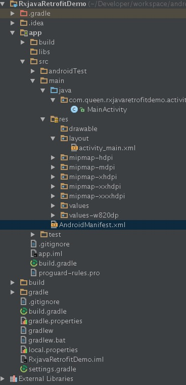

# RxJava与Retrofit结合的最佳实践

> 原文链接：http://gank.io/post/56e80c2c677659311bed9841

## 前言

RxJava和Retrofit也火了一段时间了，不过最近一直在学习ReactNative和Node相关的姿势，一直没有时间研究这些新东西，最近有个项目准备写，打算先用Android写一个Demo出来，却发现Android的世界发生了天翻地覆的变化，EventBus和OKHttp啥的都不见了，RxJava和Retrofit是什么鬼？

好吧，到Github上耐着性子看过了RxJava和Retrofit的介绍和几个Demo，原来Android的大神Jake Wharton为Retrofit这个项目贡献了这么多的代码，没有道理不用了。

如果你对RxJava不熟悉请先看[给 Android 开发者的 RxJava 详解](http://gank.io/post/560e15be2dca930e00da1083)这篇文章。

如果你对Retrofit不熟悉就先看[Retrofit官网](http://square.github.io/retrofit)。

当然也有很多RxJava与Retrofit的文章，但是我觉得很多大家都很纠结的功能都没有被总结出来，所以才有了此篇文章。

欢迎大家拍砖。

接下来进入正文，我是从下面几个角度去思考RxJava与Retrofit结合的。

1. RxJava如何与Retrofit结合
2. 相同格式的Http请求数据该如何封装
3. 相同格式的Http请求数据统一进行预处理
4. 如何取消一个Http请求 -- 观察者之间的对决，Oberver VS Subscriber
5. 一个需要ProgressDialog的Subscriber该有的样子

## 1. RxJava如何与Retrofit结合

### 1.1 基本页面

先扔出build.gradle文件的内容

```gradle
dependencies {
    compile fileTree(dir: 'libs', include: ['*.jar'])
    testCompile 'junit:junit:4.12'
    compile 'com.android.support:appcompat-v7:23.2.0'
    compile 'io.reactivex:rxjava:1.1.0'
    compile 'io.reactivex:rxandroid:1.1.0'
    compile 'com.squareup.retrofit2:retrofit:2.0.0-beta4'
    compile 'com.squareup.retrofit2:converter-gson:2.0.0-beta4'
    compile 'com.squareup.retrofit2:adapter-rxjava:2.0.0-beta4'
    compile 'com.google.code.gson:gson:2.6.2'
    compile 'com.jakewharton:butterknife:7.0.1'
}
```

也就是说本文是基于RxJava1.1.0和Retrofit 2.0.0-beta4来进行的。添加rxandroid是因为rxjava中的线程问题。

下面先搭建一个基本的页面，页面很简单，先来看文件目录结构



**activity_main.xml**的代码如下：

```xml
<RelativeLayout xmlns:android="http://schemas.android.com/apk/res/android"
    xmlns:tools="http://schemas.android.com/tools"
    android:layout_width="match_parent"
    android:layout_height="match_parent"
    android:paddingBottom="@dimen/activity_vertical_margin"
    android:paddingLeft="@dimen/activity_horizontal_margin"
    android:paddingRight="@dimen/activity_horizontal_margin"
    android:paddingTop="@dimen/activity_vertical_margin"
    tools:context=".activity.MainActivity">

    <Button
        android:id="@+id/click_me_BN"
        android:layout_width="match_parent"
        android:layout_height="wrap_content"
        android:layout_alignParentBottom="true"
        android:padding="5dp"
        android:text="点我"
        android:textSize="16sp"/>
    <TextView
        android:id="@+id/result_TV"
        android:layout_width="match_parent"
        android:layout_height="match_parent"
        android:layout_above="@id/click_me_BN"
        android:text="Hello World!"
        android:textSize="16sp"/>
</RelativeLayout>
```

**MainActivity.java**的代码如下：

```java
package com.queen.rxjavaretrofitdemo.activity;

import android.os.Bundle;
import android.support.v7.app.AppCompatActivity;
import android.widget.Button;
import android.widget.TextView;

import com.queen.rxjavaretrofitdemo.R;

import butterknife.Bind;
import butterknife.ButterKnife;
import butterknife.OnClick;

public class MainActivity extends AppCompatActivity {

    @Bind(R.id.click_me_BN)
    Button clickMeBN;
    @Bind(R.id.result_TV)
    TextView resultTV;

    @Override
    protected void onCreate(Bundle savedInstanceState) {
        super.onCreate(savedInstanceState);
        setContentView(R.layout.activity_main);
        ButterKnife.bind(this);
    }

    @OnClick(R.id.click_me_BN)
    public void onClick() {
        getMovie();
    }
    
    //进行网络请求
    private void getMovie(){

    }
}
```

注意不要忘记加网络权限

```xml
<uses-permission android:name="android.permission.INTERNET"/>
```

### 1.2 只用Retrofit

我们准备在**getMovie**方法中进行网络请求，我们先来看看只使用**Retrofit**是如何进行的。

我们使用豆瓣电影的Top250做测试连接，目标地址为

>https://api.douban.com/v2/movie/top250?start=0&count=10

至于返回的数据格式，大家自己访问下链接就看到了，太长就不放进来了。

首先我们要根据返回的结果封装一个Entity，暂命名为**MovieEntity**，代码就不贴了。

接下来我们要创建一个接口取名为**MovieService**，代码如下：

```java
public interface MovieService {
    @GET("top250")
    Call<MovieEntity> getTopMovie(@Query("start") int start, @Query("count") int count);
}
```

回到**MainActivity**之中，我们来写**getMovie**方法的代码

```java
//进行网络请求
private void getMovie(){
    String baseUrl = "https://api.douban.com/v2/movie/";

    Retrofit retrofit = new Retrofit.Builder()
            .baseUrl(baseUrl)
            .addConverterFactory(GsonConverterFactory.create())
            .build();

    MovieService movieService = retrofit.create(MovieService.class);
    Call<MovieEntity> call = movieService.getTopMovie(0, 10);
    call.enqueue(new Callback<MovieEntity>() {
        @Override
        public void onResponse(Call<MovieEntity> call, Response<MovieEntity> response) {
            resultTV.setText(response.body().toString());
        }

        @Override
        public void onFailure(Call<MovieEntity> call, Throwable t) {
            resultTV.setText(t.getMessage());
        }
    });
}
```

以上为没有经过封装的、原生态的Retrofit写网络请求的代码。

我们可以封装创建Retrofit和service部分的代码，然后Activity用创建一个Callback作为参数给Call，这样Activity中只关注请求的结果，而且Call有cancel方法可以取消一个请求，好像没Rxjava什么事了，我觉得可以写到这就下班了

接下来我们要面对的问题是这样的，如果我的Http返回数据是一个统一的格式，例如

```json
{
	"resultCode": 0,
	"resultMessage": "成功",
	"data": {}
}
```

我们如何对返回结果进行一个统一的处理呢？

另外，我的ProgressDialog的show方法应该在哪调用呢？看样子只能在getMovie()这个方法里面调用了，换个地方发出请求就要在对应的Listener里面写一遍show()的代码，其实挺闹心。

而且错误请求我也想集中处理掉不要贴重复的代码。

我们先来看结合了Rxjava之后，事情有没有变化的可能。当然即便是不用Rxjava，依旧能够做很多的封装，只是比较麻烦。

如需查看项目代码 --> 代码地址:

> https://github.com/tough1985/RxjavaRetrofitDemo

选择Tag -> step1

### 1.3 添加Rxjava

Retrofit本身对Rxjava提供了支持。

添加Retrofit对Rxjava的支持需要在**Gradle**文件中添加 `compile 'com.squareup.retrofit2:adapter-rxjava:2.0.0-beta4'`
当然我们已经添加过了。

然后在创建Retrofit的过程中添加如下代码：

```java
Retrofit retrofit = new Retrofit.Builder()
        .baseUrl(baseUrl)
        .addConverterFactory(GsonConverterFactory.create())
        .addCallAdapterFactory(RxJavaCallAdapterFactory.create())
        .build();
```

这样一来我们定义的service返回值就不在是一个**Call**了，而是一个**Observable**

重新定义**MovieService**

```java
public interface MovieService {
    @GET("top250")
    Observable<MovieEntity> getTopMovie(@Query("start") int start, @Query("count") int count);
}
```

**getMovie**方法改为：

```java
//进行网络请求
private void getMovie(){
    String baseUrl = "https://api.douban.com/v2/movie/";

    Retrofit retrofit = new Retrofit.Builder()
            .baseUrl(baseUrl)
            .addConverterFactory(GsonConverterFactory.create())
            .addCallAdapterFactory(RxJavaCallAdapterFactory.create())
            .build();

    MovieService movieService = retrofit.create(MovieService.class);

    movieService.getTopMovie(0, 10)
            .subscribeOn(Schedulers.io())
            .observeOn(AndroidSchedulers.mainThread())
            .subscribe(new Subscriber<MovieEntity>() {
                @Override
                public void onCompleted() {
                    Toast.makeText(MainActivity.this, "Get Top Movie Completed", Toast.LENGTH_SHORT).show();
                }

                @Override
                public void onError(Throwable e) {
                    resultTV.setText(e.getMessage());
                }

                @Override
                public void onNext(MovieEntity movieEntity) {
                    resultTV.setText(movieEntity.toString());
                }
            });
}
```

这样基本上就完成了Retrofit和Rxjava的结合，但是我知道你们当然不会满意的。

接下来我们把创建**Retrofit**的过程封装一下，然后希望Activity创建**Subscriber**对象传进来。


如需查看项目代码 --> 代码地址:

> https://github.com/tough1985/RxjavaRetrofitDemo

选择Tag -> step2

### 1.4 将请求过程进行封装

创建一个对象**HttpMethods**

```java
public class HttpMethods {

    public static final String BASE_URL = "https://api.douban.com/v2/movie/";

    private static final int DEFAULT_TIMEOUT = 5;

    private Retrofit retrofit;
    private MovieService movieService;

    //构造方法私有
    private HttpMethods() {
        //手动创建一个OkHttpClient并设置超时时间
        OkHttpClient.Builder httpClientBuilder = new OkHttpClient.Builder();
        httpClientBuilder.connectTimeout(DEFAULT_TIMEOUT, TimeUnit.SECONDS);

        retrofit = new Retrofit.Builder()
                .client(httpClientBuilder.build())
                .addConverterFactory(GsonConverterFactory.create())
                .addCallAdapterFactory(RxJavaCallAdapterFactory.create())
                .baseUrl(BASE_URL)
                .build();
        
        movieService = retrofit.create(MovieService.class);
    }

    //在访问HttpMethods时创建单例
    private static class SingletonHolder{
        private static final HttpMethods INSTANCE = new HttpMethods();
    }

    //获取单例
    public static HttpMethods getInstance(){
        return SingletonHolder.INSTANCE;
    }

    /**
     * 用于获取豆瓣电影Top250的数据
     * @param subscriber  由调用者传过来的观察者对象
     * @param start 起始位置
     * @param count 获取长度
     */
    public void getTopMovie(Subscriber<MovieEntity> subscriber, int start, int count){
        movieService.getTopMovie(start, count)
                .subscribeOn(Schedulers.io())
                .unsubscribeOn(Schedulers.io())
                .observeOn(AndroidSchedulers.mainThread())
                .subscribe(subscriber);
    }
}
```

用一个单例来封装该对象，在构造方法中创建Retrofit和对应的Service。        
如果需要访问不同的基地址，那么你可能需要创建多个Retrofit对象，或者干脆根据不同的基地址封装不同的HttpMethod类。

我们回头再来看MainActivity中的**getMovie**方法：

```java
private void getMovie(){
     subscriber = new Subscriber<MovieEntity>() {
         @Override
         public void onCompleted() {
             Toast.makeText(MainActivity.this, "Get Top Movie Completed", Toast.LENGTH_SHORT).show();
         }

         @Override
         public void onError(Throwable e) {
             resultTV.setText(e.getMessage());
         }

         @Override
         public void onNext(MovieEntity movieEntity) {
             resultTV.setText(movieEntity.toString());
         }
     };
     HttpMethods.getInstance().getTopMovie(subscriber, 0, 10);
}        
```

其中subscriber是MainActivity的成员变量。

如需查看项目代码 --> 代码地址:

> https://github.com/tough1985/RxjavaRetrofitDemo

选择Tag -> step3

## 2. 相同格式的Http请求数据该如何封装

第二部分和第三部分我参考了知乎上的一个问答：[RxJava+Retrofit，在联网返回后如何先进行统一的判断？](https://www.zhihu.com/question/39182019)

不过没有完整的示例，所以在这写一个完整的示例出来。

这个段落我们来聊一下有些Http服务返回一个固定格式的数据的问题。例如：

```json
{
	"resultCode": 0,
	"resultMessage": "成功",
	"data": {}
}
```

大部分的Http服务可能都是这样设置，resultCode和resultMessage的内容相对比较稳定，而data的内容变化多端，72变都不一定够变的，有可能是个User对象，也有可能是个订单对象，还有可能是个订单列表。

按照我们之前的用法，使用Gson转型需要我们在创建subscriber对象是指定返回值类型，如果我们对不同的返回值进行封装的话，那可能就要有上百个Entity了，看着明明是很清晰的结构，却因为data的不确定性无奈了起来。

少年，不必烦恼，来来来~ 老衲赐你宝典葵花，老衲就是练了这个才出家。。。

我们可以创建一个HttpResult类

```java
public class HttpResult<T> {
    private int resultCode;
    private String resultMessage;
    
    private T data;
}
```

如果data是一个User对象的话。那么在定义Service方法的返回值就可以写为

```java
Observable<HttpResult<User>>
```

这样一来HttpResult就相当于一个包装类，将结果包装了起来，但是在使用的时候要给出一个明确的类型。

在上面的示例中，我也创建了一个HttpResult类，用来模仿这个形式，将其中的Subject单独封装了起来。

```java
public class HttpResult<T> {
    
    //用来模仿resultCode和resultMessage
    private int count;
    private int start;
    private int total;
    private String title;

    //用来模仿Data
    private T subjects;
}
```

这样泛型的时候就要写为：

```java
Observable<HttpResult<List<Subject>>>
```

如需查看项目代码 --> 代码地址:

> https://github.com/tough1985/RxjavaRetrofitDemo

选择Tag -> step4

## 3. 相同格式的Http请求数据统一进行预处理

既然我们有了相同的返回格式，那么我们可能就需要在获得数据之后进行一个统一的预处理。

当接收到了一个Http请求结果之后，由于返回的结构统一为

```json
{
	"resultCode": 0,
	"resultMessage": "成功",
	"data": {}
}
```

我们想要对**resultCode**和**resultMessage**先做一个判断，因为如果 `resultCode == 0` 代表**success**，那么 `resultCode != 0` 时**data**一般都是**null**。

Activity或Fragment对**resultCode**和**resultMessage**基本没有兴趣，他们只对**请求状态**和**data**数据感兴趣。

基于这种考虑，我们在 `resultCode != 0` 的时候，抛出个自定义的**ApiException**。这样就会进入到subscriber的onError中，我们可以在onError中处理错误信息。

另外，请求成功时，需要将data数据转换为目标数据类型传递给subscriber，因为，Activity和Fragment只想拿到和他们真正相关的数据。

使用Observable的map方法可以完成这一功能。

在**HttpMethods**中创建一个内部类**HttpResultFunc**，代码如下：

```java
/**
 * 用来统一处理Http的resultCode,并将HttpResult的Data部分剥离出来返回给subscriber
 *
 * @param <T>   Subscriber真正需要的数据类型，也就是Data部分的数据类型
 */
private class HttpResultFunc<T> implements Func1<HttpResult<T>, T>{

    @Override
    public T call(HttpResult<T> httpResult) {
        if (httpResult.getResultCode() != 0) {
            throw new ApiException(httpResult.getResultCode());
        }
        return httpResult.getData();
    }
}
```

然后我们的**getTopMovie**方法改为：

```java
public void getTopMovie(Subscriber<List<Subject>> subscriber, int start, int count){

    movieService.getTopMovie(start, count)
            .map(new HttpResultFunc<List<Subject>>())
            .subscribeOn(Schedulers.io())
            .unsubscribeOn(Schedulers.io())
            .observeOn(AndroidSchedulers.mainThread())
            .subscribe(subscriber);
}
```

由于HttpResult中的泛型T就是我们希望传递给subscriber的数据类型，而数据可以通过httpResult的getData方法获得，这样我们就处理了泛型问题，错误处理问题，还有将请求数据部分剥离出来给subscriber。

这样我们只需要关注Data数据的类型，而不必在关心整个过程了。

需要注意一点，就是在定义Service的时候，泛型是

```java
HttpResult<User>
//or
HttpResult<List<Subject>>
```

而在定义Subscriber的时候泛型是

```java
User
//or
List<Subject>
```
不然你会得到一个转型错误。

如需查看项目代码 --> 代码地址:

> https://github.com/tough1985/RxjavaRetrofitDemo

选择Tag -> step5

代码中我是用豆瓣数据模拟了HttpResult中的resultCode和resultMessage，与文档中的代码略有出入。

## 4. 如何取消一个Http请求 -- 观察者之间的对决，Observer VS Subscriber

### 4.1 取消一个Http请求

这一部分我们来聊一下关于取消Http请求的事情，已经Oberver和Subscriber这两个体位我们哪个更容易给我们G点。

如果没有使用Rxjava，那么Service返回的是一个Call，而这个Call对象有一个cancel方法可以用来取消Http请求。那么用了Rxjava之后，如何来取消一个请求呢？因为返回值是一个Observable。我们能做的似乎只有解除对Observable对象的订阅，其他的什么也做不了。

好在Retrofit已经帮我们考虑到了这一点。答案在RxJavaCallAdapterFactory这个类的源码中可以找到

```java
static final class CallOnSubscribe<T> implements Observable.OnSubscribe<Response<T>> {
  private final Call<T> originalCall;

  CallOnSubscribe(Call<T> originalCall) {
    this.originalCall = originalCall;
  }

  @Override public void call(final Subscriber<? super Response<T>> subscriber) {
    // Since Call is a one-shot type, clone it for each new subscriber.
    final Call<T> call = originalCall.clone();

    // Attempt to cancel the call if it is still in-flight on unsubscription.
    subscriber.add(Subscriptions.create(new Action0() {
      @Override public void call() {
        call.cancel();
      }
    }));

    try {
      Response<T> response = call.execute();
      if (!subscriber.isUnsubscribed()) {
        subscriber.onNext(response);
      }
    } catch (Throwable t) {
      Exceptions.throwIfFatal(t);
      if (!subscriber.isUnsubscribed()) {
        subscriber.onError(t);
      }
      return;
    }

    if (!subscriber.isUnsubscribed()) {
      subscriber.onCompleted();
    }
  }
}
```

我们看到call方法中，给subscriber添加了一个Subscription对象，Subscription对象很简单，主要就是取消订阅用的，如果你查看Subscriptions.create的源码，发现是这样的

```java
public static Subscription create(final Action0 unsubscribe) {
	 return BooleanSubscription.create(unsubscribe);
}
```

利用了一个BooleanSubscription类来创建一个Subscription，如果你点进去看BooleanSubscription.create方法一切就清晰了，当解除绑定的时候，subscriber会调用Subscription的unsubscribe方法，然后触发创建Subscription时候的传递进来的Action0的call方法。RxJavaCallAdapterFactory帮我们给subscriber添加的是call.cancel()，

总结起来就是说，我们在Activity或者Fragment中创建subscriber对象，想要取消请求的时候调用subscriber的unsubscribe方法就可以了。

对不起这一节有太多的**Subscriber**和**Subscription**以及**Observer**和**Observable**，老衲当时看的时候也是不知道吐了多少次了，习惯了就好了。

### 4.2 为什么会提到Oberver

提到Observer的过程是这样的。由于Subscriber一旦调用了unsubscribe方法之后，就没有用了。且当事件传递到onError或者onCompleted之后，也会自动的解绑。这样出现的一个问题就是每次发送请求都要创建新的Subscriber对象。

这样我们就把注意力放到了Observer，Observer本身是一个接口，他的特性是不管你怎么用，都不会解绑，为什么呢？因为他没有解绑的方法。所以就达到了复用的效果，一开始我一直美滋滋的用Observer。事实上，如果你用的是Observer，在调用Observable对象的subscribe方法的时候，会自动的将Observer对象转换成Subscriber对象。

下面是源码：

```java
public final Subscription subscribe(final Observer<? super T> observer) {
    if (observer instanceof Subscriber) {
        return subscribe((Subscriber<? super T>)observer);
    }
    return subscribe(new Subscriber<T>() {

        @Override
        public void onCompleted() {
            observer.onCompleted();
        }

        @Override
        public void onError(Throwable e) {
            observer.onError(e);
        }

        @Override
        public void onNext(T t) {
            observer.onNext(t);
        }

    });
}
```

后来发现了问题，

>问题1 无法取消，因为Observer没有unsubscribe方法

>问题2 没有onStart方法，这个一会聊

这两个问题是很痛苦的。所以，为了后面更好的高潮，我们还是选择用Subscriber。

## 5. 一个需要ProgressDialog的Subscriber该有的样子

我们希望有一个Subscriber在我们每次发送请求的时候能够弹出一个ProgressDialog，然后在请求接受的时候让这个ProgressDialog消失，同时在我们取消这个ProgressDialog的同时能够取消当前的请求，而我们只需要处理里面的数据就可以了。

我们先来创建一个类，就叫**ProgressSubscriber**，让他继承**Subscriber**。

Subscriber给我们提供了onStart、onNext、onError、onCompleted四个方法。

其中只有onNext方法返回了数据，那我们自然希望能够在onNext里面处理数据相关的逻辑。

**onStart**方法我们用来启动一个ProgressDialog。        
**onError**方法我们集中处理错误，同时也停止ProgressDialog       
**onComplated**方法里面停止ProgressDialog

其中我们需要解决两个问题

> 问题1 onNext的处理

> 问题2 cancel掉一个ProgressDialog的时候取消请求

我们先来解决问题1

### 5.1 处理onNext

我们希望这里能够让Activity或者Fragment自己处理onNext之后的逻辑，很自然的我们想到了用接口。问题还是泛型的问题，这里面我们必须指定明确的类型。所以接口还是需要泛型。

我们先来定义一个接口，命名**SubscriberOnNextListener**

```java
public interface SubscriberOnNextListener<T> {
    void onNext(T t);
}
```

代码很简单。再来看一下ProgressSubscriber现在的代码

```java
public class ProgressSubscriber<T> extends Subscriber<T> {

    private SubscriberOnNextListener mSubscriberOnNextListener;
    private Context context;

    public ProgressSubscriber(SubscriberOnNextListener mSubscriberOnNextListener, Context context) {
        this.mSubscriberOnNextListener = mSubscriberOnNextListener;
        this.context = context;
    }

    @Override
    public void onStart() {
    }

    @Override
    public void onCompleted() {
        Toast.makeText(context, "Get Top Movie Completed", Toast.LENGTH_SHORT).show();
    }

    @Override
    public void onError(Throwable e) {
        Toast.makeText(context, "error:" + e.getMessage(), Toast.LENGTH_SHORT).show();
    }

    @Override
    public void onNext(T t) {
        mSubscriberOnNextListener.onNext(t);
    }
}
```

我知道传Context不好，不过为了演示而已，大家可以自己封装一下Toast。

MainActivity使用是这样的：

先来定义一个SubscriberOnNextListener对象，可以在onCreate里面创建这个对象

```java
private SubscriberOnNextListener getTopMovieOnNext;

@Override
protected void onCreate(Bundle savedInstanceState) {
    super.onCreate(savedInstanceState);
    setContentView(R.layout.activity_main);
    ButterKnife.bind(this);

    getTopMovieOnNext = new SubscriberOnNextListener<List<Subject>>() {
        @Override
        public void onNext(List<Subject> subjects) {
            resultTV.setText(subjects.toString());
        }
    };
}
```

**getMovie**方法这么写：

```java
private void getMovie(){
	HttpMethods.getInstance().getTopMovie(
		new ProgressSubscriber(getTopMovieOnNext, MainActivity.this), 
		0, 10);
}
```

这样Activity或Fragment就只需要关注拿到结果之后的逻辑了，其他的完全不用操心。

如需查看项目代码 --> 代码地址:

> https://github.com/tough1985/RxjavaRetrofitDemo

选择Tag -> step6

### 5.2 处理ProgressDialog

我们希望当cancel掉ProgressDialog的时候，能够取消订阅，也就取消了当前的Http请求。        
所以我们先来创建个接口来处理这件事情。

```java
public interface ProgressCancelListener {
    void onCancelProgress();
}
```

然后我们用ProgressSubscriber来实现这个接口，这样ProgressSubscriber就有了一个onCancelProgress方法，在这里面取消订阅。

```java
@Override
public void onCancelProgress() {
    if (!this.isUnsubscribed()) {
        this.unsubscribe();
    }
}
```

然后我用了一个Handler来封装了ProgressDialog。

```java
public class ProgressDialogHandler extends Handler {

    public static final int SHOW_PROGRESS_DIALOG = 1;
    public static final int DISMISS_PROGRESS_DIALOG = 2;

    private ProgressDialog pd;

    private Context context;
    private boolean cancelable;
    private ProgressCancelListener mProgressCancelListener;

    public ProgressDialogHandler(Context context, ProgressCancelListener mProgressCancelListener,
                                 boolean cancelable) {
        super();
        this.context = context;
        this.mProgressCancelListener = mProgressCancelListener;
        this.cancelable = cancelable;
    }

    private void initProgressDialog(){
        if (pd == null) {
            pd = new ProgressDialog(context);

            pd.setCancelable(cancelable);

            if (cancelable) {
                pd.setOnCancelListener(new DialogInterface.OnCancelListener() {
                    @Override
                    public void onCancel(DialogInterface dialogInterface) {
                        mProgressCancelListener.onCancelProgress();
                    }
                });
            }

            if (!pd.isShowing()) {
                pd.show();
            }
        }
    }

    private void dismissProgressDialog(){
        if (pd != null) {
            pd.dismiss();
            pd = null;
        }
    }

    @Override
    public void handleMessage(Message msg) {
        switch (msg.what) {
            case SHOW_PROGRESS_DIALOG:
                initProgressDialog();
                break;
            case DISMISS_PROGRESS_DIALOG:
                dismissProgressDialog();
                break;
        }
    }
}
```

Handler接收两个消息来控制显示Dialog还是关闭Dialog。创建Handler的时候我们需要传入ProgressCancelListener的对象实例。

最后贴出ProgressSubscriber的完整代码：

```java
public class ProgressSubscriber<T> extends Subscriber<T> implements ProgressCancelListener{

    private SubscriberOnNextListener mSubscriberOnNextListener;
    private ProgressDialogHandler mProgressDialogHandler;

    private Context context;

    public ProgressSubscriber(SubscriberOnNextListener mSubscriberOnNextListener, Context context) {
        this.mSubscriberOnNextListener = mSubscriberOnNextListener;
        this.context = context;
        mProgressDialogHandler = new ProgressDialogHandler(context, this, true);
    }

    private void showProgressDialog(){
        if (mProgressDialogHandler != null) {
            mProgressDialogHandler.obtainMessage(ProgressDialogHandler.SHOW_PROGRESS_DIALOG).sendToTarget();
        }
    }

    private void dismissProgressDialog(){
        if (mProgressDialogHandler != null) {
            mProgressDialogHandler.obtainMessage(ProgressDialogHandler.DISMISS_PROGRESS_DIALOG).sendToTarget();
            mProgressDialogHandler = null;
        }
    }

    @Override
    public void onStart() {
        showProgressDialog();
    }

    @Override
    public void onCompleted() {
        dismissProgressDialog();
        Toast.makeText(context, "Get Top Movie Completed", Toast.LENGTH_SHORT).show();
    }

    @Override
    public void onError(Throwable e) {
        dismissProgressDialog();
        Toast.makeText(context, "error:" + e.getMessage(), Toast.LENGTH_SHORT).show();
    }

    @Override
    public void onNext(T t) {
        mSubscriberOnNextListener.onNext(t);
    }

    @Override
    public void onCancelProgress() {
        if (!this.isUnsubscribed()) {
            this.unsubscribe();
        }
    }
}
```

目前为止，就封装完毕了。以上是我在用Rxjava和Retrofit过程中踩过的一些坑，最后整合出来的，由于没有在实际的项目中跑过，有问题的话希望能够提出来大家讨论一下，拍砖也欢迎。

现在我们再写一个新的网络请求，步骤是这样的：

1. 在**Service**中定义一个新的方法。
2. 在**HttpMethods**封装对应的请求（代码基本可以copy）
3. 创建一个**SubscriberOnNextListener**处理请求数据并刷新UI。

## 最后

如果你觉得写更改线程的代码觉得也很烦的话，可以把订阅这部分也封装起来：

```java
public void getTopMovie(Subscriber<List<Subject>> subscriber, int start, int count){
		//原来的样子
//        movieService.getTopMovie(start, count)
//                .map(new HttpResultFunc<List<Subject>>())
//                .subscribeOn(Schedulers.io())
//                .unsubscribeOn(Schedulers.io())
//                .observeOn(AndroidSchedulers.mainThread())
//                .subscribe(subscriber);

	//修改之后的样子
    Observable observable = movieService.getTopMovie(start, count)
            .map(new HttpResultFunc<List<Subject>>());

    toSubscribe(observable, subscriber);
}

//添加线程管理并订阅
private void toSubscribe(Observable o, Subscriber s){
     o.subscribeOn(Schedulers.io())
            .unsubscribeOn(Schedulers.io())
            .observeOn(AndroidSchedulers.mainThread())
            .subscribe(s);
}
```

让你每次写一个请求的时候，写的代码尽量少，更多的精力放在业务逻辑本身。


## 最后的最后

如果你的httpResult格式本身没有问题，但是data中的内容是这样的：

```json
{
	"resultCode": 0,
	"resultMessage": "成功",
	"data": {"user": {}, "orderArray": []}
}
```

这样的情况还能不能继续使用这样的框架呢？        
我的解决方法是封装一个类，把user和orderArray作为类的属性。        
但是如果你的服务器一会data本身是一个完整的user数据，一会又是这样：`"data": {"user": {}, "orderArray": []}`       
那我觉得你有必要跟你的服务端好好聊聊了，请他吃顿饭和顿酒，大不了献出菊花就是了。

但是如果服务已经上线了！！！

对不起，骚年......

老衲会在你坟前念300遍**Thinking in java**替你超度的

希望你用Retrofit和Rxjava的新体位能够享受到新的高潮。