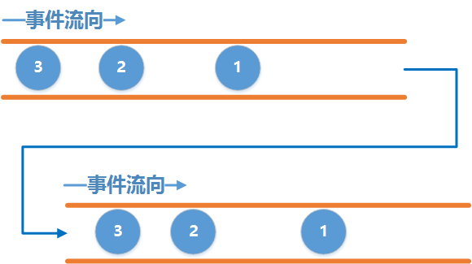
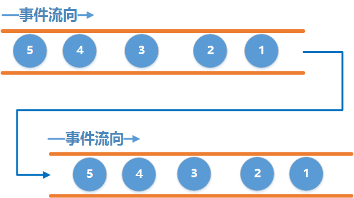
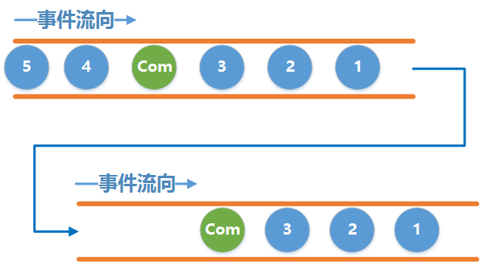
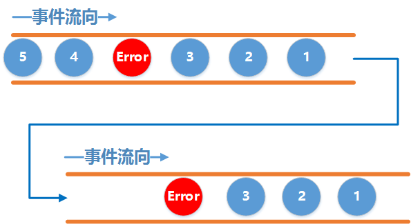

## 前言

上个月RxJava2正式版发布了，但目前国内的资料还比较少，以前使用过RxJava1只需要看看更新文档就知道怎么使用了，但还有一些以前没用过RxJava的朋友可能就不知道怎么办了，不知道该看RxJava1还是直接跳到RxJava2。所以写下这个教程， 帮助那些没有用过RxJava的朋友入门。

> 注：如果你觉得写得不好，请直接批评指出。

我先回答这个问题：学习RxJava2需要先学习RxJava1吗？

这个问题就像论坛经常问学Java前需要先学习C语言吗，这里就不引战了！（PHP是世界上最好的语言！！）

答案明显不是，如果你以前学过RxJava1，那么对于RxJava2只需要看看更新了哪些东西就行了，其最核心的思想并没有变化，如果你没学过RxJava1，没有关系，直接学习RxJava2。所以作为一个RxJava2的教程，本文中所有的名词都属于RxJava2中，并不涉及RxJava1。

要在Android中使用RxJava2, 先添加Gradle配置:

```gradle
compile 'io.reactivex.rxjava2:rxjava:2.0.1'
compile 'io.reactivex.rxjava2:rxandroid:2.0.1'
```

## 正题

在开始学习之前，先来介绍点原理性的东西。

网上也有很多介绍RxJava原理的文章，通常这些文章都从观察者模式开始，先讲观察者，被观察者，订阅关系巴拉巴拉一大堆，说实话，当我第一次看到这些文章的时候已经被这些名词给绕晕了，用了很长的时间才理清楚它们之间的关系。可能是我太蠢了，境界不够，领会不到那么多高大上的名词.

今天我用两根水管代替观察者和被观察者, 试图用通俗易懂的话把它们的关系解释清楚, 在这里我将从事件流这个角度来说明RxJava的基本工作原理。

先假设有两根水管：



上面一根水管为事件产生的水管，叫它`上游`吧，下面一根水管为事件接收的水管叫它`下游`吧。

两根水管通过一定的方式连接起来，使得上游每产生一个事件，下游就能收到该事件。注意这里和官网的事件图是反过来的, 这里的事件发送的顺序是先1，后2，后3这样的顺序, 事件接收的顺序也是先1,后2,后3的顺序, 我觉得这样更符合我们普通人的思维, 简单明了

这里的`上游`和`下游`就分别对应着RxJava中的`Observable`和`Observer`，它们之间的连接就对应着`subscribe()`，因此这个关系用RxJava来表示就是

```java
//创建一个上游 Observable：
Observable<Integer> observable = Observable.create(new ObservableOnSubscribe<Integer>() {
    @Override
    public void subscribe(ObservableEmitter<Integer> emitter) throws Exception {
        emitter.onNext(1);
        emitter.onNext(2);
        emitter.onNext(3);
        emitter.onComplete();
    }
});
//创建一个下游 Observer
Observer<Integer> observer = new Observer<Integer>() {
    @Override
    public void onSubscribe(Disposable d) {
        Log.d(TAG, "subscribe");
    }

    @Override
    public void onNext(Integer value) {
        Log.d(TAG, "" + value);
    }

    @Override
    public void onError(Throwable e) {
        Log.d(TAG, "error");
    }

    @Override
    public void onComplete() {
        Log.d(TAG, "complete");
    }
};
//建立连接
observable.subscribe(observer);
```

这个运行的结果就是:

```
12-02 03:37:17.818 4166-4166/zlc.season.rxjava2demo D/TAG: subscribe
12-02 03:37:17.819 4166-4166/zlc.season.rxjava2demo D/TAG: 1
12-02 03:37:17.819 4166-4166/zlc.season.rxjava2demo D/TAG: 2
12-02 03:37:17.819 4166-4166/zlc.season.rxjava2demo D/TAG: 3
12-02 03:37:17.819 4166-4166/zlc.season.rxjava2demo D/TAG: complete
```

> 注意: 只有当上游和下游建立连接之后, 上游才会开始发送事件. 也就是调用了`subscribe()`方法之后才开始发送事件.

把这段代码连起来写就成了RxJava引以为傲的链式操作：

```java
Observable.create(new ObservableOnSubscribe<Integer>() {
    @Override
    public void subscribe(ObservableEmitter<Integer> emitter) throws Exception {
        emitter.onNext(1);
        emitter.onNext(2);
        emitter.onNext(3);
        emitter.onComplete();
    }
}).subscribe(new Observer<Integer>() {
    @Override
    public void onSubscribe(Disposable d) {
        Log.d(TAG, "subscribe");
    }

    @Override
    public void onNext(Integer value) {
        Log.d(TAG, "" + value);
    }

    @Override
    public void onError(Throwable e) {
        Log.d(TAG, "error");
    }

    @Override
    public void onComplete() {
        Log.d(TAG, "complete");
    }
});
```

接下来解释一下其中两个陌生的玩意：`ObservableEmitter`和`Disposable`

ObservableEmitter： Emitter是发射器的意思，那就很好猜了，这个就是用来发出事件的，它可以发出三种类型的事件，通过调用emitter的`onNext(T value)`、`onComplete()`和`onError(Throwable error)`就可以分别发出next事件、complete事件和error事件

但是，请注意，并不意味着你可以随意乱七八糟发射事件，需要满足一定的规则：

- 上游可以发送无限个onNext, 下游也可以接收无限个onNext
- 当上游发送了一个onComplete后, 上游onComplete之后的事件将会`继续`发送, 而下游收到onComplete事件之后将`不再继续`接收事件
- 当上游发送了一个onError后, 上游onError之后的事件将`继续`发送, 而下游收到onError事件之后将`不再继续`接收事件.
- 上游可以不发送onComplete或onError
- 最为关键的是onComplete和onError必须唯一并且互斥, 即不能发多个onComplete, 也不能发多个onError, 也不能先发一个onComplete, 然后再发一个onError, 反之亦然

> 注: 关于onComplete和onError唯一并且互斥这一点, 是需要自行在代码中进行控制, 如果你的代码逻辑中违背了这个规则, **并不一定会导致程序崩溃. **比如发送多个onComplete是可以正常运行的, 依然是收到第一个onComplete就不再接收了, 但若是发送多个onError, 则收到第二个onError事件会导致程序会崩溃.

以上几个规则用示意图表示如下:

| 事件             | 示意图                              |
| -------------- | -------------------------------- |
| 只发送onNext事件    |  |
| 发送onComplete事件 |  |
| 发送onError事件    |  |

介绍了ObservableEmitter, 接下来介绍Disposable, 这个单词的字面意思是一次性用品,用完即可丢弃的. 那么在RxJava中怎么去理解它呢, 对应于上面的水管的例子, 我们可以把它理解成两根管道之间的一个机关, 当调用它的`dispose()`方法时, 它就会将两根管道切断, 从而导致下游收不到事件

> 注意: 调用dispose()并不会导致上游不再继续发送事件, 上游会继续发送剩余的事件.

来看个例子, 我们让上游依次发送`1,2,3,complete,4`,在下游收到第二个事件之后, 切断水管, 看看运行结果:

```java
Observable.create(new ObservableOnSubscribe<Integer>() {
    @Override
    public void subscribe(ObservableEmitter<Integer> emitter) throws Exception {
        Log.d(TAG, "emit 1");
        emitter.onNext(1);
        Log.d(TAG, "emit 2");
        emitter.onNext(2);
        Log.d(TAG, "emit 3");
        emitter.onNext(3);
        Log.d(TAG, "emit complete");
        emitter.onComplete();
        Log.d(TAG, "emit 4");
        emitter.onNext(4);
    }
}).subscribe(new Observer<Integer>() {
    private Disposable mDisposable;
    private int i;

    @Override
    public void onSubscribe(Disposable d) {
        Log.d(TAG, "subscribe");
        mDisposable = d;
    }

    @Override
    public void onNext(Integer value) {
        Log.d(TAG, "onNext: " + value);
        i++;
        if (i == 2) {
            Log.d(TAG, "dispose");
            mDisposable.dispose();
            Log.d(TAG, "isDisposed : " + mDisposable.isDisposed());
        }
    }

    @Override
    public void onError(Throwable e) {
        Log.d(TAG, "error");
    }

    @Override
    public void onComplete() {
        Log.d(TAG, "complete");
    }
});
```

运行结果为:

```
12-02 06:54:07.728 7404-7404/zlc.season.rxjava2demo D/TAG: subscribe
12-02 06:54:07.728 7404-7404/zlc.season.rxjava2demo D/TAG: emit 1
12-02 06:54:07.728 7404-7404/zlc.season.rxjava2demo D/TAG: onNext: 1
12-02 06:54:07.728 7404-7404/zlc.season.rxjava2demo D/TAG: emit 2
12-02 06:54:07.728 7404-7404/zlc.season.rxjava2demo D/TAG: onNext: 2
12-02 06:54:07.728 7404-7404/zlc.season.rxjava2demo D/TAG: dispose
12-02 06:54:07.728 7404-7404/zlc.season.rxjava2demo D/TAG: isDisposed : true
12-02 06:54:07.728 7404-7404/zlc.season.rxjava2demo D/TAG: emit 3
12-02 06:54:07.728 7404-7404/zlc.season.rxjava2demo D/TAG: emit complete
12-02 06:54:07.728 7404-7404/zlc.season.rxjava2demo D/TAG: emit 4
```

从运行结果我们看到, 在收到onNext 2这个事件后, 切断了水管, 但是上游仍然发送了3, complete, 4这几个事件, 而且上游并没有因为发送了onComplete而停止. 同时可以看到下游的`onSubscribe()`方法是最先调用的

Disposable的用处不止这些, 后面讲解到了线程的调度之后, 我们会发现它的重要性. 随着后续深入的讲解, 我们会在更多的地方发现它的身影

另外, `subscribe()`有多个重载的方法:

```java
public final Disposable subscribe() {}
public final Disposable subscribe(Consumer<? super T> onNext) {}
public final Disposable subscribe(Consumer<? super T> onNext, Consumer<? super Throwable> onError) {} 
public final Disposable subscribe(Consumer<? super T> onNext, Consumer<? super Throwable> onError, Action onComplete) {}
public final Disposable subscribe(Consumer<? super T> onNext, Consumer<? super Throwable> onError, Action onComplete, Consumer<? super Disposable> onSubscribe) {}
public final void subscribe(Observer<? super T> observer) {}
```

最后一个带有`Observer`参数的我们已经使用过了,这里对其他几个方法进行说明.

- 不带任何参数的`subscribe()` 表示下游不关心任何事件,你上游尽管发你的数据去吧, 老子可不管你发什么.
- 带有一个`Consumer`参数的方法表示下游只关心onNext事件, 其他的事件我假装没看见, 因此我们如果只需要onNext事件可以这么写:

```java
Observable.create(new ObservableOnSubscribe<Integer>() {
    @Override
    public void subscribe(ObservableEmitter<Integer> emitter) throws Exception {
        Log.d(TAG, "emit 1");
        emitter.onNext(1);
        Log.d(TAG, "emit 2");
        emitter.onNext(2);
        Log.d(TAG, "emit 3");
        emitter.onNext(3);
        Log.d(TAG, "emit complete");
        emitter.onComplete();
        Log.d(TAG, "emit 4");
        emitter.onNext(4);
    }
}).subscribe(new Consumer<Integer>() {
    @Override
    public void accept(Integer integer) throws Exception {
        Log.d(TAG, "onNext: " + integer);
    }
});
```

- 其他几个方法同理, 这里就不一一解释了

好了本次的教程到此结束, 下一节中我们将会学习RxJava强大的线程调度