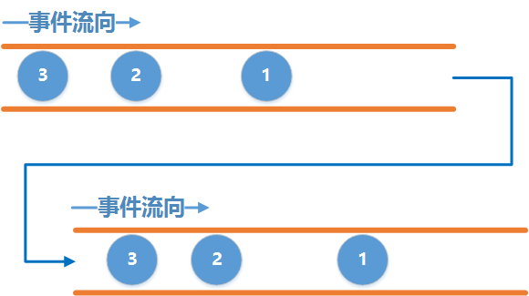
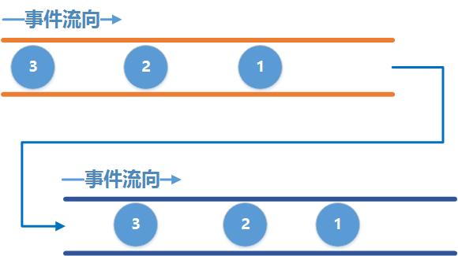

## 前言

上一节教程讲解了最基本的RxJava2的使用, 在本节中, 我们将学习RxJava强大的线程控制.

## 正题

还是以之前的例子, 两根水管:



正常情况下, 上游和下游是工作在同一个线程中的, 也就是说上游在哪个线程发事件, 下游就在哪个线程接收事件.

怎么去理解呢, 以Android为例, 一个Activity的所有动作默认都是在主线程中运行的, 比如我们在onCreate中打出当前线程的名字:

```java
@Override
protected void onCreate(Bundle savedInstanceState) {
    super.onCreate(savedInstanceState);
    setContentView(R.layout.activity_main);
    Log.d(TAG, Thread.currentThread().getName());
}
```

结果便是:

```
D/TAG: main
```

回到RxJava中, 当我们在主线程中去创建一个上游Observable来发送事件, 则这个上游默认就在主线程发送事件.

当我们在主线程去创建一个下游Observer来接收事件, 则这个下游默认就在主线程中接收事件, 来看段代码:

```java
@Override                                                                                       
protected void onCreate(Bundle savedInstanceState) {                                            
    super.onCreate(savedInstanceState);                                                         
    setContentView(R.layout.activity_main);                                                     

    Observable<Integer> observable = Observable.create(new ObservableOnSubscribe<Integer>() {   
        @Override                                                                               
        public void subscribe(ObservableEmitter<Integer> emitter) throws Exception {            
            Log.d(TAG, "Observable thread is : " + Thread.currentThread().getName());           
            Log.d(TAG, "emit 1");                                                               
            emitter.onNext(1);                                                                  
        }                                                                                       
    });                                                                                         

    Consumer<Integer> consumer = new Consumer<Integer>() {                                      
        @Override                                                                               
        public void accept(Integer integer) throws Exception {                                  
            Log.d(TAG, "Observer thread is :" + Thread.currentThread().getName());              
            Log.d(TAG, "onNext: " + integer);                                                   
        }                                                                                       
    };                                                                                          

    observable.subscribe(consumer);                                                             
}
```

在主线程中分别创建上游和下游, 然后将他们连接在一起, 同时分别打印出它们所在的线程, 运行结果为:

```
D/TAG: Observable thread is : main
D/TAG: emit 1                     
D/TAG: Observer thread is :main   
D/TAG: onNext: 1
```

这就验证了刚才所说, 上下游默认是在同一个线程工作.

这样肯定是满足不了我们的需求的, 我们更多想要的是这么一种情况, 在子线程中做耗时的操作, 然后回到主线程中来操作UI, 用图片来描述就是下面这个图片:



在这个图中, 我们用黄色水管表示子线程, 深蓝色水管表示主线程.

要达到这个目的, 我们需要先改变上游发送事件的线程, 让它去子线程中发送事件, 然后再改变下游的线程, 让它去主线程接收事件. 通过RxJava内置的线程调度器可以很轻松的做到这一点. 接下来看一段代码:

```java
@Override                                                                                       
protected void onCreate(Bundle savedInstanceState) {                                            
    super.onCreate(savedInstanceState);                                                         
    setContentView(R.layout.activity_main);                                                     

    Observable<Integer> observable = Observable.create(new ObservableOnSubscribe<Integer>() {   
        @Override                                                                               
        public void subscribe(ObservableEmitter<Integer> emitter) throws Exception {            
            Log.d(TAG, "Observable thread is : " + Thread.currentThread().getName());           
            Log.d(TAG, "emit 1");                                                               
            emitter.onNext(1);                                                                  
        }                                                                                       
    });                                                                                         

    Consumer<Integer> consumer = new Consumer<Integer>() {                                      
        @Override                                                                               
        public void accept(Integer integer) throws Exception {                                  
            Log.d(TAG, "Observer thread is :" + Thread.currentThread().getName());              
            Log.d(TAG, "onNext: " + integer);                                                   
        }                                                                                       
    };                                                                                          

    observable.subscribeOn(Schedulers.newThread())                                              
            .observeOn(AndroidSchedulers.mainThread())                                          
            .subscribe(consumer);                                                               
}
```

还是刚才的例子, 只不过我们太添加了一点东西, 先来看看运行结果:

```
 D/TAG: Observable thread is : RxNewThreadScheduler-2  
 D/TAG: emit 1                                         
 D/TAG: Observer thread is :main                       
 D/TAG: onNext: 1
```

可以看到, 上游发送事件的线程的确改变了, 是在一个叫 `RxNewThreadScheduler-2`的线程中发送的事件, 而下游仍然在主线程中接收事件, 这说明我们的目的达成了, 接下来看看是如何做到的.

和上一段代码相比,这段代码只不过是增加了两行代码:

```java
.subscribeOn(Schedulers.newThread())                                              
.observeOn(AndroidSchedulers.mainThread())
```

作为一个初学者的入门教程, 并不会贴出一大堆源码来分析, 因此只需要让大家记住几个要点, 已达到如何正确的去使用这个目的才是我们的目标.

简单的来说, `subscribeOn()` 指定的是上游发送事件的线程, `observeOn()` 指定的是下游接收事件的线程.

多次指定上游的线程只有第一次指定的有效, 也就是说多次调用`subscribeOn()` 只有第一次的有效, 其余的会被忽略.

多次指定下游的线程是可以的, 也就是说每调用一次`observeOn()` , 下游的线程就会切换一次.

举个例子:

```java
observable.subscribeOn(Schedulers.newThread())     
        .subscribeOn(Schedulers.io())              
        .observeOn(AndroidSchedulers.mainThread()) 
        .observeOn(Schedulers.io())                
        .subscribe(consumer);
```

这段代码中指定了两次上游发送事件的线程, 分别是newThread和IO线程, 下游也指定了两次线程,分别是main和IO线程. 运行结果为:

```
D/TAG: Observable thread is : RxNewThreadScheduler-3
D/TAG: emit 1                                       
D/TAG: Observer thread is :RxCachedThreadScheduler-1
D/TAG: onNext: 1
```

可以看到, 上游虽然指定了两次线程, 但只有第一次指定的有效, 依然是在`RxNewThreadScheduler`线程中, 而下游则跑到了`RxCachedThreadScheduler` 中, 这个CacheThread其实就是IO线程池中的一个.

为了更清晰的看到下游的线程切换过程, 我们加点log:

```java
observable.subscribeOn(Schedulers.newThread())
           .subscribeOn(Schedulers.io())
           .observeOn(AndroidSchedulers.mainThread())
           .doOnNext(new Consumer<Integer>() {
               @Override
               public void accept(Integer integer) throws Exception {
                   Log.d(TAG, "After observeOn(mainThread), current thread is: " + Thread.currentThread().getName());
               }
           })
           .observeOn(Schedulers.io())
           .doOnNext(new Consumer<Integer>() {
               @Override
               public void accept(Integer integer) throws Exception {
                   Log.d(TAG, "After observeOn(io), current thread is : " + Thread.currentThread().getName());
               }
           })
           .subscribe(consumer);
```

我们在下游线程切换之后, 把当前的线程打印出来, 运行结果:

```
D/TAG: Observable thread is : RxNewThreadScheduler-1                                             
D/TAG: emit 1                                                                                    
D/TAG: After observeOn(mainThread), current thread is: main                                      
D/TAG: After observeOn(io), current thread is : RxCachedThreadScheduler-2                        
D/TAG: Observer thread is :RxCachedThreadScheduler-2                                             
D/TAG: onNext: 1
```

可以看到, 每调用一次`observeOn()` 线程便会切换一次, 因此如果我们有类似的需求时, 便可知道如何处理了.

在RxJava中, 已经内置了很多线程选项供我们选择, 例如有

- Schedulers.io() 代表io操作的线程, 通常用于网络,读写文件等io密集型的操作
- Schedulers.computation() 代表CPU计算密集型的操作, 例如需要大量计算的操作
- Schedulers.newThread() 代表一个常规的新线程
- AndroidSchedulers.mainThread() 代表Android的主线程

这些内置的Scheduler已经足够满足我们开发的需求, 因此我们应该使用内置的这些选项, 在RxJava内部使用的是线程池来维护这些线程, 所有效率也比较高.

## 实践

对于我们Android开发人员来说, 经常会将一些耗时的操作放在后台, 比如网络请求或者读写文件,操作数据库等等,等到操作完成之后回到主线程去更新UI, 有了上面的这些基础, 那么现在我们就可以轻松的去做到这样一些操作.

下面来举几个常用的场景.

### 网络请求

Android中有名的网络请求库就那么几个, Retrofit能够从中脱颖而出很大原因就是因为它支持RxJava的方式来调用, 下面简单讲解一下它的基本用法.

要使用Retrofit,先添加Gradle配置:

```java
//retrofit
compile 'com.squareup.retrofit2:retrofit:2.1.0'
//Gson converter
compile 'com.squareup.retrofit2:converter-gson:2.1.0'
//RxJava2 Adapter
compile 'com.jakewharton.retrofit:retrofit2-rxjava2-adapter:1.0.0'
//okhttp
compile 'com.squareup.okhttp3:okhttp:3.4.1'
compile 'com.squareup.okhttp3:logging-interceptor:3.4.1'
```

随后定义Api接口:

```java
public interface Api {
    @GET
    Observable<LoginResponse> login(@Body LoginRequest request);

    @GET
    Observable<RegisterResponse> register(@Body RegisterRequest request);
}
```

接着创建一个Retrofit客户端:

```java
private static Retrofit create() {
            OkHttpClient.Builder builder = new OkHttpClient().newBuilder();
            builder.readTimeout(10, TimeUnit.SECONDS);
            builder.connectTimeout(9, TimeUnit.SECONDS);

            if (BuildConfig.DEBUG) {
                HttpLoggingInterceptor interceptor = new HttpLoggingInterceptor();
                interceptor.setLevel(HttpLoggingInterceptor.Level.BODY);
                builder.addInterceptor(interceptor);
            }

            return new Retrofit.Builder().baseUrl(ENDPOINT)
                    .client(builder.build())
                    .addConverterFactory(GsonConverterFactory.create())
                    .addCallAdapterFactory(RxJava2CallAdapterFactory.create())
                    .build();
}
```

发起请求就很简单了:

```java
Api api = retrofit.create(Api.class);
api.login(request)
      .subscribeOn(Schedulers.io())               //在IO线程进行网络请求
     .observeOn(AndroidSchedulers.mainThread())  //回到主线程去处理请求结果
    .subscribe(new Observer<LoginResponse>() {
            @Override
        public void onSubscribe(Disposable d) {}

        @Override
        public void onNext(LoginResponse value) {}

        @Override
        public void onError(Throwable e) {
            Toast.makeText(mContext, "登录失败", Toast.LENGTH_SHORT).show();
        }

        @Override
        public void onComplete() {
            Toast.makeText(mContext, "登录成功", Toast.LENGTH_SHORT).show();
        }
    });
```

看似很完美, 但我们忽略了一点, 如果在请求的过程中Activity已经退出了, 这个时候如果回到主线程去更新UI, 那么APP肯定就崩溃了, 怎么办呢, 上一节我们说到了`Disposable` , 说它是个开关, 调用它的`dispose()`方法时就会切断水管, 使得下游收不到事件, 既然收不到事件, 那么也就不会再去更新UI了. 因此我们可以在Activity中将这个`Disposable` 保存起来, 当Activity退出时, 切断它即可.

那如果有多个`Disposable` 该怎么办呢, RxJava中已经内置了一个容器`CompositeDisposable`, 每当我们得到一个`Disposable`时就调用`CompositeDisposable.add()`将它添加到容器中, 在退出的时候, 调用`CompositeDisposable.clear()` 即可切断所有的水管.

### 读写数据库

上面说了网络请求的例子, 接下来再看看读写数据库, 读写数据库也算一个耗时的操作, 因此我们也最好放在IO线程里去进行, 这个例子就比较简单, 直接上代码:

```java
public Observable<List<Record>> readAllRecords() {
        return Observable.create(new ObservableOnSubscribe<List<Record>>() {
            @Override
            public void subscribe(ObservableEmitter<List<Record>> emitter) throws Exception {
                Cursor cursor = null;
                try {
                    cursor = getReadableDatabase().rawQuery("select * from " + TABLE_NAME, new String[]{});
                    List<Record> result = new ArrayList<>();
                    while (cursor.moveToNext()) {
                        result.add(Db.Record.read(cursor));
                    }
                    emitter.onNext(result);
                    emitter.onComplete();
                } finally {
                    if (cursor != null) {
                        cursor.close();
                    }
                }
            }
        }).subscribeOn(Schedulers.io()).observeOn(AndroidSchedulers.mainThread());
    }
```

好了本次的教程就到这里吧, 后面的教程将会教大家如何使用RxJava中强大的操作符. 通过使用这些操作符可以很轻松的做到各种吊炸天的效果. 敬请期待