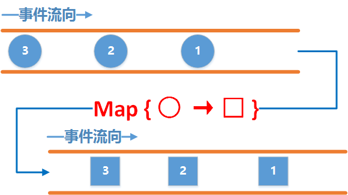
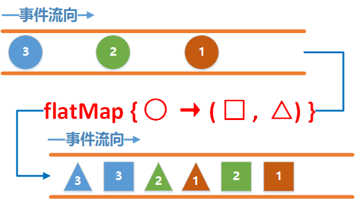
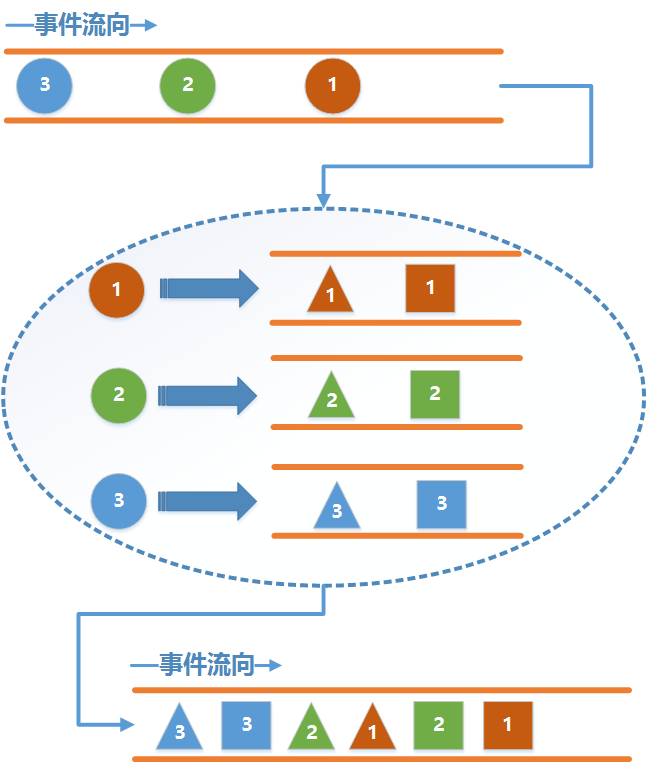

## 前言

上一节讲解了线程调度, 并且举了两个实际中的例子, 其中有一个登录的例子, 不知大家有没有想过这么一个问题, 如果是一个新用户, 必须先注册, 等注册成功之后再自动登录该怎么做呢.

很明显, 这是一个嵌套的网络请求, 首先需要去请求注册, 待注册成功回调了再去请求登录的接口.

我们当然可以想当然的写成这样:

```java
private void login() {
    api.login(new LoginRequest())
            .subscribeOn(Schedulers.io())               //在IO线程进行网络请求
            .observeOn(AndroidSchedulers.mainThread())  //回到主线程去处理请求结果
            .subscribe(new Consumer<LoginResponse>() {
                @Override
                public void accept(LoginResponse loginResponse) throws Exception {
                    Toast.makeText(MainActivity.this, "登录成功", Toast.LENGTH_SHORT).show();
                }
            }, new Consumer<Throwable>() {
                @Override
                public void accept(Throwable throwable) throws Exception {
                    Toast.makeText(MainActivity.this, "登录失败", Toast.LENGTH_SHORT).show();
                }
            });
}

private void register() {
    api.register(new RegisterRequest())
            .subscribeOn(Schedulers.io())               //在IO线程进行网络请求
            .observeOn(AndroidSchedulers.mainThread())  //回到主线程去处理请求结果
            .subscribe(new Consumer<RegisterResponse>() {
                @Override
                public void accept(RegisterResponse registerResponse) throws Exception {
                    Toast.makeText(MainActivity.this, "注册成功", Toast.LENGTH_SHORT).show();
                    login();   //注册成功, 调用登录的方法
                }
            }, new Consumer<Throwable>() {
                @Override
                public void accept(Throwable throwable) throws Exception {
                    Toast.makeText(MainActivity.this, "注册失败", Toast.LENGTH_SHORT).show();
                }
            });
}
```

(其实能写成这样的代码的人也很不错了, 至少没写到一起...)

这样的代码能够工作, 但不够优雅, 通过本节的学习, 可以让我们用一种更优雅的方式来解决这个问题.

## 正题

先来看看最简单的变换操作符map吧

### Map

map是RxJava中最简单的一个变换操作符了, 它的作用就是对上游发送的每一个事件应用一个函数, 使得每一个事件都按照指定的函数去变化. 用事件图表示如下:



图中map中的函数作用是将圆形事件转换为矩形事件, 从而导致下游接收到的事件就变为了矩形.用代码来表示这个例子就是:

```java
Observable.create(new ObservableOnSubscribe<Integer>() {
        @Override
        public void subscribe(ObservableEmitter<Integer> emitter) throws Exception {
            emitter.onNext(1);
            emitter.onNext(2);
            emitter.onNext(3);
        }
    }).map(new Function<Integer, String>() {
        @Override
        public String apply(Integer integer) throws Exception {
            return "This is result " + integer;
        }
    }).subscribe(new Consumer<String>() {
        @Override
        public void accept(String s) throws Exception {
            Log.d(TAG, s);
        }
    });
```

在上游我们发送的是数字类型, 而在下游我们接收的是String类型, 中间起转换作用的就是map操作符, 运行结果为:

```
 D/TAG: This is result 1 
 D/TAG: This is result 2 
 D/TAG: This is result 3
```

通过Map, 可以将上游发来的事件转换为任意的类型, 可以是一个Object, 也可以是一个集合, 如此强大的操作符你难道不想试试?

接下来我们来看另外一个广为人知的操作符flatMap.

### FlatMap

flatMap是一个非常强大的操作符, 先用一个比较难懂的概念说明一下:

`FlatMap`将一个发送事件的上游Observable变换为多个发送事件的Observables，然后将它们发射的事件合并后放进一个单独的Observable里.

这句话比较难以理解, 我们先通俗易懂的图片来详细的讲解一下, 首先先来看看整体的一个图片:



先看看上游, 上游发送了三个事件, 分别是1,2,3, 注意它们的颜色.

中间flatMap的作用是将圆形的事件转换为一个发送矩形事件和三角形事件的新的上游Observable.

还是不能理解? 别急, 再来看看分解动作:



这样就很好理解了吧 !!!

上游每发送一个事件, flatMap都将创建一个新的水管, 然后发送转换之后的新的事件, 下游接收到的就是这些新的水管发送的数据. **这里需要注意的是, flatMap并不保证事件的顺序,** 也就是图中所看到的, 并不是事件1就在事件2的前面. 如果需要保证顺序则需要使用`concatMap`.

说了原理, 我们还是来看看实际中的代码如何写吧:

```java
Observable.create(new ObservableOnSubscribe<Integer>() {
    @Override
    public void subscribe(ObservableEmitter<Integer> emitter) throws Exception {
        emitter.onNext(1);
        emitter.onNext(2);
        emitter.onNext(3);
    }
}).flatMap(new Function<Integer, ObservableSource<String>>() {
    @Override
    public ObservableSource<String> apply(Integer integer) throws Exception {
        final List<String> list = new ArrayList<>();
        for (int i = 0; i < 3; i++) {
            list.add("I am value " + integer);
        }
        return Observable.fromIterable(list).delay(10,TimeUnit.MILLISECONDS);
    }
}).subscribe(new Consumer<String>() {
    @Override
    public void accept(String s) throws Exception {
        Log.d(TAG, s);
    }
});
```

如代码所示, 我们在flatMap中将上游发来的每个事件转换为一个新的发送三个String事件的水管, 为了看到flatMap结果是无序的,所以加了10毫秒的延时, 来看看运行结果吧:

```
D/TAG: I am value 1
D/TAG: I am value 1
D/TAG: I am value 1
D/TAG: I am value 3
D/TAG: I am value 3
D/TAG: I am value 3
D/TAG: I am value 2
D/TAG: I am value 2
D/TAG: I am value 2
```

结果也确实验证了我们之前所说.

这里也简单说一下`concatMap`吧, 它和flatMap的作用几乎一模一样, 只是它的结果是严格按照上游发送的顺序来发送的, 来看个代码吧:

```java
Observable.create(new ObservableOnSubscribe<Integer>() {
    @Override
    public void subscribe(ObservableEmitter<Integer> emitter) throws Exception {
        emitter.onNext(1);
        emitter.onNext(2);
        emitter.onNext(3);
    }
}).concatMap(new Function<Integer, ObservableSource<String>>() {
    @Override
    public ObservableSource<String> apply(Integer integer) throws Exception {
        final List<String> list = new ArrayList<>();
        for (int i = 0; i < 3; i++) {
            list.add("I am value " + integer);
        }
        return Observable.fromIterable(list).delay(10,TimeUnit.MILLISECONDS);
    }
}).subscribe(new Consumer<String>() {
    @Override
    public void accept(String s) throws Exception {
        Log.d(TAG, s);
    }
});
```

只是将之前的flatMap改为了concatMap, 其余原封不动, 运行结果如下:

```
D/TAG: I am value 1   
D/TAG: I am value 1   
D/TAG: I am value 1   
D/TAG: I am value 2   
D/TAG: I am value 2   
D/TAG: I am value 2   
D/TAG: I am value 3   
D/TAG: I am value 3   
D/TAG: I am value 3
```

可以看到, 结果仍然是有序的.

好了关于RxJava的操作符最基本的使用就讲解到这里了, RxJava中内置了许许多多的操作符, 这里通过讲解`map`和`flatMap`只是起到一个抛砖引玉的作用, 关于其他的操作符只要大家按照本文的思路去理解, 再仔细阅读文档, 应该是没有问题的了, 如果大家有需要也可以将需要讲解的操作符列举出来, 我可以根据大家的需求讲解一下.

## 实践

学习了FlatMap操作符, 我们就可以回答文章开头提出的那个问题了.

如何优雅的解决嵌套请求, 只需要用flatMap转换一下就行了.

先回顾一下上一节的请求接口:

```java
public interface Api {
    @GET
    Observable<LoginResponse> login(@Body LoginRequest request);

    @GET
    Observable<RegisterResponse> register(@Body RegisterRequest request);
}
```

可以看到登录和注册返回的都是一个上游Observable, 而我们的flatMap操作符的作用就是把一个Observable转换为另一个Observable, 因此结果就很显而易见了:

```java
api.register(new RegisterRequest())            //发起注册请求
    .subscribeOn(Schedulers.io())               //在IO线程进行网络请求
    .observeOn(AndroidSchedulers.mainThread())  //回到主线程去处理请求注册结果
    .doOnNext(new Consumer<RegisterResponse>() {
        @Override
        public void accept(RegisterResponse registerResponse) throws Exception {
            //先根据注册的响应结果去做一些操作
        }
    })
    .observeOn(Schedulers.io())                 //回到IO线程去发起登录请求
    .flatMap(new Function<RegisterResponse, ObservableSource<LoginResponse>>() {
        @Override
        public ObservableSource<LoginResponse> apply(RegisterResponse registerResponse) throws Exception {
            return api.login(new LoginRequest());
        }
    })
    .observeOn(AndroidSchedulers.mainThread())  //回到主线程去处理请求登录的结果
    .subscribe(new Consumer<LoginResponse>() {
        @Override
        public void accept(LoginResponse loginResponse) throws Exception {
            Toast.makeText(MainActivity.this, "登录成功", Toast.LENGTH_SHORT).show();
        }
    }, new Consumer<Throwable>() {
        @Override
        public void accept(Throwable throwable) throws Exception {
            Toast.makeText(MainActivity.this, "登录失败", Toast.LENGTH_SHORT).show();
        }
    });
```

从这个例子也可以看到我们切换线程是多么简单.

好了本次的教程就到这里了. 下一节我们将会学到`Flowable` 以及理解`Backpressure`背压的概念. 敬请期待