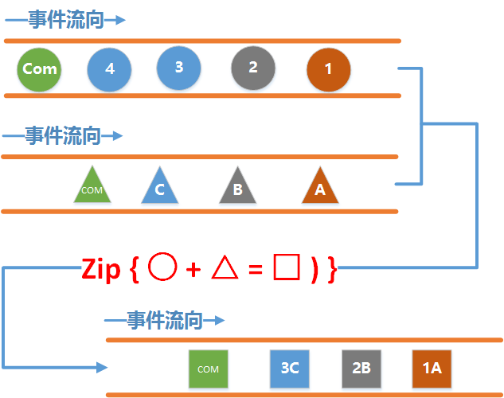
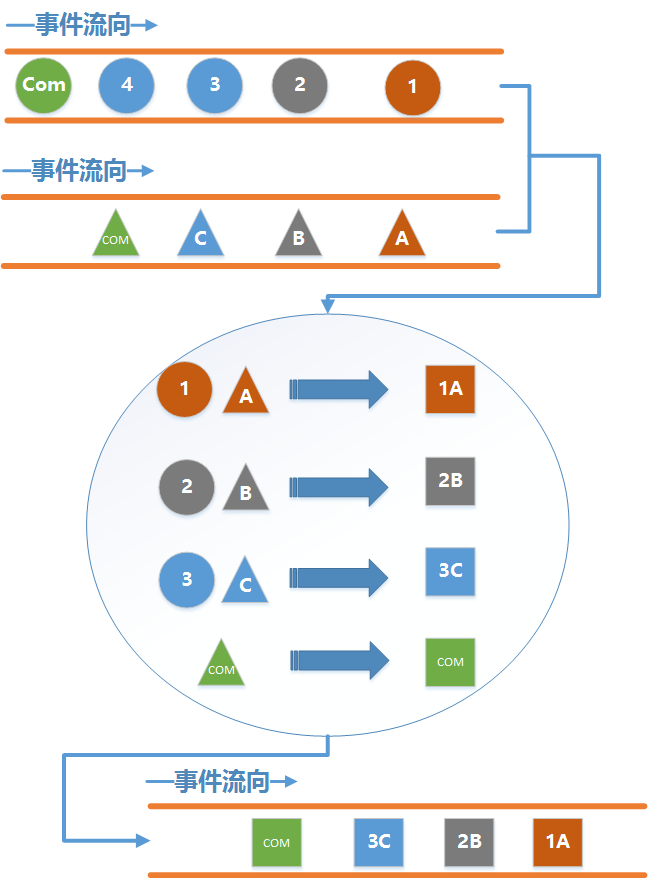
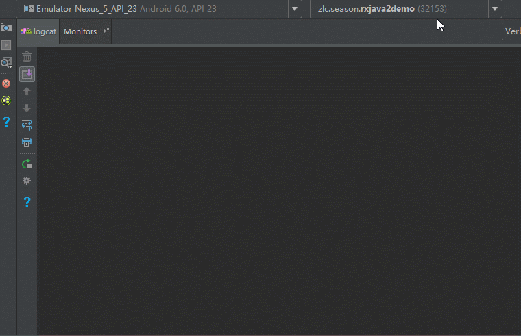
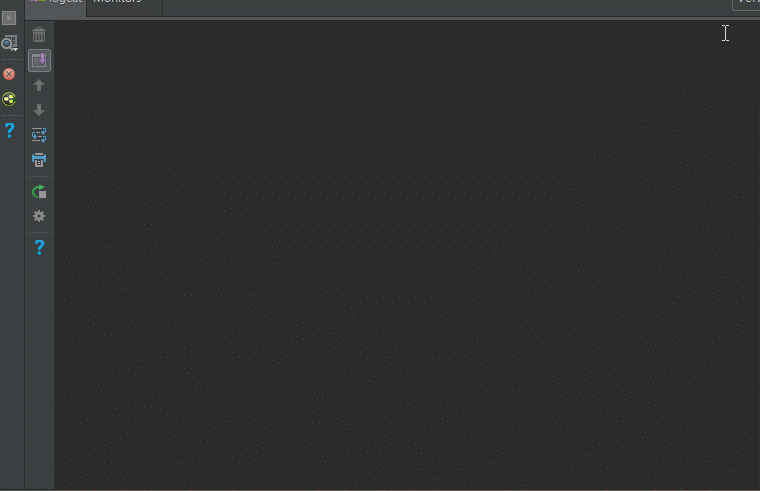

## 前言

在上一节中, 我们提到了`Flowable` 和`Backpressure`背压, 本来这一节的确是想讲这两个东西的，可是写到一半感觉还是差点火候，感觉时机未到， 因此，这里先来做个准备工作， 先带大家学习`zip`这个操作符, 这个操作符也是比较牛逼的东西了， 涉及到的东西也比较多， 主要是一些细节上的东西太多， 通过学习这个操作符，可以为我们下一节的`Backpressure` 做个铺垫.

## 正题

照惯例我们还是先贴上一下比较正式的解释吧.

`Zip`通过一个函数将多个Observable发送的事件结合到一起，然后发送这些组合到一起的事件. 它按照严格的顺序应用这个函数。它只发射与发射数据项最少的那个Observable一样多的数据。

我们再用通俗易懂的图片来解释一下:



从这个图中可以看见, 这次上游和以往不同的是, 我们有两根水管了.

其中一根水管负责发送`圆形事件` , 另外一根水管负责发送`三角形事件` , 通过Zip操作符, 使得`圆形事件` 和`三角形事件` 合并为了一个`矩形事件` .

下面我们再来看看分解动作：



通过分解动作我们可以看出:

- 组合的过程是`分别从` 两根水管里`各取出一个事件` 来进行组合, 并且一个事件`只能被使用一次,`组合的顺序是严格`按照事件发送的顺利` 来进行的, 也就是说不会出现`圆形1` 事件和`三角形B` 事件进行合并, 也不可能出现`圆形2` 和`三角形A` 进行合并的情况.
- 最终`下游收到的事件数量` 是和`上游中发送事件最少的那一根水管的事件数量` 相同. 这个也很好理解, 因为是从`每一根水管` 里取一个事件来进行合并, `最少的` 那个肯定就`最先取完` , 这个时候其他的水管`尽管还有事件` , 但是已经没有足够的事件来组合了, 因此下游就不会收到剩余的事件了.

分析了大概的原理, 我们还是劳逸结合, 先来看看实际中的代码怎么写吧:

```java
Observable<Integer> observable1 = Observable.create(new ObservableOnSubscribe<Integer>() {
    @Override
    public void subscribe(ObservableEmitter<Integer> emitter) throws Exception {
        Log.d(TAG, "emit 1");
        emitter.onNext(1);
        Log.d(TAG, "emit 2");
        emitter.onNext(2);
        Log.d(TAG, "emit 3");
        emitter.onNext(3);
        Log.d(TAG, "emit 4");
        emitter.onNext(4);
        Log.d(TAG, "emit complete1");
        emitter.onComplete();
    }
});

Observable<String> observable2 = Observable.create(new ObservableOnSubscribe<String>() {
    @Override
    public void subscribe(ObservableEmitter<String> emitter) throws Exception {
        Log.d(TAG, "emit A");
        emitter.onNext("A");
        Log.d(TAG, "emit B");
        emitter.onNext("B");
        Log.d(TAG, "emit C");
        emitter.onNext("C");
        Log.d(TAG, "emit complete2");
        emitter.onComplete();
    }
});                                                                     

Observable.zip(observable1, observable2, new BiFunction<Integer, String, String>() {
    @Override
    public String apply(Integer integer, String s) throws Exception {
        return integer + s;
    }
}).subscribe(new Observer<String>() {
    @Override
    public void onSubscribe(Disposable d) {
        Log.d(TAG, "onSubscribe");
    }

    @Override
    public void onNext(String value) {
        Log.d(TAG, "onNext: " + value);
    }

    @Override
    public void onError(Throwable e) {
        Log.d(TAG, "onError");
    }

    @Override
    public void onComplete() {
        Log.d(TAG, "onComplete");
    }
});
```

我们分别创建了两个上游水管, 一个发送1,2,3,4,Complete, 另一个发送A,B,C,Complete, 接着用Zip把发出的事件组合, 来看看运行结果吧:

```
D/TAG: onSubscribe     
D/TAG: emit 1          
D/TAG: emit 2          
D/TAG: emit 3          
D/TAG: emit 4          
D/TAG: emit complete1  
D/TAG: emit A          
D/TAG: onNext: 1A      
D/TAG: emit B          
D/TAG: onNext: 2B      
D/TAG: emit C          
D/TAG: onNext: 3C      
D/TAG: emit complete2  
D/TAG: onComplete
```

结果似乎是对的... 但是总感觉什么地方不对劲...

哪儿不对劲呢, 为什么感觉是水管一发送完了之后, 水管二才开始发送啊? 到底是不是呢, 我们来验证一下:

```java
Observable<Integer> observable1 = Observable.create(new ObservableOnSubscribe<Integer>() {
    @Override
    public void subscribe(ObservableEmitter<Integer> emitter) throws Exception {
        Log.d(TAG, "emit 1");
        emitter.onNext(1);
        Thread.sleep(1000);

        Log.d(TAG, "emit 2");
        emitter.onNext(2);
        Thread.sleep(1000);

        Log.d(TAG, "emit 3");
        emitter.onNext(3);
        Thread.sleep(1000);

        Log.d(TAG, "emit 4");
        emitter.onNext(4);
        Thread.sleep(1000);

        Log.d(TAG, "emit complete1");
        emitter.onComplete();
    }
});

Observable<String> observable2 = Observable.create(new ObservableOnSubscribe<String>() {
    @Override
    public void subscribe(ObservableEmitter<String> emitter) throws Exception {
        Log.d(TAG, "emit A");
        emitter.onNext("A");
        Thread.sleep(1000);

        Log.d(TAG, "emit B");
        emitter.onNext("B");
        Thread.sleep(1000);

        Log.d(TAG, "emit C");
        emitter.onNext("C");
        Thread.sleep(1000);

        Log.d(TAG, "emit complete2");
        emitter.onComplete();
    }
});                                                                                                  

Observable.zip(observable1, observable2, new BiFunction<Integer, String, String>() {
    @Override
    public String apply(Integer integer, String s) throws Exception {
        return integer + s;
    }
}).subscribe(new Observer<String>() {
    @Override
    public void onSubscribe(Disposable d) {
        Log.d(TAG, "onSubscribe");
    }

    @Override
    public void onNext(String value) {
        Log.d(TAG, "onNext: " + value);
    }

    @Override
    public void onError(Throwable e) {
        Log.d(TAG, "onError");
    }

    @Override
    public void onComplete() {
        Log.d(TAG, "onComplete");
    }
});
```

这次我们在每发送一个事件之后加入了一秒钟的延时, 来看看运行结果吧, 注意这是个GIF图:



(贴心的我怕大家看不清楚, 特意调成了老年字体呢)

阿西吧, 好像真的是先发送的水管一再发送的水管二呢, 为什么会有这种情况呢? 因为我们两根水管都是运行在同一个线程里, 同一个线程里执行代码肯定有先后顺序呀.

因此我们来稍微改一下, 不让他们在同一个线程, 不知道怎么切换线程的, 请掉头看前面几节.

```java
Observable<Integer> observable1 = Observable.create(new ObservableOnSubscribe<Integer>() {         
    @Override                                                                                      
    public void subscribe(ObservableEmitter<Integer> emitter) throws Exception {                   
        Log.d(TAG, "emit 1");                                                                      
        emitter.onNext(1);                                                                         
        Thread.sleep(1000);                                                                        

        Log.d(TAG, "emit 2");                                                                      
        emitter.onNext(2);                                                                         
        Thread.sleep(1000);                                                                        

        Log.d(TAG, "emit 3");                                                                      
        emitter.onNext(3);                                                                         
        Thread.sleep(1000);                                                                        

        Log.d(TAG, "emit 4");                                                                      
        emitter.onNext(4);                                                                         
        Thread.sleep(1000);                                                                        

        Log.d(TAG, "emit complete1");                                                              
        emitter.onComplete();                                                                      
    }                                                                                              
}).subscribeOn(Schedulers.io());                                                                   

Observable<String> observable2 = Observable.create(new ObservableOnSubscribe<String>() {           
    @Override                                                                                      
    public void subscribe(ObservableEmitter<String> emitter) throws Exception {                    
        Log.d(TAG, "emit A");                                                                      
        emitter.onNext("A");                                                                       
        Thread.sleep(1000);                                                                        

        Log.d(TAG, "emit B");                                                                      
        emitter.onNext("B");                                                                       
        Thread.sleep(1000);                                                                        

        Log.d(TAG, "emit C");                                                                      
        emitter.onNext("C");                                                                       
        Thread.sleep(1000);                                                                        

        Log.d(TAG, "emit complete2");                                                              
        emitter.onComplete();                                                                      
    }                                                                                              
}).subscribeOn(Schedulers.io());                                                                   

Observable.zip(observable1, observable2, new BiFunction<Integer, String, String>() {               
    @Override                                                                                      
    public String apply(Integer integer, String s) throws Exception {                              
        return integer + s;                                                                        
    }                                                                                              
}).subscribe(new Observer<String>() {                    
    @Override                                                                                      
    public void onSubscribe(Disposable d) {                                                        
        Log.d(TAG, "onSubscribe");                                                                 
    }                                                                                              

    @Override                                                                                      
    public void onNext(String value) {                                                             
        Log.d(TAG, "onNext: " + value);                                                            
    }                                                                                              

    @Override                                                                                      
    public void onError(Throwable e) {                                                             
        Log.d(TAG, "onError");                                                                     
    }                                                                                              

    @Override                                                                                      
    public void onComplete() {                                                                     
        Log.d(TAG, "onComplete");                                                                  
    }                                                                                              
});
```

好了, 这次我们让水管都在IO线程里发送事件, 再来看看运行结果:

```
D/TAG: onSubscribe    
D/TAG: emit A         
D/TAG: emit 1         
D/TAG: onNext: 1A     
D/TAG: emit B         
D/TAG: emit 2         
D/TAG: onNext: 2B     
D/TAG: emit C         
D/TAG: emit 3         
D/TAG: onNext: 3C     
D/TAG: emit complete2 
D/TAG: onComplete
```

GIF图:



诶! 这下就对了嘛, 两根水管同时开始发送, 每发送一个, Zip就组合一个, 再将组合结果发送给下游.

不对呀! 可能细心点的朋友又看出端倪了, 第一根水管明明发送了四个数据+一个Complete, 之前明明还有的, 为啥到这里没了呢?

这是因为我们之前说了, zip发送的事件数量跟上游中发送事件最少的那一根水管的事件数量是有关的, 在这个例子里我们第二根水管只发送了三个事件然后就发送了Complete, 这个时候尽管第一根水管还有`事件4` 和事件`Complete` 没有发送, 但是它们发不发送还有什么意义呢? 所以本着节约是美德的思想, 就干脆打断它的狗腿, 不让它发了.

至于前面的例子为什么会发送, 刚才不是已经说了是！在！同！一！个！线！程！里！吗！！！！再问老子打死你！

有好事的程序员可能又要问了， 那我不发送Complete呢？ 答案是显然的, 上游会继续发送事件, 但是下游仍然收不到那些多余的事件. 不信你可以试试.

## 实践

学习了Zip的基本用法, 那么它在Android有什么用呢, 其实很多场景都可以用到Zip. 举个例子.

比如一个界面需要展示用户的一些信息, 而这些信息分别要从两个服务器接口中获取, 而只有当两个都获取到了之后才能进行展示, 这个时候就可以用Zip了:

首先分别定义这两个请求接口:

```java
public interface Api {
    @GET
    Observable<UserBaseInfoResponse> getUserBaseInfo(@Body UserBaseInfoRequest request);

    @GET
    Observable<UserExtraInfoResponse> getUserExtraInfo(@Body UserExtraInfoRequest request);
}
```

接着用Zip来打包请求:

```java
Observable<UserBaseInfoResponse> observable1 =                                            
        api.getUserBaseInfo(new UserBaseInfoRequest()).subscribeOn(Schedulers.io());      

Observable<UserExtraInfoResponse> observable2 =                                           
        api.getUserExtraInfo(new UserExtraInfoRequest()).subscribeOn(Schedulers.io());    

Observable.zip(observable1, observable2,                                                  
        new BiFunction<UserBaseInfoResponse, UserExtraInfoResponse, UserInfo>() {         
            @Override                                                                     
            public UserInfo apply(UserBaseInfoResponse baseInfo,                          
                                  UserExtraInfoResponse extraInfo) throws Exception {     
                return new UserInfo(baseInfo, extraInfo);                                 
            }                                                                             
        }).observeOn(AndroidSchedulers.mainThread())                                      
        .subscribe(new Consumer<UserInfo>() {                                             
            @Override                                                                     
            public void accept(UserInfo userInfo) throws Exception {                      
                //do something;                                                           
            }                                                                             
        });
```

好了, 本次的教程就到这里吧. 又到周末鸟, 下周见.