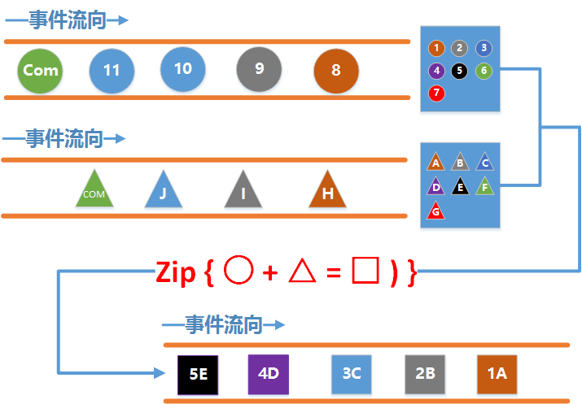
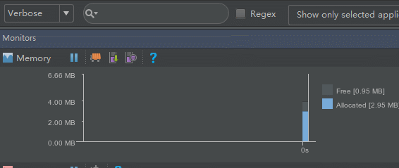
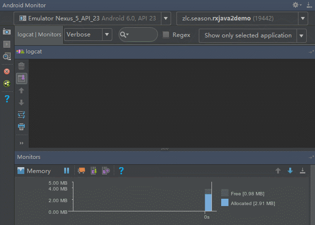
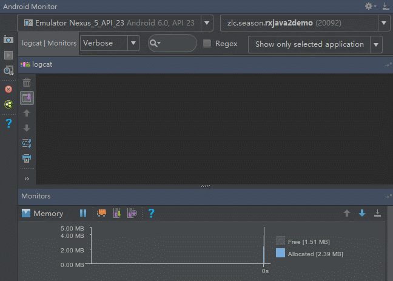
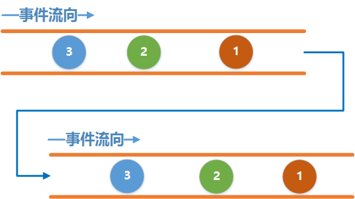
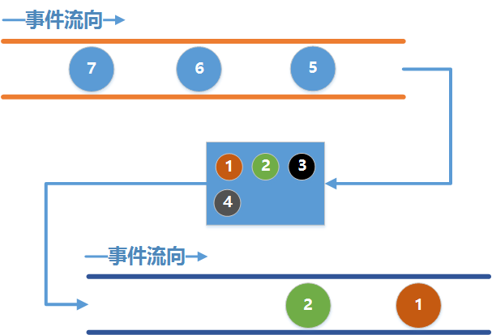

## 前言

大家喜闻乐见的`Backpressure`来啦.

这一节中我们将来学习`Backpressure`. 我看好多吃瓜群众早已坐不住了, 别急, 我们先来回顾一下上一节讲的`Zip`.

## 正题

上一节中我们说到Zip可以将多个上游发送的事件组合起来发送给下游, 那大家有没有想过一个问题, 如果其中一个`水管A`发送事件特别快, 而另一个`水管B` 发送事件特别慢, 那就可能出现这种情况, 发得快的`水管A` 已经发送了1000个事件了, 而发的慢的`水管B` 才发一个出来, 组合了一个之后`水管A` 还剩999个事件, 这些事件需要继续等待`水管B` 发送事件出来组合, 那么这么多的事件是放在哪里的呢? 总有一个地方保存吧? 没错, Zip给我们的每一根水管都弄了一个`水缸` , 用来保存这些事件, 用通俗易懂的图片来表示就是:



如图中所示, 其中蓝色的框框就是`zip`给我们的`水缸`! 它将每根水管发出的事件保存起来, 等两个水缸都有事件了之后就分别从水缸中取出一个事件来组合, 当其中一个水缸是空的时候就处于等待的状态.

题外话: 大家来分析一下这个水缸有什么特点呢? 它是按顺序保存的, 先进来的事件先取出来, 这个特点是不是很熟悉呀? 没错, 这就是我们熟知的队列, 这个水缸在Zip内部的实现就是用的队列, 感兴趣的可以翻看源码查看.

好了回到正题上来, 这个水缸有大小限制吗? 要是一直往里存会怎样? 我们来看个例子:

```java
Observable<Integer> observable1 = Observable.create(new ObservableOnSubscribe<Integer>() {    
    @Override                                                                          
    public void subscribe(ObservableEmitter<Integer> emitter) throws Exception {       
        for (int i = 0; ; i++) {   //无限循环发事件                                                    
            emitter.onNext(i);                                                         
        }                                                                              
    }                                                                                  
}).subscribeOn(Schedulers.io());    

Observable<String> observable2 = Observable.create(new ObservableOnSubscribe<String>() {      
    @Override                                                                          
    public void subscribe(ObservableEmitter<String> emitter) throws Exception {        
        emitter.onNext("A");                                                           
    }                                                                                  
}).subscribeOn(Schedulers.io());    

Observable.zip(observable1, observable2, new BiFunction<Integer, String, String>() {                 
    @Override                                                                          
    public String apply(Integer integer, String s) throws Exception {                  
        return integer + s;                                                            
    }                                                                                  
}).observeOn(AndroidSchedulers.mainThread()).subscribe(new Consumer<String>() {                               
    @Override                                                                          
    public void accept(String s) throws Exception {                                    
        Log.d(TAG, s);                                                                 
    }                                                                                  
}, new Consumer<Throwable>() {                                                         
    @Override                                                                          
    public void accept(Throwable throwable) throws Exception {                         
        Log.w(TAG, throwable);                                                         
    }                                                                                  
});
```

在这个例子中, 我们分别创建了两根水管, 第一根水管用机器指令的执行速度来无限循环发送事件, 第二根水管随便发送点什么, 由于我们没有发送`Complete`事件, 因此第一根水管会一直发事件到它对应的水缸里去, 我们来看看运行结果是什么样.

运行结果GIF图:



我勒个草, 内存占用以斜率为1的直线迅速上涨, 几秒钟就300多M , 最终报出了OOM:

```
zlc.season.rxjava2demo W/art: Throwing OutOfMemoryError "Failed to allocate a 28 byte allocation with
4194304 free bytes and 8MB until OOM; 
zlc.season.rxjava2demo W/art: "main" prio=5 tid=1 Runnable      
zlc.season.rxjava2demo W/art:   | group="main" sCount=0 dsCount=0 obj=0x75188710 self=0x7fc0efe7ba00   
zlc.season.rxjava2demo W/art:   | sysTid=32686 nice=0 cgrp=default sched=0/0 handle=0x7fc0f37dc200    
zlc.season.rxjava2demo W/art:   | state=R schedstat=( 0 0 0 ) utm=948 stm=120 core=1 HZ=100         
zlc.season.rxjava2demo W/art:   | stack=0x7fff971e8000-0x7fff971ea000 stackSize=8MB         
zlc.season.rxjava2demo W/art:   | held mutexes= "mutator lock"(shared held)    
zlc.season.rxjava2demo W/art:     at java.lang.Integer.valueOf(Integer.java:742)
```

出现这种情况肯定是我们不想看见的, 这里就可以引出我们的`Backpressure`了, 所谓的`Backpressure`其实就是为了控制流量, 水缸存储的能力毕竟有限, 因此我们还得从`源头`去解决问题, 既然你发那么快, 数据量那么大, 那我就想办法不让你发那么快呗.

那么这个`源头`到底在哪里, 究竟什么时候会出现这种情况, 这里只是说的Zip这一个例子, 其他的地方会出现吗? 带着这个问题我们来探究一下.

我们让事情变得简单一点, 从一个单一的`Observable`说起.

来看段代码:

```java
Observable.create(new ObservableOnSubscribe<Integer>() {                         
    @Override                                                                    
    public void subscribe(ObservableEmitter<Integer> emitter) throws Exception { 
        for (int i = 0; ; i++) {   //无限循环发事件                                              
            emitter.onNext(i);                                                   
        }                                                                        
    }                                                                            
}).subscribe(new Consumer<Integer>() {                                           
    @Override                                                                    
    public void accept(Integer integer) throws Exception {                       
        Thread.sleep(2000);                                                      
        Log.d(TAG, "" + integer);                                                
    }                                                                            
});
```

这段代码很简单, 上游同样无限循环的发送事件, 在下游每次接收事件前延时2秒. 上下游工作在`同一个线程`里, 来看下运行结果:



哎卧槽, 怎么如此平静, 感觉像是走错了片场.

为什么呢, 因为上下游工作在`同一个线程`呀骚年们! 这个时候上游每次调用`emitter.onNext(i)`其实就相当于直接调用了Consumer中的:

```java
public void accept(Integer integer) throws Exception {                       
     Thread.sleep(2000);                                                      
     Log.d(TAG, "" + integer);                                                
}     
```

所以这个时候其实就是上游每延时2秒发送一次. 最终的结果也说明了这一切.

那我们加个线程呢, 改成这样:

```java
Observable.create(new ObservableOnSubscribe<Integer>() {                            
    @Override                                                                       
    public void subscribe(ObservableEmitter<Integer> emitter) throws Exception {    
        for (int i = 0; ; i++) {    //无限循环发事件                                                     
            emitter.onNext(i);                                                      
        }                                                                           
    }                                                                               
}).subscribeOn(Schedulers.io())                                                    
        .observeOn(AndroidSchedulers.mainThread())                                  
        .subscribe(new Consumer<Integer>() {                                        
            @Override                                                               
            public void accept(Integer integer) throws Exception {                  
                Thread.sleep(2000);                                                 
                Log.d(TAG, "" + integer);                                           
            }                                                                       
        });
```

这个时候把上游切换到了IO线程中去, 下游到主线程去接收, 来看看运行结果呢:



可以看到, 给上游加了个线程之后, 它就像脱缰的野马一样, 内存又爆掉了.

为什么不加线程和加上线程区别这么大呢, 这就涉及了`同步`和`异步`的知识了.

当上下游工作在`同一个线程`中时, 这时候是一个`同步`的订阅关系, 也就是说`上游`每发送一个事件`必须`等到`下游`接收处理完了以后才能接着发送下一个事件.

当上下游工作在`不同的线程`中时, 这时候是一个`异步`的订阅关系, 这个时候`上游`发送数据`不需要`等待`下游`接收, 为什么呢, 因为两个线程并不能直接进行通信, 因此上游发送的事件并不能直接到下游里去, 这个时候就需要一个田螺姑娘来帮助它们俩, 这个田螺姑娘就是我们刚才说的`水缸`! 上游把事件发送到水缸里去, 下游从水缸里取出事件来处理, 因此, 当上游发事件的速度太快, 下游取事件的速度太慢, 水缸就会迅速装满, 然后溢出来, 最后就OOM了.

这两种情况用图片来表示如下:

同步:



异步:



从图中我们可以看出, `同步和异步`的区别仅仅在于是否有`水缸`.

相信通过这个例子大家对线程之间的通信也有了比较清楚的认知和理解.

源头找到了, 只要有`水缸`, 就会出现上下游发送事件速度不平衡的情况, 因此当我们以后遇到这种情况时, 仔细思考一下水缸在哪里, 找到水缸, 你就找到了解决问题的办法.

既然源头找到了, 那么下一节我们就要来学习如何去解决了. 下节见