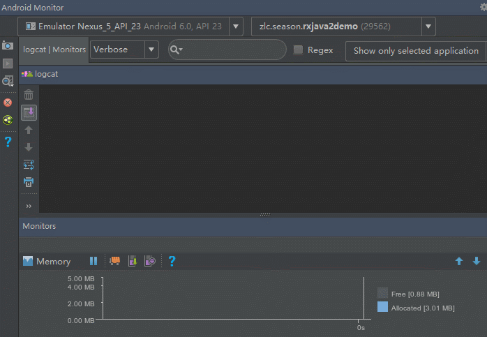
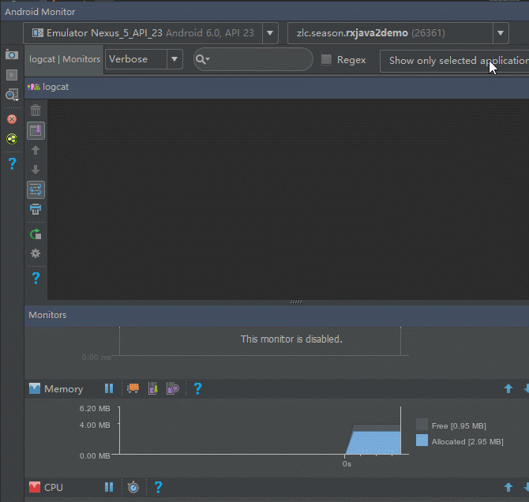
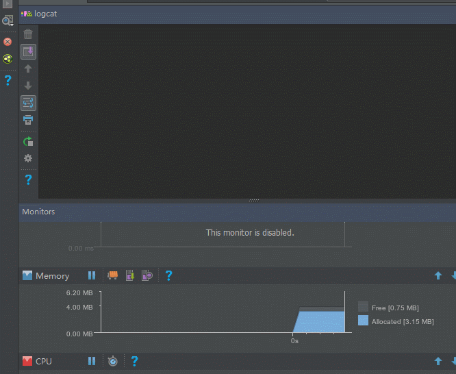
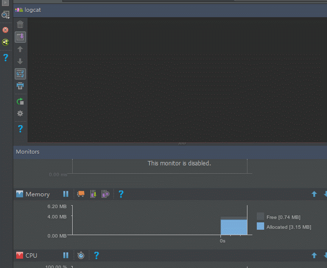

## 前言

在上一节中, 我们找到了上下游流速不均衡从而导致BackPressureException出现的源头 , 在这一节里我们将学习如何去治理它 . 可能很多看过其他人写的文章的朋友都会觉得只有`Flowable`才能解决 , 所以大家对这个`Flowable`都抱有很大的期许 , 其实呐 , 你们毕竟图样图森破 , 今天我们先抛开`Flowable`, 仅仅依靠我们自己的`双手和智慧` , 来看看我们如何去治理 , 通过本节的学习之后我们再来看`Flowable`, 你会发现它其实并没有想象中那么牛叉, 它只是被其他人过度神化了.

## 正题

我们接着来看上一节的这个例子:

```java
Observable.create(new ObservableOnSubscribe<Integer>() {
            @Override
            public void subscribe(ObservableEmitter<Integer> emitter) throws Exception {
                for (int i = 0; ; i++) {  //无限循环发送事件
                    emitter.onNext(i);
                }
            }
        }).subscribeOn(Schedulers.io())
                .observeOn(AndroidSchedulers.mainThread())
                .subscribe(new Consumer<Integer>() {
                    @Override
                    public void accept(Integer integer) throws Exception {
                        Log.d(TAG, "" + integer);
                    }
                });
```

上一节中我们看到了它的运行结果是直接爆掉了内存, 也明白它为什么就爆掉了内存, 那么我们能做些什么, 才能不让这种情况发生呢.

之前我们说了, 上游发送的所有事件都放到水缸里了, 所以瞬间水缸就满了, 那我们可以只放我们需要的事件到水缸里呀, 只放一部分数据到水缸里, 这样不就不会溢出来了吗, 因此, 我们把上面的代码修改一下:

```java
Observable.create(new ObservableOnSubscribe<Integer>() {
            @Override
            public void subscribe(ObservableEmitter<Integer> emitter) throws Exception {
                for (int i = 0; ; i++) {
                    emitter.onNext(i);
                }
            }
        }).subscribeOn(Schedulers.io())
                .filter(new Predicate<Integer>() {
                    @Override
                    public boolean test(Integer integer) throws Exception {
                        return integer % 10 == 0;
                    }
                })
                .observeOn(AndroidSchedulers.mainThread())
                .subscribe(new Consumer<Integer>() {
                    @Override
                    public void accept(Integer integer) throws Exception {
                        Log.d(TAG, "" + integer);
                    }
                });
```

在这段代码中我们增加了一个filter, 只允许能被10整除的事件通过, 再来看看运行结果:



可以看到, 虽然内存依然在增长, 但是增长速度相比之前, 已经减少了太多了, 至少在我录完GIF之前还没有爆掉内存, 大家可以试着改成能被100整除试试.

可以看到, 通过减少进入水缸的事件数量的确可以缓解上下游流速不均衡的问题, 但是力度还不够, 我们再来看一段代码:

```java
Observable.create(new ObservableOnSubscribe<Integer>() {
            @Override
            public void subscribe(ObservableEmitter<Integer> emitter) throws Exception {
                for (int i = 0; ; i++) {
                    emitter.onNext(i);
                }
            }
        }).subscribeOn(Schedulers.io())
                .sample(2, TimeUnit.SECONDS)  //sample取样
                .observeOn(AndroidSchedulers.mainThread())
                .subscribe(new Consumer<Integer>() {
                    @Override
                    public void accept(Integer integer) throws Exception {
                        Log.d(TAG, "" + integer);
                    }
                });
```

这里用了一个`sample`操作符, 简单做个介绍, 这个操作符每隔指定的时间就从上游中取出一个事件发送给下游. 这里我们让它每隔2秒取一个事件给下游, 来看看这次的运行结果吧:


这次我们可以看到, 虽然上游仍然一直在不停的发事件, 但是我们只是`每隔一定时间`取一个放进水缸里, 并没有全部放进水缸里, 因此这次内存仅仅只占用了5M.

> 大家以后可以出去吹牛逼了: 我曾经通过技术手段去优化一个程序, 最终使得内存占用从300多M变成不到5M. ~(≧▽≦)/~

前面这两种方法归根到底其实就是减少放进水缸的事件的数量, 是以`数量`取胜, 但是这个方法有个`缺点`, 就是`丢失了大部分的事件`.

那么我们换一个角度来思考, 既然上游发送事件的速度太快, 那我们就适当减慢发送事件的速度, 从`速度`上取胜, 听上去不错, 我们来试试:

```java
Observable.create(new ObservableOnSubscribe<Integer>() {
            @Override
            public void subscribe(ObservableEmitter<Integer> emitter) throws Exception {
                for (int i = 0; ; i++) {
                    emitter.onNext(i);
                    Thread.sleep(2000);  //每次发送完事件延时2秒
                }
            }
        }).subscribeOn(Schedulers.io())
                .observeOn(AndroidSchedulers.mainThread())
                .subscribe(new Consumer<Integer>() {
                    @Override
                    public void accept(Integer integer) throws Exception {
                        Log.d(TAG, "" + integer);
                    }
                });
```

这次我们让上游每次发送完事件后都延时了2秒, 来看看运行结果:



完美 ! 一切都是那么完美 !

可以看到, 我们给上游加上延时了之后, 瞬间一头发情的公牛就变得跟只小绵羊一样, 如此温顺, 如此平静, 如此平稳的内存线, 美妙极了. 而且`事件也没有丢失`, `上游`通过适当的`延时`, 不但`减缓了`事件进入水缸的`速度`, 也可以让`下游`有`充足的时间`从水缸里取出事件来处理 , 这样一来, 就不至于导致大量的事件涌进水缸, 也就不会OOM啦.

到目前为止, 我们没有依靠任何其他的工具, 就轻易解决了上下游流速不均衡的问题.

因此我们总结一下, 本节中的治理的办法就两种:

- 一是从数量上进行治理, 减少发送进水缸里的事件
- 二是从速度上进行治理, 减缓事件发送进水缸的速度

大家一定没忘记, 在上一节还有个Zip的例子, 这个例子也爆了我们的内存, 现学现用, 我们用刚学到的办法来试试能不能惩奸除恶, 先来看看第一种办法.

先来减少进入水缸的事件的数量:

```java
Observable<Integer> observable1 = Observable.create(new ObservableOnSubscribe<Integer>() {
            @Override
            public void subscribe(ObservableEmitter<Integer> emitter) throws Exception {
                for (int i = 0; ; i++) {
                    emitter.onNext(i);
                }
            }
        }).subscribeOn(Schedulers.io()).sample(2, TimeUnit.SECONDS); //进行sample采样

        Observable<String> observable2 = Observable.create(new ObservableOnSubscribe<String>() {
            @Override
            public void subscribe(ObservableEmitter<String> emitter) throws Exception {
                emitter.onNext("A");
            }
        }).subscribeOn(Schedulers.io());

        Observable.zip(observable1, observable2, new BiFunction<Integer, String, String>() {
            @Override
            public String apply(Integer integer, String s) throws Exception {
                return integer + s;
            }
        }).observeOn(AndroidSchedulers.mainThread()).subscribe(new Consumer<String>() {
            @Override
            public void accept(String s) throws Exception {
                Log.d(TAG, s);
            }
        }, new Consumer<Throwable>() {
            @Override
            public void accept(Throwable throwable) throws Exception {
                Log.w(TAG, throwable);
            }
        });
```

来试试运行结果吧:



哈哈, 成功了吧, 再来用第二种办法试试.

这次我们来减缓速度:

```java
Observable<Integer> observable1 = Observable.create(new ObservableOnSubscribe<Integer>() {
            @Override
            public void subscribe(ObservableEmitter<Integer> emitter) throws Exception {
                for (int i = 0; ; i++) {
                    emitter.onNext(i);
                    Thread.sleep(2000);  //发送事件之后延时2秒
                }
            }
        }).subscribeOn(Schedulers.io());

        Observable<String> observable2 = Observable.create(new ObservableOnSubscribe<String>() {
            @Override
            public void subscribe(ObservableEmitter<String> emitter) throws Exception {
                emitter.onNext("A");
            }
        }).subscribeOn(Schedulers.io());

        Observable.zip(observable1, observable2, new BiFunction<Integer, String, String>() {
            @Override
            public String apply(Integer integer, String s) throws Exception {
                return integer + s;
            }
        }).observeOn(AndroidSchedulers.mainThread()).subscribe(new Consumer<String>() {
            @Override
            public void accept(String s) throws Exception {
                Log.d(TAG, s);
            }
        }, new Consumer<Throwable>() {
            @Override
            public void accept(Throwable throwable) throws Exception {
                Log.w(TAG, throwable);
            }
        });
```

来看看运行结果吧:



果然也成功了, 这里只打印出了下游收到的事件, 所以只有一个. 如果你对这个结果看不懂, 请自觉掉头看前面几篇文章.

通过本节的学习, 大家应该对如何处理上下游流速不均衡已经有了基本的认识了, 大家也可以看到, 我们并没有使用`Flowable`, 所以很多时候仔细去分析问题, 找到问题的原因, 从源头去解决才是最根本的办法. 后面我们讲到`Flowable`的时候, 大家就会发现它其实没什么神秘的, 它用到的办法和我们本节所讲的基本上是一样的, 只是它稍微做了点封装.

好了, 今天的教程就到这里吧, 下一节中我们就会来学习你们喜闻乐见的`Flowable`