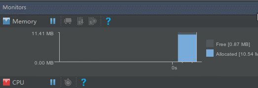

## 前言

上一节里我们学习了只使用`Observable`如何去解决上下游流速不均衡的问题, 之所以学习这个是因为`Observable`还是有很多它使用的场景, 有些朋友自从听说了`Flowable`之后就觉得`Flowable`能解决任何问题, 甚至有抛弃`Observable`这种想法, 这是万万不可的, 它们都有各自的优势和不足.

在这一节里我们先来学习如何使用`Flowable`, 它东西比较多, 也比较繁琐, 解释起来也比较麻烦, 但我还是尽量用`通俗易懂`的话来说清楚, 毕竟, 这是一个`通俗易懂`的教程.

## 正题

我们还是以两根水管举例子:


之前我们所的上游和下游分别是`Observable`和`Observer`, 这次不一样的是上游变成了`Flowable`, 下游变成了`Subscriber`, 但是水管之间的连接还是通过`subscribe()`, 我们来看看最基本的用法吧:

```java
Flowable<Integer> upstream = Flowable.create(new FlowableOnSubscribe<Integer>() {
            @Override
            public void subscribe(FlowableEmitter<Integer> emitter) throws Exception {
                Log.d(TAG, "emit 1");
                emitter.onNext(1);
                Log.d(TAG, "emit 2");
                emitter.onNext(2);
                Log.d(TAG, "emit 3");
                emitter.onNext(3);
                Log.d(TAG, "emit complete");
                emitter.onComplete();
            }
        }, BackpressureStrategy.ERROR); //增加了一个参数

        Subscriber<Integer> downstream = new Subscriber<Integer>() {
            @Override
            public void onSubscribe(Subscription s) {
                Log.d(TAG, "onSubscribe");
                s.request(Long.MAX_VALUE);  //注意这句代码
            }

            @Override
            public void onNext(Integer integer) {
                Log.d(TAG, "onNext: " + integer);
            }

            @Override
            public void onError(Throwable t) {
                 Log.w(TAG, "onError: ", t);
            }

            @Override
            public void onComplete() {
                Log.d(TAG, "onComplete");
            }
        };

        upstream.subscribe(downstream);
```

这段代码中,分别创建了一个上游`Flowable`和下游`Subscriber`, 上下游工作在同一个线程中, 和之前的`Observable`的使用方式只有一点点的区别, 先来看看运行结果吧:

```
D/TAG: onSubscribe   
D/TAG: emit 1        
D/TAG: onNext: 1     
D/TAG: emit 2        
D/TAG: onNext: 2     
D/TAG: emit 3        
D/TAG: onNext: 3     
D/TAG: emit complete 
D/TAG: onComplete
```

结果也和我们预期的是一样的.

我们注意到这次和`Observable`有些不同. 首先是创建`Flowable`的时候增加了一个参数, 这个参数是用来选择背压,也就是出现上下游流速不均衡的时候应该怎么处理的办法, 这里我们直接用`BackpressureStrategy.ERROR`这种方式, 这种方式会在出现上下游流速不均衡的时候直接抛出一个异常,这个异常就是著名的`MissingBackpressureException`. 其余的策略后面再来讲解.

另外的一个区别是在下游的`onSubscribe`方法中传给我们的不再是`Disposable`了, 而是`Subscription`, 它俩有什么区别呢, 首先它们都是上下游中间的一个开关, 之前我们说调用`Disposable.dispose()`方法可以切断水管, 同样的调用`Subscription.cancel()`也可以切断水管, 不同的地方在于`Subscription`增加了一个`void request(long n)`方法, 这个方法有什么用呢, 在上面的代码中也有这么一句代码:

```java
 s.request(Long.MAX_VALUE);
```

这句代码有什么用呢, 不要它可以吗? 我们来试试:

```java
 Flowable.create(new FlowableOnSubscribe<Integer>() {
            @Override
            public void subscribe(FlowableEmitter<Integer> emitter) throws Exception {
                Log.d(TAG, "emit 1");
                emitter.onNext(1);
                Log.d(TAG, "emit 2");
                emitter.onNext(2);
                Log.d(TAG, "emit 3");
                emitter.onNext(3);
                Log.d(TAG, "emit complete");
                emitter.onComplete();
            }
        }, BackpressureStrategy.ERROR).subscribe(new Subscriber<Integer>() {
            @Override
            public void onSubscribe(Subscription s) {
                Log.d(TAG, "onSubscribe");
            }

            @Override
            public void onNext(Integer integer) {
                Log.d(TAG, "onNext: " + integer);
            }

            @Override
            public void onError(Throwable t) {
                Log.w(TAG, "onError: ", t);
            }

            @Override
            public void onComplete() {
                Log.d(TAG, "onComplete");
            }
        });
```

这次我们取消掉了request这句代码, 来看看运行结果:

```
zlc.season.rxjava2demo D/TAG: onSubscribe
zlc.season.rxjava2demo D/TAG: emit 1
zlc.season.rxjava2demo W/TAG: onError: 
io.reactivex.exceptions.MissingBackpressureException: create: could not emit value due to lack of requests
    at io.reactivex.internal.operators.flowable.FlowableCreate$ErrorAsyncEmitter.onOverflow(FlowableCreate.java:411)
    at io.reactivex.internal.operators.flowable.FlowableCreate$NoOverflowBaseAsyncEmitter.onNext(FlowableCreate.java:377)
    at zlc.season.rxjava2demo.demo.ChapterSeven$3.subscribe(ChapterSeven.java:77)
    at io.reactivex.internal.operators.flowable.FlowableCreate.subscribeActual(FlowableCreate.java:72)
    at io.reactivex.Flowable.subscribe(Flowable.java:12218)
    at zlc.season.rxjava2demo.demo.ChapterSeven.demo2(ChapterSeven.java:111)
    at zlc.season.rxjava2demo.MainActivity$2.onClick(MainActivity.java:36)
    at android.view.View.performClick(View.java:5637)
    at android.view.View$PerformClick.run(View.java:22429)
    at android.os.Handler.handleCallback(Handler.java:751)
    at android.os.Handler.dispatchMessage(Handler.java:95)
    at android.os.Looper.loop(Looper.java:154)
    at android.app.ActivityThread.main(ActivityThread.java:6119)
    at java.lang.reflect.Method.invoke(Native Method)
    at com.android.internal.os.ZygoteInit$MethodAndArgsCaller.run(ZygoteInit.java:886)
    at com.android.internal.os.ZygoteInit.main(ZygoteInit.java:776)
zlc.season.rxjava2demo D/TAG: emit 2
zlc.season.rxjava2demo D/TAG: emit 3
zlc.season.rxjava2demo D/TAG: emit complete
```

哎哎哎, 大兄弟, 怎么一言不合就抛异常?

从运行结果中可以看到, 在`上游`发送`第一个事件`之后, `下游`就抛出了一个著名的`MissingBackpressureException`异常, 并且`下游`没有收到`任何其余的事件`. 可是这是一个`同步`的订阅呀, 上下游工作在`同一个线程`, 上游每发送一个事件应该会等待下游处理完了才会继续发事件啊, 不可能出现上下游流速不均衡的问题呀.

带着这个疑问, 我们再来看看异步的情况:

```java
Flowable.create(new FlowableOnSubscribe<Integer>() {
            @Override
            public void subscribe(FlowableEmitter<Integer> emitter) throws Exception {
                Log.d(TAG, "emit 1");
                emitter.onNext(1);
                Log.d(TAG, "emit 2");
                emitter.onNext(2);
                Log.d(TAG, "emit 3");
                emitter.onNext(3);
                Log.d(TAG, "emit complete");
                emitter.onComplete();
            }
        }, BackpressureStrategy.ERROR).subscribeOn(Schedulers.io())
                .observeOn(AndroidSchedulers.mainThread())
                .subscribe(new Subscriber<Integer>() {
                    @Override
                    public void onSubscribe(Subscription s) {
                        Log.d(TAG, "onSubscribe");
                        mSubscription = s;
                    }

                    @Override
                    public void onNext(Integer integer) {
                        Log.d(TAG, "onNext: " + integer);
                    }

                    @Override
                    public void onError(Throwable t) {
                        Log.w(TAG, "onError: ", t);
                    }

                    @Override
                    public void onComplete() {
                        Log.d(TAG, "onComplete");
                    }
                });
```

这次我们同样去掉了request这句代码, 但是让上下游工作在不同的线程, 来看看运行结果:

```
zlc.season.rxjava2demo D/TAG: onSubscribe
zlc.season.rxjava2demo D/TAG: emit 1
zlc.season.rxjava2demo D/TAG: emit 2
zlc.season.rxjava2demo D/TAG: emit 3
zlc.season.rxjava2demo D/TAG: emit complete
```

哎, 这次上游正确的发送了所有的事件, 但是下游一个事件也没有收到. 这是因为什么呢?

这是因为`Flowable`在设计的时候采用了一种新的思路也就是`响应式拉取`的方式来更好的解决上下游流速不均衡的问题, 与我们之前所讲的`控制数量`和`控制速度`不太一样, 这种方式用通俗易懂的话来说就好比是`叶问打鬼子`, 我们把`上游`看成`小日本`, 把`下游`当作`叶问`, 当调用`Subscription.request(1)`时, `叶问`就说`我要打一个!` 然后`小日本`就拿出`一个鬼子`给叶问, 让他打, 等叶问打死这个鬼子之后, 再次调用`request(10)`, 叶问就又说`我要打十个!` 然后小日本又派出`十个鬼子`给叶问, 然后就在边上看热闹, 看叶问能不能打死十个鬼子, 等叶问打死十个鬼子后再继续要鬼子接着打...

所以我们把request当做是一种能力, 当成`下游处理事件`的能力, 下游能处理几个就告诉上游我要几个, 这样只要上游根据下游的处理能力来决定发送多少事件, 就不会造成一窝蜂的发出一堆事件来, 从而导致OOM. 这也就完美的解决之前我们所学到的两种方式的缺陷, 过滤事件会导致事件丢失, 减速又可能导致性能损失. 而这种方式既解决了事件丢失的问题, 又解决了速度的问题, 完美 !

但是太完美的东西也就意味着陷阱也会很多, 你可能只是被它的外表所迷惑, 失去了理智, 如果你滥用或者不遵守规则, 一样会吃到苦头.

比如这里需要注意的是, 只有当`上游正确的实现了`如何`根据下游的处理能力`来发送事件的时候, 才能达到这种效果, 如果上游根本不管下游的处理能力, 一股脑的瞎他妈发事件, 仍然会产生上下游流速不均衡的问题, 这就好比小日本管他叶问要打几个, 老子直接拿出1万个鬼子, 这尼玛有种打死给我看看? 那么`如何正确的去实现上游`呢, 这里先卖个关子, 之后我们再来讲解.

学习了request, 我们就可以解释上面的两段代码了.

首先第一个同步的代码, 为什么上游发送第一个事件后下游就抛出了`MissingBackpressureException`异常, 这是因为下游没有调用request, 上游就认为下游没有处理事件的能力, 而这又是一个同步的订阅, 既然下游处理不了, 那上游不可能一直等待吧, 如果是这样, 万一这两根水管工作在主线程里, 界面不就卡死了吗, 因此只能抛个异常来提醒我们. 那如何解决这种情况呢, 很简单啦, 下游直接调用request(Long.MAX_VALUE)就行了, 或者根据上游发送事件的数量来request就行了, 比如这里request(3)就可以了.

然后我们再来看看第二段代码, 为什么上下游没有工作在同一个线程时, 上游却正确的发送了所有的事件呢? 这是因为在`Flowable`里默认有一个`大小为128`的水缸, 当上下游工作在不同的线程中时, 上游就会先把事件发送到这个水缸中, 因此, 下游虽然没有调用request, 但是上游在水缸中保存着这些事件, 只有当下游调用request时, 才从水缸里取出事件发给下游.

是不是这样呢, 我们来验证一下:

```java
public static void request(long n) {
    mSubscription.request(n); //在外部调用request请求上游
}

public static void demo3() {
    Flowable.create(new FlowableOnSubscribe<Integer>() {
        @Override
        public void subscribe(FlowableEmitter<Integer> emitter) throws Exception {
            Log.d(TAG, "emit 1");
            emitter.onNext(1);
            Log.d(TAG, "emit 2");
            emitter.onNext(2);
            Log.d(TAG, "emit 3");
            emitter.onNext(3);
            Log.d(TAG, "emit complete");
            emitter.onComplete();
        }
    }, BackpressureStrategy.ERROR).subscribeOn(Schedulers.io())
            .observeOn(AndroidSchedulers.mainThread())
            .subscribe(new Subscriber<Integer>() {
                @Override
                public void onSubscribe(Subscription s) {
                    Log.d(TAG, "onSubscribe");
                    mSubscription = s;  //把Subscription保存起来
                }

                @Override
                public void onNext(Integer integer) {
                    Log.d(TAG, "onNext: " + integer);
                }

                @Override
                public void onError(Throwable t) {
                    Log.w(TAG, "onError: ", t);
                }

                @Override
                public void onComplete() {
                    Log.d(TAG, "onComplete");
                }
            });
}
```

这里我们把Subscription保存起来, 在界面上增加了一个按钮, 点击一次就调用`Subscription.request(1)`, 来看看运行结果:



结果似乎像那么回事, 上游发送了四个事件保存到了水缸里, 下游每request一个, 就接收一个进行处理.

刚刚我们有说到水缸的大小为128, 有朋友就问了, 你说128就128吗, 又不是唯品会周年庆, 我不信. 那就来验证一下:

```java
Flowable.create(new FlowableOnSubscribe<Integer>() {
            @Override
            public void subscribe(FlowableEmitter<Integer> emitter) throws Exception {
                for (int i = 0; i < 128; i++) {
                    Log.d(TAG, "emit " + i);
                    emitter.onNext(i);
                }
            }
        }, BackpressureStrategy.ERROR).subscribeOn(Schedulers.io())
                .observeOn(AndroidSchedulers.mainThread())
                .subscribe(new Subscriber<Integer>() {
                    @Override
                    public void onSubscribe(Subscription s) {
                        Log.d(TAG, "onSubscribe");
                        mSubscription = s;
                    }

                    @Override
                    public void onNext(Integer integer) {
                        Log.d(TAG, "onNext: " + integer);
                    }

                    @Override
                    public void onError(Throwable t) {
                        Log.w(TAG, "onError: ", t);
                    }

                    @Override
                    public void onComplete() {
                        Log.d(TAG, "onComplete");
                    }
                });
```

这里我们让上游一次性发送了128个事件, 下游一个也不接收, 来看看运行结果:

```
zlc.season.rxjava2demo D/TAG: onSubscribe
zlc.season.rxjava2demo D/TAG: emit 0
  ...
zlc.season.rxjava2demo D/TAG: emit 126
zlc.season.rxjava2demo D/TAG: emit 127
```

这段代码的运行结果很正常, 没有任何错误和异常, 上游仅仅是发送了128个事件.

那来试试129个呢, 把上面代码中的128改成129试试:

```
zlc.season.rxjava2demo D/TAG: onSubscribe
zlc.season.rxjava2demo D/TAG: emit 0
  ...
zlc.season.rxjava2demo D/TAG: emit 126
zlc.season.rxjava2demo D/TAG: emit 127
zlc.season.rxjava2demo D/TAG: emit 128  //这是第129个事件
zlc.season.rxjava2demo W/TAG: onError: 
io.reactivex.exceptions.MissingBackpressureException: create: could not emit value due to lack of requests
    at io.reactivex.internal.operators.flowable.FlowableCreate$ErrorAsyncEmitter.onOverflow(FlowableCreate.java:411)
    at io.reactivex.internal.operators.flowable.FlowableCreate$NoOverflowBaseAsyncEmitter.onNext(FlowableCreate.java:377)
    at zlc.season.rxjava2demo.demo.ChapterSeven$7.subscribe(ChapterSeven.java:169)
    at io.reactivex.internal.operators.flowable.FlowableCreate.subscribeActual(FlowableCreate.java:72)
    at io.reactivex.Flowable.subscribe(Flowable.java:12218)
    at io.reactivex.internal.operators.flowable.FlowableSubscribeOn$SubscribeOnSubscriber.run(FlowableSubscribeOn.java:82)
    at io.reactivex.internal.schedulers.ScheduledRunnable.run(ScheduledRunnable.java:59)
    at io.reactivex.internal.schedulers.ScheduledRunnable.call(ScheduledRunnable.java:51)
    at java.util.concurrent.FutureTask.run(FutureTask.java:237)
    at java.util.concurrent.ScheduledThreadPoolExecutor$ScheduledFutureTask.run(ScheduledThreadPoolExecutor.java:272)
    at java.util.concurrent.ThreadPoolExecutor.runWorker(ThreadPoolExecutor.java:1133)
    at java.util.concurrent.ThreadPoolExecutor$Worker.run(ThreadPoolExecutor.java:607)
    at java.lang.Thread.run(Thread.java:761)
```

这次可以看到, 在上游发送了第129个事件的时候, 就抛出了`MissingBackpressureException`异常, 提醒我们发洪水啦. 当然了, 这个128也不是我凭空捏造出来的, Flowable的源码中就有这个buffersize的大小定义, 可以自行查看.

注意这里我们是把上游发送的事件全部都存进了水缸里, 下游一个也没有消费, 所以就溢出了, 如果下游去消费了事件, `可能`就不会导致水缸溢出来了. 这里我们说的是可能不会, 这也很好理解, 比如刚才这个例子上游发了129个事件, 下游只要快速的消费了一个事件, 就不会溢出了, 但如果下游过了十秒钟再来消费一个, 那肯定早就溢出了.

好了, 今天的教程就到这里了, 下一节我们将会更加深入的去学习Flowable, 敬请期待.

(哈哈, 给我的RxDownload打个广告: RxDownload是一个基于RxJava的多线程+断点续传的下载工具, 感兴趣的来GitHub点个star吧. 电梯直达->[戳这里](https://github.com/ssseasonnn/RxDownload) )