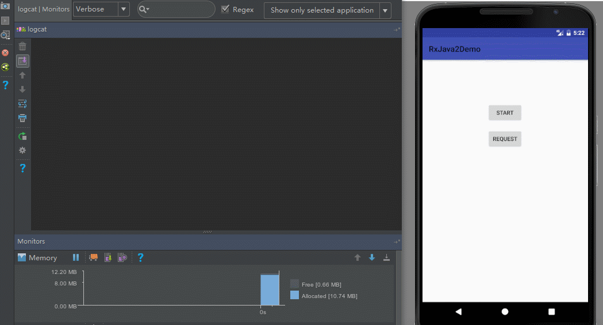
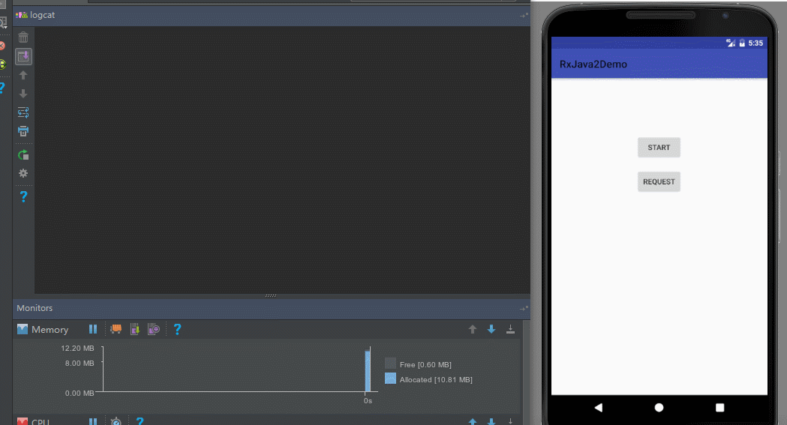
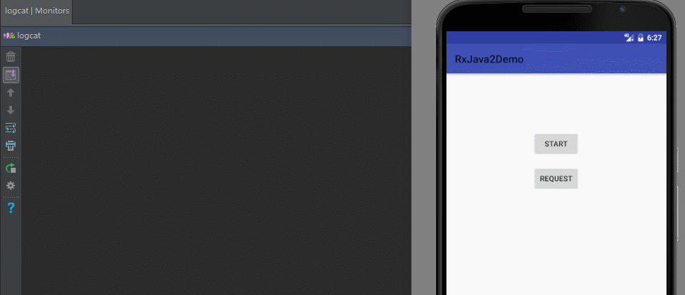
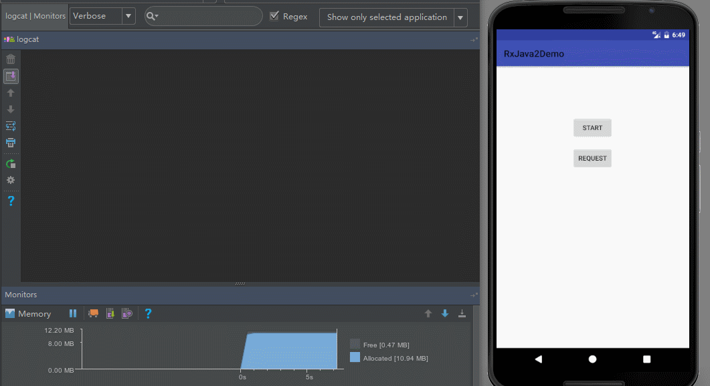

## 前言

在上一节中, 我们学习了FLowable的一些基本知识, 同时也挖了许多坑, 这一节就让我们来填坑吧.

## 正题

在上一节中最后我们有个例子, 当上游一次性发送128个事件的时候是没有任何问题的, 一旦超过128就会抛出`MissingBackpressureException`异常, 提示你上游发太多事件了, 下游处理不过来, 那么怎么去解决呢?

我们先来思考一下, 发送128个事件没有问题是因为`FLowable`内部有一个大小为128的水缸, 超过128就会装满溢出来, 那既然你水缸这么小, 那我给你换一个`大水缸`如何, 听上去很有道理的样子, 来试试:

```java
Flowable.create(new FlowableOnSubscribe<Integer>() {
            @Override
            public void subscribe(FlowableEmitter<Integer> emitter) throws Exception {
                for (int i = 0; i < 1000; i++) {
                    Log.d(TAG, "emit " + i);
                    emitter.onNext(i);
                }
            }
        }, BackpressureStrategy.BUFFER).subscribeOn(Schedulers.io())
                .observeOn(AndroidSchedulers.mainThread())
                .subscribe(new Subscriber<Integer>() {

                    @Override
                    public void onSubscribe(Subscription s) {
                        Log.d(TAG, "onSubscribe");
                        mSubscription = s;
                    }

                    @Override
                    public void onNext(Integer integer) {
                        Log.d(TAG, "onNext: " + integer);
                    }

                    @Override
                    public void onError(Throwable t) {
                        Log.w(TAG, "onError: ", t);
                    }

                    @Override
                    public void onComplete() {
                        Log.d(TAG, "onComplete");
                    }
                });
```

这次我们直接让上游发送了1000个事件,下游仍然不调用request去请求, 与之前不同的是, 这次我们用的策略是`BackpressureStrategy.BUFFER`, 这就是我们的`新水缸`啦, 这个水缸就比原来的水缸牛逼多了,如果说原来的水缸是95式步枪, 那这个新的水缸就好比黄金AK , 它没有大小限制, 因此可以存放许许多多的事件.

所以这次的运行结果就是:

```
zlc.season.rxjava2demo D/TAG: onSubscribe
zlc.season.rxjava2demo D/TAG: emit 0
zlc.season.rxjava2demo D/TAG: emit 1
zlc.season.rxjava2demo D/TAG: emit 2
...
zlc.season.rxjava2demo D/TAG: emit 997
zlc.season.rxjava2demo D/TAG: emit 998
zlc.season.rxjava2demo D/TAG: emit 999
```

不知道大家有没有发现, 换了水缸的FLowable和Observable好像是一样的嘛...

不错, 这时的FLowable表现出来的特性的确和Observable一模一样, 因此, 如果你像这样单纯的使用FLowable, 同样需要注意OOM的问题, 例如下面这个例子:

```java
Flowable.create(new FlowableOnSubscribe<Integer>() {
            @Override
            public void subscribe(FlowableEmitter<Integer> emitter) throws Exception {
                for (int i = 0; ; i++) {
                    emitter.onNext(i);
                }
            }
        }, BackpressureStrategy.BUFFER).subscribeOn(Schedulers.io())
                .observeOn(AndroidSchedulers.mainThread())
                .subscribe(new Subscriber<Integer>() {

                    @Override
                    public void onSubscribe(Subscription s) {
                        Log.d(TAG, "onSubscribe");
                        mSubscription = s;
                    }

                    @Override
                    public void onNext(Integer integer) {
                        Log.d(TAG, "onNext: " + integer);
                    }

                    @Override
                    public void onError(Throwable t) {
                        Log.w(TAG, "onError: ", t);
                    }

                    @Override
                    public void onComplete() {
                        Log.d(TAG, "onComplete");
                    }
                });
```

按照我们以前学习Observable一样, 让上游无限循环发送事件, 下游一个也不去处理, 来看看运行结果吧:



同样可以看到, 内存迅速增长, 直到最后抛出OOM. 所以说不要迷恋FLowable, 它只是个传说.

> 可能有朋友也注意到了, 之前使用Observable测试的时候内存增长非常迅速, 几秒钟就OOM, 但这里增长速度却比较缓慢, 可以翻回去看之前的文章中的GIF图进行对比, 这也看出FLowable相比Observable, 在性能方面有些不足, 毕竟FLowable内部为了实现响应式拉取做了更多的操作, 性能有所丢失也是在所难免, 因此单单只是说因为FLowable是新兴产物就盲目的使用也是不对的, 也要具体分场景,

那除了给FLowable换一个大水缸还有没有其他的办法呢, 因为更大的水缸也只是缓兵之计啊, 动不动就OOM给你看.

想想看我们之前学习Observable的时候说到的如何解决上游发送事件太快的, 有一招叫从`数量`上取胜, 同样的FLowable中也有这种方法, 对应的就是`BackpressureStrategy.DROP`和`BackpressureStrategy.LATEST`这两种策略.

从名字上就能猜到它俩是干啥的, Drop就是直接把存不下的事件丢弃,Latest就是只保留最新的事件, 来看看它们的实际效果吧.

先来看看Drop:

```java
public static void request() {
        mSubscription.request(128);
    }

public static void demo3() {
        Flowable.create(new FlowableOnSubscribe<Integer>() {
            @Override
            public void subscribe(FlowableEmitter<Integer> emitter) throws Exception {
                for (int i = 0; ; i++) {
                    emitter.onNext(i);
                }
            }
        }, BackpressureStrategy.DROP).subscribeOn(Schedulers.io())
                .observeOn(AndroidSchedulers.mainThread())
                .subscribe(new Subscriber<Integer>() {

                    @Override
                    public void onSubscribe(Subscription s) {
                        Log.d(TAG, "onSubscribe");
                        mSubscription = s;
                    }

                    @Override
                    public void onNext(Integer integer) {
                        Log.d(TAG, "onNext: " + integer);
                    }

                    @Override
                    public void onError(Throwable t) {
                        Log.w(TAG, "onError: ", t);
                    }

                    @Override
                    public void onComplete() {
                        Log.d(TAG, "onComplete");
                    }
                });
    }
```

我们仍然让上游无限循环发送事件, 这次的策略选择了Drop, 同时把Subscription保存起来, 待会我们在外部调用request(128)时, 便可以看到运行的结果.

我们先来猜一下运行结果, 这里为什么request(128)呢, 因为之前不是已经说了吗, FLowable内部的默认的水缸大小为128, 因此, 它刚开始肯定会把0-127这128个事件保存起来, 然后丢弃掉其余的事件, 当我们request(128)的时候,下游便会处理掉这128个事件, 那么上游水缸中又会重新装进新的128个事件, 以此类推, 来看看运行结果吧:



从运行结果中我们看到的确是如此, 第一次request的时候, 下游的确收到的是0-127这128个事件, 但第二次request的时候就不确定了, 因为上游一直在发送事件. 内存占用也很正常, drop的作用相信大家也很清楚了.

再来看看Latest吧:

```java
public static void request() {
        mSubscription.request(128);
    }

public static void demo4() {
        Flowable.create(new FlowableOnSubscribe<Integer>() {
            @Override
            public void subscribe(FlowableEmitter<Integer> emitter) throws Exception {
                for (int i = 0; ; i++) {
                    emitter.onNext(i);
                }
            }
        }, BackpressureStrategy.LATEST).subscribeOn(Schedulers.io())
                .observeOn(AndroidSchedulers.mainThread())
                .subscribe(new Subscriber<Integer>() {

                    @Override
                    public void onSubscribe(Subscription s) {
                        Log.d(TAG, "onSubscribe");
                        mSubscription = s;
                    }

                    @Override
                    public void onNext(Integer integer) {
                        Log.d(TAG, "onNext: " + integer);
                    }

                    @Override
                    public void onError(Throwable t) {
                        Log.w(TAG, "onError: ", t);
                    }

                    @Override
                    public void onComplete() {
                        Log.d(TAG, "onComplete");
                    }
                });
    }
```

同样的, 上游无限循环发送事件, 策略选择Latest, 同时把Subscription保存起来, 方便在外部调用request(128).来看看这次的运行结果:



诶, 看上去好像和Drop差不多啊, Latest也首先保存了0-127这128个事件, 等下游把这128个事件处理了之后才进行之后的处理, 光从这里没有看出有任何区别啊...

```
古人云，师者，所以传道受业解惑也。人非生而知之者，孰能无惑？惑而不从师，其为惑也，终不解矣．
```

作为初学者的`入门导师`, 是不能给大家留下一点点疑惑的, 来让我们继续揭开这个疑问.

我们把上面两段代码改良一下, 先来看看DROP的改良版:

```java
 Flowable.create(new FlowableOnSubscribe<Integer>() {
            @Override
            public void subscribe(FlowableEmitter<Integer> emitter) throws Exception {
                for (int i = 0; i < 10000; i++) {  //只发1w个事件
                    emitter.onNext(i);
                }
            }
        }, BackpressureStrategy.DROP).subscribeOn(Schedulers.io())
                .observeOn(AndroidSchedulers.mainThread())
                .subscribe(new Subscriber<Integer>() {

                    @Override
                    public void onSubscribe(Subscription s) {
                        Log.d(TAG, "onSubscribe");
                        mSubscription = s;
                        s.request(128);  //一开始就处理掉128个事件
                    }

                    @Override
                    public void onNext(Integer integer) {
                        Log.d(TAG, "onNext: " + integer);
                    }

                    @Override
                    public void onError(Throwable t) {
                        Log.w(TAG, "onError: ", t);
                    }

                    @Override
                    public void onComplete() {
                        Log.d(TAG, "onComplete");
                    }
                });
```

这段代码和之前有两点不同, 一是上游只发送了10000个事件, 二是下游在一开始就立马处理掉了128个事件, 然后我们在外部再调用request(128)试试, 来看看运行结果:



这次可以看到, 一开始下游就处理掉了128个事件, 当我们再次request的时候, 只得到了第3317的事件, 后面的事件直接被抛弃了.

再来看看Latest的运行结果吧:


从运行结果中可以看到, 除去前面128个事件, 与Drop不同, Latest总是能获取到最后最新的事件, 例如这里我们总是能获得最后一个事件9999.

好了, 关于FLowable的策略我们也讲完了, 有些朋友要问了, 这些FLowable是我自己创建的, 所以我可以选择策略, 那面对有些FLowable并不是我自己创建的, 该怎么办呢? 比如RxJava中的interval操作符, 这个操作符并不是我们自己创建的, 来看下面这个例子吧:

```java
Flowable.interval(1, TimeUnit.MICROSECONDS)
                .observeOn(AndroidSchedulers.mainThread())
                .subscribe(new Subscriber<Long>() {
                    @Override
                    public void onSubscribe(Subscription s) {
                        Log.d(TAG, "onSubscribe");
                        mSubscription = s;
                        s.request(Long.MAX_VALUE);
                    }

                    @Override
                    public void onNext(Long aLong) {
                        Log.d(TAG, "onNext: " + aLong);
                        try {
                            Thread.sleep(1000);  //延时1秒
                        } catch (InterruptedException e) {
                            e.printStackTrace();
                        }
                    }

                    @Override
                    public void onError(Throwable t) {
                        Log.w(TAG, "onError: ", t);
                    }

                    @Override
                    public void onComplete() {
                        Log.d(TAG, "onComplete");
                    }
                });
```

interval操作符发送Long型的事件, 从0开始, 每隔指定的时间就把数字加1并发送出来, 在这个例子里, 我们让它每隔1毫秒就发送一次事件, 在下游延时1秒去接收处理, 不用猜也知道结果是什么:

```
zlc.season.rxjava2demo D/TAG: onSubscribe
zlc.season.rxjava2demo W/TAG: onError: 
io.reactivex.exceptions.MissingBackpressureException: Can't deliver value 128 due to lack of requests
    at io.reactivex.internal.operators.flowable.FlowableInterval$IntervalSubscriber.run(FlowableInterval.java:87)
    at java.util.concurrent.Executors$RunnableAdapter.call(Executors.java:428)
    at java.util.concurrent.FutureTask.runAndReset(FutureTask.java:278)
    at java.util.concurrent.ScheduledThreadPoolExecutor$ScheduledFutureTask.run(ScheduledThreadPoolExecutor.java:273)
    at java.util.concurrent.ThreadPoolExecutor.runWorker(ThreadPoolExecutor.java:1133)
    at java.util.concurrent.ThreadPoolExecutor$Worker.run(ThreadPoolExecutor.java:607)
    at java.lang.Thread.run(Thread.java:761)
```

一运行就抛出了`MissingBackpressureException`异常, 提醒我们发太多了, 那么怎么办呢, 这个又不是我们自己创建的FLowable啊...

别慌, 虽然不是我们自己创建的, 但是RxJava给我们提供了其他的方法:

- onBackpressureBuffer()
- onBackpressureDrop()
- onBackpressureLatest()

熟悉吗? 这跟我们上面学的策略是一样的, 用法也简单, 拿刚才的例子现学现用:

```java
Flowable.interval(1, TimeUnit.MICROSECONDS)
                .onBackpressureDrop()  //加上背压策略
                .observeOn(AndroidSchedulers.mainThread())
                .subscribe(new Subscriber<Long>() {
                    @Override
                    public void onSubscribe(Subscription s) {
                        Log.d(TAG, "onSubscribe");
                        mSubscription = s;
                        s.request(Long.MAX_VALUE);
                    }

                    @Override
                    public void onNext(Long aLong) {
                        Log.d(TAG, "onNext: " + aLong);
                        try {
                            Thread.sleep(1000);
                        } catch (InterruptedException e) {
                            e.printStackTrace();
                        }
                    }

                    @Override
                    public void onError(Throwable t) {
                        Log.w(TAG, "onError: ", t);
                    }

                    @Override
                    public void onComplete() {
                        Log.d(TAG, "onComplete");
                    }
                });
```

其余的我就不一一列举了.

好了, 今天的教程就到这里吧, 这一节我们学习了如何使用内置的BackpressureStrategy来解决上下游事件速率不均衡的问题. 这些策略其实之前我们将Observable的时候也提到过, 其实大差不差, 只要理解了为什么会上游发事件太快, 下游处理太慢这一点, 你就好处理了, FLowable无非就是给你封装好了, 确实对初学者友好一点, 但是很多初学者往往只知道How, 却不知道Why, 最重要的其实是知道why, 而不是How.

(其余的教程大多数到这里就结束了, 但是, 你以为FLowable就这么点东西吗, 骚年, Too young too simple, sometimes naive! 这仅仅是开始, 真正牛逼的还没来呢. 敬请关注下一节, 下节见 ! )