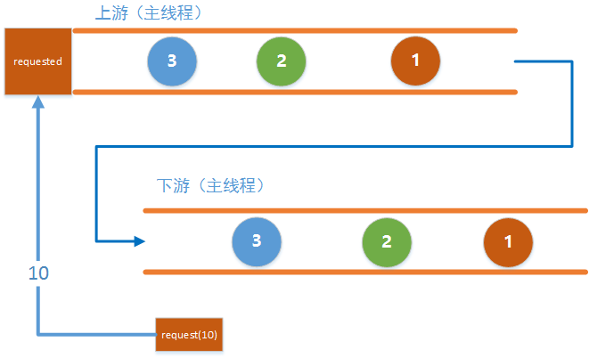
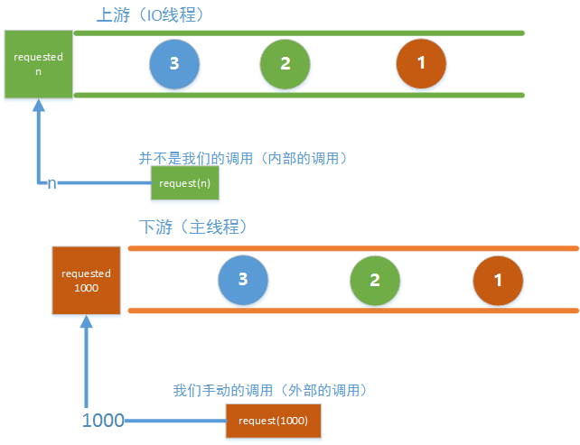
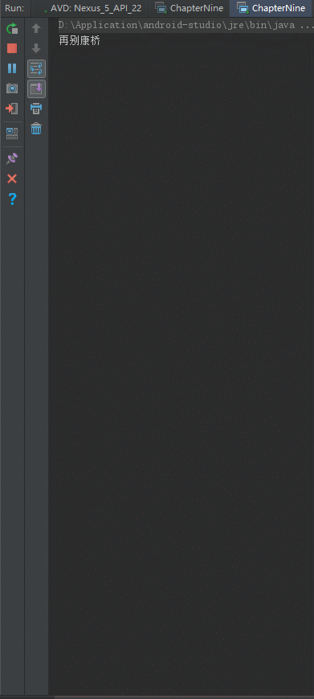

## 前言

好久不见朋友们，最近一段时间在忙工作上的事情，没来得及写文章，这两天正好有点时间，赶紧写下了这篇教程，免得大家说我太监了。

## 正题

先来回顾一下上上节，我们讲Flowable的时候，说它采用了`响应式拉`的方式，我们还举了个`叶问打小日本`的例子，再来回顾一下吧，我们说把`上游`看成`小日本`, 把`下游`当作`叶问`, 当调用`Subscription.request(1)`时, `叶问`就说`我要打一个!` 然后`小日本`就拿出`一个鬼子`给叶问, 让他打, 等叶问打死这个鬼子之后, 再次调用`request(10)`, 叶问就又说`我要打十个!` 然后小日本又派出`十个鬼子`给叶问, 然后就在边上看热闹, 看叶问能不能打死十个鬼子, 等叶问打死十个鬼子后再继续要鬼子接着打。

但是不知道大家有没有发现，在我们前两节中的例子中，我们口中声称的`响应式拉`并没有完全体现出来，比如这个例子：

```java
Flowable.create(new FlowableOnSubscribe<Integer>() {
            @Override
            public void subscribe(FlowableEmitter<Integer> emitter) throws Exception {
                Log.d(TAG, "emit 1");
                emitter.onNext(1);
                Log.d(TAG, "emit 2");
                emitter.onNext(2);
                Log.d(TAG, "emit 3");
                emitter.onNext(3);
                Log.d(TAG, "emit complete");
                emitter.onComplete();
            }
        }, BackpressureStrategy.ERROR).subscribeOn(Schedulers.io())
                .observeOn(AndroidSchedulers.mainThread())
                .subscribe(new Subscriber<Integer>() {

                    @Override
                    public void onSubscribe(Subscription s) {
                        Log.d(TAG, "onSubscribe");
                        mSubscription = s;  
                        s.request(1);
                    }

                    @Override
                    public void onNext(Integer integer) {
                        Log.d(TAG, "onNext: " + integer);
                        mSubscription.request(1);
                    }

                    @Override
                    public void onError(Throwable t) {
                        Log.w(TAG, "onError: ", t);
                    }

                    @Override
                    public void onComplete() {
                        Log.d(TAG, "onComplete");
                    }
                });
```

虽然我们在下游中是每次处理掉了一个事件之后才调用request(1)去请求下一个事件，也就是说叶问的确是在打死了一个鬼子之后才继续打下一个鬼子，可是上游呢？上游真的是每次当下游请求一个才拿出一个吗？从上上篇文章中我们知道并不是这样的，上游仍然是一开始就发送了所有的事件，也就是说小日本并没有等叶问打死一个才拿出一个，而是一开始就拿出了所有的鬼子，这些鬼子从一开始就在这儿排队等着被打死。

有个故事是这么说的：

> 楚人有卖盾与矛者，先誉其盾之坚，曰：“吾盾之坚，物莫能陷也。”俄而又誉其矛之利，曰：“吾矛之利，万物莫不陷也。”市人诘之曰："以子之矛陷子之盾，何如？”其人弗能应也。众皆笑之。

没错，我们前后所说的就是自相矛盾了，这说明了什么呢，说明我们的实现并不是一个完整的实现，那么，究竟怎样的实现才是完整的呢？

我们先自己来想一想，在下游中调用Subscription.request(n)就可以告诉上游，下游能够处理多少个事件，那么上游要根据下游的处理能力正确的去发送事件，那么上游是不是应该知道下游的处理能力是多少啊，对吧，不然，一个巴掌拍不响啊，这种事情得你情我愿才行。

那么上游从哪里得知下游的处理能力呢？我们来看看上游最重要的部分，肯定就是`FlowableEmitter`了啊，我们就是通过它来发送事件的啊，来看看它的源码吧(别紧张，它的代码灰常简单)：

```java
public interface FlowableEmitter<T> extends Emitter<T> {
    void setDisposable(Disposable s);
    void setCancellable(Cancellable c);

    /**
     * The current outstanding request amount.
     * <p>This method is thread-safe.
     * @return the current outstanding request amount
     */
    long requested();

    boolean isCancelled();
    FlowableEmitter<T> serialize();
}
```

FlowableEmitter是个接口，继承Emitter，Emitter里面就是我们的onNext(),onComplete()和onError()三个方法。我们看到FlowableEmitter中有这么一个方法：

```java
long requested();
```

方法注释的意思就是`当前外部请求的数量`，哇哦，这好像就是我们要找的答案呢. 我们还是实际验证一下吧.

先来看`同步`的情况吧：

```java
public static void demo1() {
       Flowable
               .create(new FlowableOnSubscribe<Integer>() {
                   @Override
                   public void subscribe(FlowableEmitter<Integer> emitter) throws Exception {
                       Log.d(TAG, "current requested: " + emitter.requested());
                   }
               }, BackpressureStrategy.ERROR)
               .subscribe(new Subscriber<Integer>() {

                   @Override
                   public void onSubscribe(Subscription s) {
                       Log.d(TAG, "onSubscribe");
                       mSubscription = s;
                   }

                   @Override
                   public void onNext(Integer integer) {
                       Log.d(TAG, "onNext: " + integer);
                   }

                   @Override
                   public void onError(Throwable t) {
                       Log.w(TAG, "onError: ", t);
                   }

                   @Override
                   public void onComplete() {
                       Log.d(TAG, "onComplete");
                   }
               });
   }
```

这个例子中，我们在上游中打印出当前的request数量，下游什么也不做。

我们先猜测一下结果，下游没有调用request()，说明当前下游的处理能力为0，那么上游得到的requested也应该是0，是不是呢？

来看看运行结果：

```
D/TAG: onSubscribe
D/TAG: current requested: 0
```

哈哈，结果果然是0，说明我们的结论基本上是对的。

那下游要是调用了request()呢，来看看：

```java
public static void demo1() {
       Flowable
               .create(new FlowableOnSubscribe<Integer>() {
                   @Override
                   public void subscribe(FlowableEmitter<Integer> emitter) throws Exception {
                       Log.d(TAG, "current requested: " + emitter.requested());
                   }
               }, BackpressureStrategy.ERROR)
               .subscribe(new Subscriber<Integer>() {

                   @Override
                   public void onSubscribe(Subscription s) {
                       Log.d(TAG, "onSubscribe");
                       mSubscription = s;
                       s.request(10); //我要打十个！
                   }

                   @Override
                   public void onNext(Integer integer) {
                       Log.d(TAG, "onNext: " + integer);
                   }

                   @Override
                   public void onError(Throwable t) {
                       Log.w(TAG, "onError: ", t);
                   }

                   @Override
                   public void onComplete() {
                       Log.d(TAG, "onComplete");
                   }
               });
   }
```

这次在下游中调用了request(10)，告诉上游我要打十个，看看运行结果：

```
D/TAG: onSubscribe
D/TAG: current requested: 10
```

果然！上游的requested的确是根据下游的请求来决定的，那要是下游多次请求呢？比如这样：

```java
public static void demo1() {
        Flowable
                .create(new FlowableOnSubscribe<Integer>() {
                    @Override
                    public void subscribe(FlowableEmitter<Integer> emitter) throws Exception {
                        Log.d(TAG, "current requested: " + emitter.requested());
                    }
                }, BackpressureStrategy.ERROR)
                .subscribe(new Subscriber<Integer>() {

                    @Override
                    public void onSubscribe(Subscription s) {
                        Log.d(TAG, "onSubscribe");
                        mSubscription = s;
                        s.request(10);  //我要打十个!
                        s.request(100); //再给我一百个！
                    }

                    @Override
                    public void onNext(Integer integer) {
                        Log.d(TAG, "onNext: " + integer);
                    }

                    @Override
                    public void onError(Throwable t) {
                        Log.w(TAG, "onError: ", t);
                    }

                    @Override
                    public void onComplete() {
                        Log.d(TAG, "onComplete");
                    }
                });
    }
```

下游先调用了request(10), 然后又调用了request(100)，来看看运行结果：

```
D/TAG: onSubscribe
D/TAG: current requested: 110
```

看来多次调用也没问题，做了`加法`。

诶加法？对哦，只是做加法，那什么时候做`减法`呢？

当然是发送事件啦！

来看个例子吧：

```java
public static void demo2() {
       Flowable
               .create(new FlowableOnSubscribe<Integer>() {
                   @Override
                   public void subscribe(final FlowableEmitter<Integer> emitter) throws Exception {
                       Log.d(TAG, "before emit, requested = " + emitter.requested());

                       Log.d(TAG, "emit 1");
                       emitter.onNext(1);
                       Log.d(TAG, "after emit 1, requested = " + emitter.requested());

                       Log.d(TAG, "emit 2");
                       emitter.onNext(2);
                       Log.d(TAG, "after emit 2, requested = " + emitter.requested());

                       Log.d(TAG, "emit 3");
                       emitter.onNext(3);
                       Log.d(TAG, "after emit 3, requested = " + emitter.requested());

                       Log.d(TAG, "emit complete");
                       emitter.onComplete();

                       Log.d(TAG, "after emit complete, requested = " + emitter.requested());
                   }
               }, BackpressureStrategy.ERROR)
               .subscribe(new Subscriber<Integer>() {

                   @Override
                   public void onSubscribe(Subscription s) {
                       Log.d(TAG, "onSubscribe");
                       mSubscription = s;
                       s.request(10);  //request 10
                   }

                   @Override
                   public void onNext(Integer integer) {
                       Log.d(TAG, "onNext: " + integer);
                   }

                   @Override
                   public void onError(Throwable t) {
                       Log.w(TAG, "onError: ", t);
                   }

                   @Override
                   public void onComplete() {
                       Log.d(TAG, "onComplete");
                   }
               });
   }
```

代码很简单，来看看运行结果：

```
D/TAG: onSubscribe                        
D/TAG: before emit, requested = 10        
D/TAG: emit 1                             
D/TAG: onNext: 1                          
D/TAG: after emit 1, requested = 9        
D/TAG: emit 2                             
D/TAG: onNext: 2                          
D/TAG: after emit 2, requested = 8        
D/TAG: emit 3                             
D/TAG: onNext: 3                          
D/TAG: after emit 3, requested = 7        
D/TAG: emit complete                      
D/TAG: onComplete                         
D/TAG: after emit complete, requested = 7
```

大家应该能看出端倪了吧，下游调用request(n) 告诉上游它的处理能力，上游每发送一个`next事件`之后，requested就减一，`注意是next事件，complete和error事件不会消耗requested`，当减到0时，则代表下游没有处理能力了，这个时候你如果继续发送事件，会发生什么后果呢？当然是`MissingBackpressureException`啦，试一试：

```java
public static void demo2() {
        Flowable
                .create(new FlowableOnSubscribe<Integer>() {
                    @Override
                    public void subscribe(final FlowableEmitter<Integer> emitter) throws Exception {
                        Log.d(TAG, "before emit, requested = " + emitter.requested());

                        Log.d(TAG, "emit 1");
                        emitter.onNext(1);
                        Log.d(TAG, "after emit 1, requested = " + emitter.requested());

                        Log.d(TAG, "emit 2");
                        emitter.onNext(2);
                        Log.d(TAG, "after emit 2, requested = " + emitter.requested());

                        Log.d(TAG, "emit 3");
                        emitter.onNext(3);
                        Log.d(TAG, "after emit 3, requested = " + emitter.requested());

                        Log.d(TAG, "emit complete");
                        emitter.onComplete();

                        Log.d(TAG, "after emit complete, requested = " + emitter.requested());
                    }
                }, BackpressureStrategy.ERROR)
                .subscribe(new Subscriber<Integer>() {

                    @Override
                    public void onSubscribe(Subscription s) {
                        Log.d(TAG, "onSubscribe");
                        mSubscription = s;
                        s.request(2);   //request 2
                    }

                    @Override
                    public void onNext(Integer integer) {
                        Log.d(TAG, "onNext: " + integer);
                    }

                    @Override
                    public void onError(Throwable t) {
                        Log.w(TAG, "onError: ", t);
                    }

                    @Override
                    public void onComplete() {
                        Log.d(TAG, "onComplete");
                    }
                });
    }
```

还是这个例子，只不过这次只request(2), 看看运行结果：

```
 D/TAG: onSubscribe
 D/TAG: before emit, requested = 2
 D/TAG: emit 1
 D/TAG: onNext: 1
 D/TAG: after emit 1, requested = 1
 D/TAG: emit 2
 D/TAG: onNext: 2
 D/TAG: after emit 2, requested = 0
 D/TAG: emit 3
 W/TAG: onError: io.reactivex.exceptions.MissingBackpressureException: create: could not emit value due to lack of requests
                 at io.reactivex.internal.operators.flowable.FlowableCreate$ErrorAsyncEmitter.onOverflow(FlowableCreate.java:411)
                 at io.reactivex.internal.operators.flowable.FlowableCreate$NoOverflowBaseAsyncEmitter.onNext(FlowableCreate.java:377)
                 at zlc.season.rxjava2demo.demo.ChapterNine$4.subscribe(ChapterNine.java:80)
                 at io.reactivex.internal.operators.flowable.FlowableCreate.subscribeActual(FlowableCreate.java:72)
                 at io.reactivex.Flowable.subscribe(Flowable.java:12218)
                 at zlc.season.rxjava2demo.demo.ChapterNine.demo2(ChapterNine.java:89)
                 at zlc.season.rxjava2demo.MainActivity$2.onClick(MainActivity.java:36)
                 at android.view.View.performClick(View.java:4780)
                 at android.view.View$PerformClick.run(View.java:19866)
                 at android.os.Handler.handleCallback(Handler.java:739)
                 at android.os.Handler.dispatchMessage(Handler.java:95)
                 at android.os.Looper.loop(Looper.java:135)
                 at android.app.ActivityThread.main(ActivityThread.java:5254)
                 at java.lang.reflect.Method.invoke(Native Method)
                 at java.lang.reflect.Method.invoke(Method.java:372)
                 at com.android.internal.os.ZygoteInit$MethodAndArgsCaller.run(ZygoteInit.java:903)
                 at com.android.internal.os.ZygoteInit.main(ZygoteInit.java:698)
 D/TAG: after emit 3, requested = 0
 D/TAG: emit complete
 D/TAG: after emit complete, requested = 0
```

到目前为止我们一直在说同步的订阅，现在同步说完了，我们先用一张图来总结一下同步的情况：



这张图的意思就是当上下游在同一个线程中的时候，在`下游`调用request(n)就会直接改变`上游`中的requested的值，多次调用便会叠加这个值，而上游每发送一个事件之后便会去减少这个值，当这个值减少至0的时候，继续发送事件便会抛异常了。

我们再来说说`异步`的情况，异步和同步会有区别吗？会有什么区别呢？带着这个疑问我们继续来探究。

同样的先来看一个基本的例子：

```java
public static void demo3() {
        Flowable
                .create(new FlowableOnSubscribe<Integer>() {
                    @Override
                    public void subscribe(FlowableEmitter<Integer> emitter) throws Exception {
                        Log.d(TAG, "current requested: " + emitter.requested());
                    }
                }, BackpressureStrategy.ERROR)
                .subscribeOn(Schedulers.io())
                .observeOn(AndroidSchedulers.mainThread())
                .subscribe(new Subscriber<Integer>() {

                    @Override
                    public void onSubscribe(Subscription s) {
                        Log.d(TAG, "onSubscribe");
                        mSubscription = s;
                    }

                    @Override
                    public void onNext(Integer integer) {
                        Log.d(TAG, "onNext: " + integer);
                    }

                    @Override
                    public void onError(Throwable t) {
                        Log.w(TAG, "onError: ", t);
                    }

                    @Override
                    public void onComplete() {
                        Log.d(TAG, "onComplete");
                    }
                });
    }
```

这次是异步的情况，上游啥也不做，下游也啥也不做，来看看运行结果：

```
D/TAG: onSubscribe
D/TAG: current requested: 128
```

哈哈，又是128，看了我前几篇文章的朋友肯定很熟悉这个数字啊！这个数字为什么和我们之前所说的默认的水缸大小一样啊，莫非？

带着这个疑问我们继续来研究一下：

```java
public static void demo3() {
       Flowable
               .create(new FlowableOnSubscribe<Integer>() {
                   @Override
                   public void subscribe(FlowableEmitter<Integer> emitter) throws Exception {
                       Log.d(TAG, "current requested: " + emitter.requested());
                   }
               }, BackpressureStrategy.ERROR)
               .subscribeOn(Schedulers.io())
               .observeOn(AndroidSchedulers.mainThread())
               .subscribe(new Subscriber<Integer>() {

                   @Override
                   public void onSubscribe(Subscription s) {
                       Log.d(TAG, "onSubscribe");
                       mSubscription = s;
                       s.request(1000); //我要打1000个！！
                   }

                   @Override
                   public void onNext(Integer integer) {
                       Log.d(TAG, "onNext: " + integer);
                   }

                   @Override
                   public void onError(Throwable t) {
                       Log.w(TAG, "onError: ", t);
                   }

                   @Override
                   public void onComplete() {
                       Log.d(TAG, "onComplete");
                   }
               });
   }
```

这次我们在下游调用了request（1000）告诉上游我要打1000个，按照之前我们说的，这次的运行结果应该是1000，来看看运行结果：

```
D/TAG: onSubscribe
D/TAG: current requested: 128
```

卧槽，你确定你没贴错代码？

是的，真相就是这样，就是128，蜜汁128。。。


为了答疑解惑，我就直接上图了：



可以看到，当上下游工作在不同的线程里时，每一个线程里都有一个requested，而我们调用request（1000）时，实际上改变的是下游主线程中的requested，而上游中的requested的值是由RxJava内部调用request(n)去设置的，这个调用会在合适的时候自动触发。

现在我们就能理解为什么没有调用request，上游中的值是128了，因为下游在`一开始就在内部调用了`request(128)去设置了上游中的值，因此即使下游没有调用request()，上游也能发送128个事件，这也可以解释之前我们为什么说Flowable中默认的水缸大小是128，其实就是这里设置的。

刚才同步的时候我们说了，上游每发送一个事件，requested的值便会减一，对于异步来说同样如此，那有人肯定有疑问了，一开始上游的requested的值是128，那这128个事件发送完了不就不能继续发送了吗？

刚刚说了，设置上游requested的值的这个内部调用会在`合适的时候`自动触发，那到底什么时候是合适的时候呢？是发完128个事件才去调用吗？还是发送了一半才去调用呢？

带着这个疑问我们来看下一段代码：

```java
 public static void request() {
        mSubscription.request(96); //请求96个事件
    }

public static void demo4() {
        Flowable
                .create(new FlowableOnSubscribe<Integer>() {
                    @Override
                    public void subscribe(FlowableEmitter<Integer> emitter) throws Exception {
                        Log.d(TAG, "First requested = " + emitter.requested());
                        boolean flag;
                        for (int i = 0; ; i++) {
                            flag = false;
                            while (emitter.requested() == 0) {
                                if (!flag) {
                                    Log.d(TAG, "Oh no! I can't emit value!");
                                    flag = true;
                                }
                            }
                            emitter.onNext(i);
                            Log.d(TAG, "emit " + i + " , requested = " + emitter.requested());
                        }
                    }
                }, BackpressureStrategy.ERROR)
                .subscribeOn(Schedulers.io())
                .observeOn(AndroidSchedulers.mainThread())
                .subscribe(new Subscriber<Integer>() {

                    @Override
                    public void onSubscribe(Subscription s) {
                        Log.d(TAG, "onSubscribe");
                        mSubscription = s;
                    }

                    @Override
                    public void onNext(Integer integer) {
                        Log.d(TAG, "onNext: " + integer);
                    }

                    @Override
                    public void onError(Throwable t) {
                        Log.w(TAG, "onError: ", t);
                    }

                    @Override
                    public void onComplete() {
                        Log.d(TAG, "onComplete");
                    }
                });
    }
```

这次的上游稍微复杂了一点点，首先仍然是个无限循环发事件，但是是有条件的，只有当上游的requested != 0的时候才会发事件，然后我们调用request（96）去消费96个事件（为什么是96而不是其他的数字先不要管），来看看运行结果吧：

```
D/TAG: onSubscribe
D/TAG: First requested = 128
D/TAG: emit 0 , requested = 127
D/TAG: emit 1 , requested = 126
D/TAG: emit 2 , requested = 125
  ...
D/TAG: emit 124 , requested = 3
D/TAG: emit 125 , requested = 2
D/TAG: emit 126 , requested = 1
D/TAG: emit 127 , requested = 0
D/TAG: Oh no! I can't emit value!
```

首先运行之后上游便会发送完128个事件，之后便不做任何事情，从打印的结果中我们也可以看出这一点。

然后我们调用request(96)，这会让下游去消费96个事件，来看看运行结果吧：

```
D/TAG: onNext: 0
D/TAG: onNext: 1
  ...
D/TAG: onNext: 92
D/TAG: onNext: 93
D/TAG: onNext: 94
D/TAG: onNext: 95
D/TAG: emit 128 , requested = 95
D/TAG: emit 129 , requested = 94
D/TAG: emit 130 , requested = 93
D/TAG: emit 131 , requested = 92
  ...
D/TAG: emit 219 , requested = 4
D/TAG: emit 220 , requested = 3
D/TAG: emit 221 , requested = 2
D/TAG: emit 222 , requested = 1
D/TAG: emit 223 , requested = 0
D/TAG: Oh no! I can't emit value!
```

可以看到，当下游消费掉第96个事件之后，上游又开始发事件了，而且可以看到当前上游的requested的值是96(打印出来的95是已经发送了一个事件减一之后的值)，最终发出了第223个事件之后又进入了等待区，而223-127 正好等于 96。

这是不是说明当下游每消费96个事件便会自动触发内部的request()去设置上游的requested的值啊！没错，就是这样，而这个新的值就是96。

朋友们可以手动试试请求95个事件，上游是不会继续发送事件的。

至于这个96是怎么得出来的（肯定不是我猜的蒙的啊），感兴趣的朋友可以自行阅读源码寻找答案，对于初学者而言应该没什么必要，管它内部怎么实现的呢对吧。

好了今天的教程就到这里了！通过本节的学习，大家应该知道如何正确的去实现一个完整的响应式拉取了，在`某一些场景`下，可以在发送事件前先判断当前的requested的值是否大于0，若等于0则说明下游处理不过来了，则需要等待，例如下面这个例子。

## 实践

这个例子是读取一个文本文件，需要一行一行读取，然后处理并输出，如果文本文件很大的时候，比如几十M的时候，全部先读入内存肯定不是明智的做法，因此我们可以一边读取一边处理，实现的代码如下：

```java
public static void main(String[] args) {
       practice1();
       try {
           Thread.sleep(10000000);
       } catch (InterruptedException e) {
           e.printStackTrace();
       }
   }

   public static void practice1() {
       Flowable
               .create(new FlowableOnSubscribe<String>() {
                   @Override
                   public void subscribe(FlowableEmitter<String> emitter) throws Exception {
                       try {
                           FileReader reader = new FileReader("test.txt");
                           BufferedReader br = new BufferedReader(reader);

                           String str;

                           while ((str = br.readLine()) != null && !emitter.isCancelled()) {
                               while (emitter.requested() == 0) {
                                   if (emitter.isCancelled()) {
                                       break;
                                   }
                               }
                               emitter.onNext(str);
                           }

                           br.close();
                           reader.close();

                           emitter.onComplete();
                       } catch (Exception e) {
                           emitter.onError(e);
                       }
                   }
               }, BackpressureStrategy.ERROR)
               .subscribeOn(Schedulers.io())
               .observeOn(Schedulers.newThread())
               .subscribe(new Subscriber<String>() {

                   @Override
                   public void onSubscribe(Subscription s) {
                       mSubscription = s;
                       s.request(1);
                   }

                   @Override
                   public void onNext(String string) {
                       System.out.println(string);
                       try {
                           Thread.sleep(2000);
                           mSubscription.request(1);
                       } catch (InterruptedException e) {
                           e.printStackTrace();
                       }
                   }

                   @Override
                   public void onError(Throwable t) {
                       System.out.println(t);
                   }

                   @Override
                   public void onComplete() {
                   }
               });
   }
```

运行的结果便是：



好了，本次的教程就到这里了，谢谢大家捧场！下节见，敬请期待！（PS： 我这么用心的写文章， 你们也不给个赞吗？）