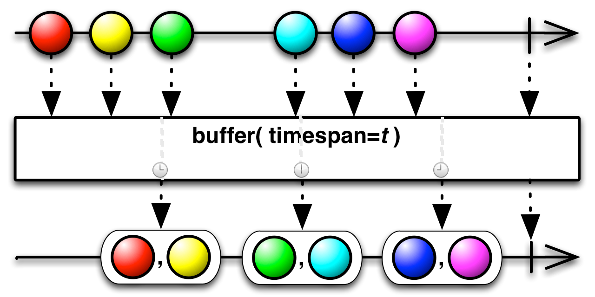
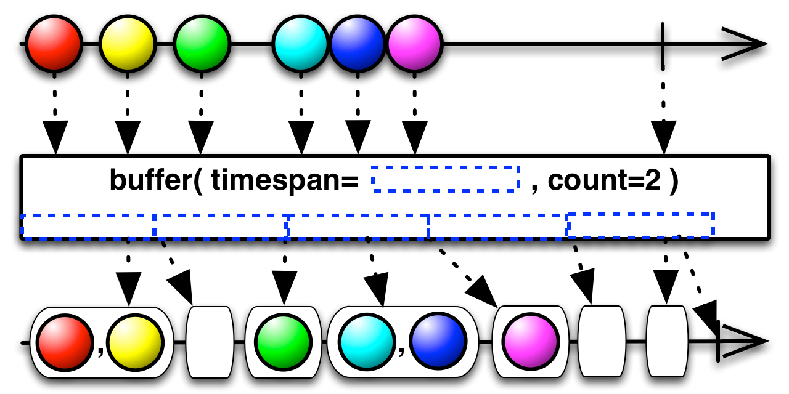
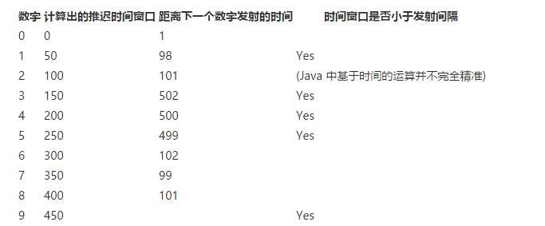

# 14. 驯服数据流之时间平移

Rx 最大的特征之一就是无法预测何时会有数据发射。有些 Observable 会同步的即可发射所有的数据，比如 range ，有些按照一定的时间间隔发射数据、有些根本无法确定到底何时发射数据。例如，鼠标移动时事件和 UDP 数据包到达的时刻。我们需要合适的工具来处理这些无法确定何时发射的事件。

## Buffer 缓存

Buffer 可以收集数据并缓存起来，等缓存到固定的数目后一起发射，而不是来一个发射一个。有多种方式可以缓存数据。

### Complete, non-overlapping buffering

先来看看每个值只缓冲一次的操作函数。

#### buffer by count

最简单的是根据个数来缓冲，当缓冲满了把这几个数据一起发射出去。


```java
Observable.range(0, 10)
    .buffer(4)
    .subscribe(System.out::println);
```

结果：

```
[0, 1, 2, 3]
[4, 5, 6, 7]
[8, 9]
```

### buffer by time

还可以根据时间来缓冲，每隔一段时间缓冲一次，当时间到了，把缓冲的数据一起发射出去。



下面的示例中，每隔100毫秒发射一个数据，使用250毫秒的时间窗口来缓冲数据。

```java
Observable.interval(100, TimeUnit.MILLISECONDS).take(10)
    .buffer(250, TimeUnit.MILLISECONDS)
    .subscribe(System.out::println);
```

结果：

```
[0, 1]
[2, 3]
[4, 5, 6]
[7, 8]
[9]
```

**注意：每个时间窗口发射的数据个数可能是不一样的。在某个时间窗口内，也可能没有数据发射。**

### buffer by count and time

也可以同时用数目和时间作为缓冲条件，任意一个条件满足了（缓冲的个数达到了或者当前时间窗口结束了），就发射缓冲到的数据。



```java
Observable.interval(100, TimeUnit.MILLISECONDS)
    .take(10)
    .buffer(250, TimeUnit.MILLISECONDS, 2)
    .subscribe(System.out::println);
```

结果：

```
[0, 1]
[]
[2, 3]
[]
[4, 5]
[6]
[7, 8]
[]
[9]
```

上面这个示例中，发射了很多空的数据。这是因为，发射了2个数据后，达到了数目缓冲的要求，就触发了一次发射数据的操作，然后过了几十毫秒又触发了时间缓冲的条件，这个时候还没有新的数据发射，所以就触发一个空的列表发射出来。

### buffer with signal

除了时间和数目以外，还可以使用另外一个 Observable 作为信号来缓冲数据，当信号 Observable 的 onNext 事件触发的时候，源 Observable 中就发射缓冲的数据。


下面的示例和 .buffer(250, TimeUnit.MILLISECONDS) 是一样的效果：

```java
Observable.interval(100, TimeUnit.MILLISECONDS).take(10)
    .buffer(Observable.interval(250, TimeUnit.MILLISECONDS))
    .subscribe(System.out::println);
```

使用信号缓冲还有另外一种形式，.buffer(() -> Observable.interval(250, TimeUnit.MILLISECONDS)) ，使用一个函数来返回一个信号Observable，而上面是直接使用信号 Observable，区别是，只有当有Subscriber 订阅的时候，使用函数返回的信号 Observable 才开始执行。

### 交错的缓冲

上面所介绍的所有操作函数都有对应的变体函数，可以重叠的缓冲数据，也可以跳过一些数据。

### buffer by count

除了指定缓冲的数目以外，还可以指定间隔多少个数据开始下一个缓冲。


从上图可以看到，每隔 3个数据开始一个缓冲，每次缓冲 2 个数据。所以 每次第三个数据都被丢弃了。 你还可以在前一个缓冲结束之前就开始下一个缓冲。

- 当 count > skip 的时候，缓冲的数据重叠了
- 当 count < skip 的时候，缓冲的数据有丢失
- 当 count = skip 的时候，和前面看到的简单版本一样

下面是一个缓冲重叠的示例：

```java
Observable.range(0,10)
    .buffer(4, 3)
    .subscribe(System.out::println);
```

结果：

```
[0, 1, 2, 3]
[3, 4, 5, 6]
[6, 7, 8, 9]
[9]
```

每隔 3 个数据开始一个缓冲，每次缓冲 4 个数据。

### buffer by time

同样，对于时间缓冲也可以指定缓冲的时间窗口和每个多久开始下一个缓冲。


同样：

- 当 timespan > timeshift 的时候，缓冲的数据重叠了
- 当 timespan < timeshift 的时候，缓冲的数据有丢失
- 当 timespan = timeshift 的时候，和前面看到的简单版本一样

下一个示例中，每隔 200毫秒开启下一个缓冲，每个缓冲时间窗口是 350毫秒。所以两个缓冲之间会有 150毫秒的重叠。

```java
Observable.interval(100, TimeUnit.MILLISECONDS).take(10)
    .buffer(350, 200, TimeUnit.MILLISECONDS)
    .subscribe(System.out::println);
```

结果：

```
[0, 1, 2]
[2, 3, 4]
[3, 4, 5, 6]
[5, 6, 7, 8]
[7, 8, 9]
[9]
```

### buffer by signal

最后一个强大的缓冲操作可以使用两个信号 Observable 来分别标示何时开始缓冲何时结束缓冲。

```java
public final <TOpening,TClosing> Observable<java.util.List<T>> buffer(
    Observable<? extends TOpening> bufferOpenings,
    Func1<? super TOpening,? extends Observable<? extends TClosing>> bufferClosingSelector)
```


这个操作函数有两个参数，第一个 bufferOpenings 参数为一个 Observable，只要该 Observable 发射了一个数据，就开始一个新的缓冲。每个缓冲到的数据会传递给第二个函数参数 bufferClosingSelector ，bufferClosingSelector 参数为一个函数，该函数创建一个新的 Observable，当这个 Observable 发射数据的时候表明这个缓冲结束。

代码来演示：

```java
Observable.interval(100, TimeUnit.MILLISECONDS).take(10)
    .buffer(
        Observable.interval(250, TimeUnit.MILLISECONDS),
        i -> Observable.timer(200, TimeUnit.MILLISECONDS))
    .subscribe(System.out::println);
```

结果：

```
[2, 3]
[4, 5]
[7, 8]
[9]
```

使用 Observable.interval 创建一个 Observable，这个 Observable 每隔 250毫秒开始一个新的缓冲。由于使用 interval 创建的 Observable，第一个数据是在 250毫秒后发射的，所以第一个缓冲也是从 250毫秒开始的。上面示例中还使用 bufferOpenings Observable 发射的数据作为参数来创建结束缓冲的函数，但是由于上面的示例比较简单，并没有使用这个数据（也就是上面示例中的Lambda 表达式中的参数 i 并没有用）。只是创建了一个等待 200毫秒就发射一个数据的 Observable。这样每个缓冲的时间窗口就是固定的 200毫秒。

### takeLastBuffer

在前面我们已经看到了 takeLast 操作函数，该函数返回最后 N 个数据。takeLast 内部实现需要缓冲最后的 N 个数据，并当数据流结束后从新发送最后 N 个数据。而 takeLastBuffer 把最后的数据作为一个数据返回。

### By count


返回最后 N 个数据

```java
Observable.range(0, 5)
    .takeLastBuffer(2)
    .subscribe(System.out::println);
```

结果：

```
[3, 4]
```

### By time

当源 Observable 结束的时候，从后面开始倒数这个时间窗口，把里面所有发射的数据返回。


```java
Observable.interval(100, TimeUnit.MILLISECONDS)
    .take(5)
    .takeLastBuffer(200, TimeUnit.MILLISECONDS)
    .subscribe(System.out::println);
```

结果：

```
[2, 3, 4]
```

### By count and time

在时间窗口上添加一个数量的限制，如果最后的时间窗口中的数据数目大于规定的数量，则只返回最后几个规定数量的数据。

```java
Observable.interval(100, TimeUnit.MILLISECONDS)
    .take(5)
    .takeLastBuffer(2, 200, TimeUnit.MILLISECONDS)
    .subscribe(System.out::println);
```

结果：

```
[3, 4]
```

如果修改为 .takeLastBuffer(1, 200, TimeUnit.MILLISECONDS)，则返回的结果为 [4]

## Delay 延时

顾名思义，delay 操作会延时一段时间再发射数据。有两种方式实现这个效果；一是缓存这些数据，等一段时间后再发射；或者是把 Subscriber 订阅的时间延迟。

### delay

简单的 delay 函数只是把每个数据都延时一段时间再发射，相当于把整个数据流都往后推迟了。


示例

```java
Observable.interval(100, TimeUnit.MILLISECONDS).take(5)
            .delay(1, TimeUnit.SECONDS)
            .timeInterval()
            .subscribe(System.out::println);
```

结果：

```
TimeInterval [intervalInMilliseconds=1109, value=0]
TimeInterval [intervalInMilliseconds=94, value=1]
TimeInterval [intervalInMilliseconds=100, value=2]
TimeInterval [intervalInMilliseconds=100, value=3]
TimeInterval [intervalInMilliseconds=101, value=4]
```

可以看到，第一个数据差不多被延迟了 1s ，后面每隔 100ms 左右发射下一个数据。
还可以分别推迟每个数据的时间


这个重载函数的参数为一个函数，该函数的参数为源 Observable 发射的数据返回一个 信号Observable。当信号 Observable 发射数据的时候，也就是源 Observable 的数据发射的时候。

```java
Observable.interval(100, TimeUnit.MILLISECONDS).take(5)
    .delay(i -> Observable.timer(i * 100, TimeUnit.MILLISECONDS))
    .timeInterval()
    .subscribe(System.out::println);
```

结果：

```
TimeInterval [intervalInMilliseconds=152, value=0]
TimeInterval [intervalInMilliseconds=173, value=1]
TimeInterval [intervalInMilliseconds=199, value=2]
TimeInterval [intervalInMilliseconds=201, value=3]
TimeInterval [intervalInMilliseconds=199, value=4]
```

源 Observable 每隔 100ms 发射一个数据，而结果显示为 200ms 发射一个数据。interval 从 0 开始发射数据， i 结果为 0、1、2 等，每隔数据推迟了 i*100ms 再发射。所以后面每隔数据都比前一个数据多推迟了100ms，结果就是每个数据差不多间隔200ms 发射。

### delaySubscription

除了缓存数据，延迟发射缓冲的数据以外，还可以选择使用推迟订阅的方式。根据 Observable 是 hot 或者 cold 则会有不同的结果。后面会专门的介绍 cold 和 hot Observable 的区别。这里的示例为 cold Observable，推迟订阅到 cold Observable 和推迟整个数据流是一样的效果。 但是由于推迟订阅不需要缓存发射的数据，所以更加高效。

```java
Observable.interval(100, TimeUnit.MILLISECONDS).take(5)
    .delaySubscription(1000, TimeUnit.MILLISECONDS)
    .timeInterval()
    .subscribe(System.out::println);
```

结果：

```
TimeInterval [intervalInMilliseconds=1114, value=0]
TimeInterval [intervalInMilliseconds=92, value=1]
TimeInterval [intervalInMilliseconds=101, value=2]
TimeInterval [intervalInMilliseconds=100, value=3]
TimeInterval [intervalInMilliseconds=99, value=4]
```

可以看到整个数据流推迟了 1000ms。

同样还有一个重载函数，可以使用另外一个 Observable 来告诉Subscriber 何时订阅

```java
public final <U> Observable<T> delaySubscription(Func0<? extends Observable<U>> subscriptionDelay)1
```

下面的示例，和上面的是一样的效果：

```java
Observable.interval(100, TimeUnit.MILLISECONDS).take(5)
    .delaySubscription(() -> Observable.timer(1000, TimeUnit.MILLISECONDS))
    .timeInterval()
    .subscribe(System.out::println);
```

### delay values and subscription

该分类的最后一个操作函数既可以推迟单个数据，也可以推迟订阅。

```java
public final <U,V> Observable<T> delay(
    Func0<? extends Observable<U>> subscriptionDelay,
    Func1<? super T,? extends Observable<V>> itemDelay)
```


这是一个组合情况，两个参数分别控制推迟多久订阅和推迟多久发射数据。

### Sample

sample 操作可以把一个数据流分割为一个一个的时间窗口，当每个时间窗口结束的时候，发射该时间窗口中的最后一个数据。


```
Observable.interval(150, TimeUnit.MILLISECONDS)
    .sample(1, TimeUnit.SECONDS)
    .subscribe(System.out::println);
```

结果：

```
5
12
18
...
```

每个时间窗口的时间长短也可以不同。你一样可以使用一个信号 Observable 来指定时间结束：


下面这个示例和前面的效果是一样的

```java
Observable.interval(150, TimeUnit.MILLISECONDS)
    .sample(Observable.interval(1, TimeUnit.SECONDS))
    .subscribe(System.out::println);
```

### Throttling

Throttling 也是用来过滤数据的。

### throttleFirst

throttleFirst 操作函数接收到第一个数据后，就开启一个时间窗口，在规定的时间窗口内发射第一个数据，后面的数据丢弃直到时间窗口结束。当时间窗口结束后，下一个数据发射后将开启下一个时间窗口。


```java
Observable.interval(150, TimeUnit.MILLISECONDS)
    .throttleFirst(1, TimeUnit.SECONDS)
    .subscribe(System.out::println);
```

结果：

```
0
7
14
...
```

上面示例中，interval 每隔150ms 发射一个数据。从数据流开始，每个数值都是在 (i+1)\*150ms 的时候发射。第一个数据 0 在 第150ms 发射，然后后面 1000ms 时间内发射的所有数据都被丢弃了。然后下一个数据在第1200ms 的时候发射，然后后面 1000ms 的数据又被丢弃。

### throttleLast

throttleFirst 是根据第一个数据发射后来计时的，而 throttleLast 则使用一样的时间来分割数据流，发射每个时间窗口内的最后一个数据。


```java
Observable.interval(150, TimeUnit.MILLISECONDS)
    .throttleLast(1, TimeUnit.SECONDS)
    .subscribe(System.out::println);
```

结果：

```
5
12
18
...
```

上面示例中，当数据流开始的时候，时间窗口也同时开始了。第一个时间窗口在 1000ms 的时候结束，最后一个数据在 900ms的时候产生；下一个时间窗口从 1000ms 到 2000ms，这个时间窗口内的最后一个数据在 1950ms 的时候产生；同样可以计算下一个时间窗口内的数据在 2850ms 的时候产生。

### Debouncing

debounce 操作函数的功能是：当一个数据发射的时候，就开始一个时间窗口计时，当这个时间窗口结束了还没有新的数据发射，则就发射这数据。如果在这个时间窗口内，又发射了一个新的数据，则当前数据丢弃，从新开始时间窗口计时。


使用简单的 interval 函数无法演示这种情况。所以需要使用一个稍微复杂的 Observable：

```java
Observable.concat(
        Observable.interval(100, TimeUnit.MILLISECONDS).take(3),
        Observable.interval(500, TimeUnit.MILLISECONDS).take(3),
        Observable.interval(100, TimeUnit.MILLISECONDS).take(3)
    )
    .scan(0, (acc, v) -> acc+1)
    .timeInterval()
    .subscribe(System.out::println);
```

这个 Observable 的结果为：

```
TimeInterval [intervalInMilliseconds=110, value=0]
TimeInterval [intervalInMilliseconds=1, value=1]
TimeInterval [intervalInMilliseconds=98, value=2]
TimeInterval [intervalInMilliseconds=101, value=3]
TimeInterval [intervalInMilliseconds=502, value=4]
TimeInterval [intervalInMilliseconds=500, value=5]
TimeInterval [intervalInMilliseconds=499, value=6]
TimeInterval [intervalInMilliseconds=102, value=7]
TimeInterval [intervalInMilliseconds=99, value=8]
TimeInterval [intervalInMilliseconds=101, value=9]
```

从上面的结果中，可以看到我们构造的这个 Observable 先间隔 100ms 发射 4个数字，然后间隔 500ms 再发射 3 个数字，然后再间隔 100ms 发射 3个数字。

scan 函数的作用只是把数字转换为自然顺序发射出去，这个可以区分每个发射出去的数字。

下面用 debounce 函数来操作我们这个源 Observable：

```java
Observable.concat(
        Observable.interval(100, TimeUnit.MILLISECONDS).take(3),
        Observable.interval(500, TimeUnit.MILLISECONDS).take(3),
        Observable.interval(100, TimeUnit.MILLISECONDS).take(3)
    )
    .scan(0, (acc, v) -> acc+1)
    .debounce(150, TimeUnit.MILLISECONDS)
    .subscribe(System.out::println);
```

结果：

```
3
4
5
9
```

这个示例中推迟的时间窗口为 150ms， 前面4个数字都是每隔100ms 就发射了，而第五个数字间隔 500ms 才发射，所以只有第四个数字延迟的时间超过了 150ms 被发射了，同样，4、5这两个数字也是延迟 500ms 发射的。

同样，也可以在每个数据上设置不同的推迟时间窗口，通过一个函数参数来设置每个数据需要推迟的时间。当这个信号 Observable 结束的时候，代表推迟的时间窗口结束。


在下面这个示例中，每个数字i的推迟时间窗口为 i*50 ms

```java
Observable.concat(
        Observable.interval(100, TimeUnit.MILLISECONDS).take(3),
        Observable.interval(500, TimeUnit.MILLISECONDS).take(3),
        Observable.interval(100, TimeUnit.MILLISECONDS).take(3)
    )
    .scan(0, (acc, v) -> acc+1)
    .debounce(i -> Observable.timer(i * 50, TimeUnit.MILLISECONDS))
    .subscribe(System.out::println);
```

结果：

```
1
3
4
5
9
```

下面是一个表格，列出了每个数字的推迟时间窗口和该数字和下一个数字之间的时间间隔：



这个操作函数非常适合输入提示的场景，比如在一个具有辅助提示功能的输入框中，如果每次用户输入了一个字符，就立刻去计算提示的内容，则实际用起来会比较烦人，通常情况下都是延迟一段时间后，再去请求提示内容并显示，如果用户在延迟的时间还没到，就输入了下一个字符，则重新开始新的延迟计时。

### Timeout

timeout 用来检测一个 Observable 是否很长时间内没有数据发射了。 如果超过了这个时间没有发射数据，则 timeout 函数会把源 Observable 结束掉并发射一个 TimeoutException 异常。


使用前面使用过的例子来演示 timeout：

```java
Observable.concat(
        Observable.interval(100, TimeUnit.MILLISECONDS).take(3),
        Observable.interval(500, TimeUnit.MILLISECONDS).take(3),
        Observable.interval(100, TimeUnit.MILLISECONDS).take(3)
    )
    .scan(0, (acc, v) -> acc+1)
    .timeout(200, TimeUnit.MILLISECONDS)
    .subscribe(
        System.out::println,
        System.out::println);
```

结果：

```
0
1
2
3
java.util.concurrent.TimeoutException
```

如果超过200ms 还没有下一个数据发射，则抛出一个 TimeoutException并结束 Observable。

如果超时了，可以指定一个替代的 Observable 而不是抛出 TimeoutException 异常。这样超时了，就使用 替代的 Observable 继续发射。源 Observable将会被丢弃。


```java
Observable.concat(
        Observable.interval(100, TimeUnit.MILLISECONDS).take(3),
        Observable.interval(500, TimeUnit.MILLISECONDS).take(3),
        Observable.interval(100, TimeUnit.MILLISECONDS).take(3)
    )
    .scan(0, (acc, v) -> acc+1)
    .timeout(200, TimeUnit.MILLISECONDS, Observable.just(-1))
    .subscribe(
        System.out::println,
        System.out::println);
```

结果：

```
0
1
2
3
-1
```

同样，也可以每一个数据指定一个不同的超时时间。提供一个函数为每个数据返回一个 信号Observable，当信号 Observable 结束的时候，代表该数据后面的超时时间，如果信号 Observable 结束了，还没有数据发射，则代表超时了。


```java
Observable.concat(
        Observable.interval(100, TimeUnit.MILLISECONDS).take(3),
        Observable.interval(500, TimeUnit.MILLISECONDS).take(3),
        Observable.interval(100, TimeUnit.MILLISECONDS).take(3)
    )
    .scan(0, (acc, v) -> acc+1)
    .timeout(i -> Observable.timer(200, TimeUnit.MILLISECONDS))
    .subscribe(
        System.out::println,
        System.out::println);
```

同样，也可以指定一个替代超时异常的 Observable

```java
.timeout(i -> Observable.timer(200, TimeUnit.MILLISECONDS), Observable.just(-1))
```

结果和前面的示例是一样的。
