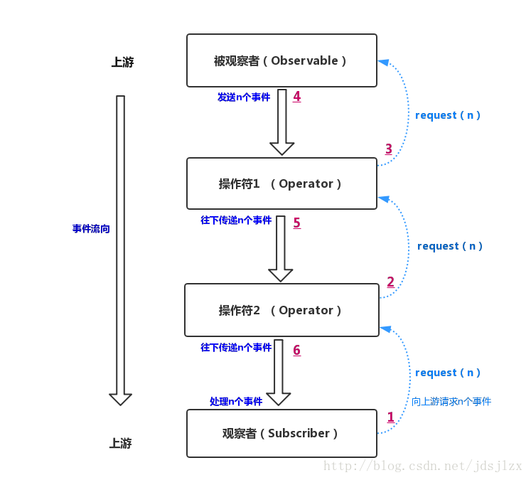

## 20.RxJava 教程第四部分：并发 之数据流发射太快如何办

### Backpressure

Rx 中的数据流是从一个地方发射到另外一个地方。每个地方处理数据的速度是不一样的。如果生产者发射数据的速度比消费者处理的快会出现什么情况？在同步操作中，这不是个问题，例如：

```java
// Produce
Observable<Integer> producer = Observable.create(o -> {
    o.onNext(1);
    o.onNext(2);
    o.onCompleted();
});
// Consume
producer.subscribe(i -> {
    try {
        Thread.sleep(1000);
        System.out.println(i);
    } catch (Exception e) { }
});
```

​虽然上面的消费者处理数据的速度慢，但是由于是同步调用的，所以当 o.onNext(1) 执行后，一直阻塞到消费者处理完才执行 o.onNext(2)。 但是生产者和消费者异步处理的情况很常见。如果是在异步的情况下会出现什么情况呢？

​在传统的 pull 模型中，当消费者请求数据的时候，如果生产者比较慢，则消费者会阻塞等待。如果生产者比较快，则生产者会等待消费者处理完后再生产新的数据。

​而 Rx 为 push 模型。 在 Rx 中，只要生产者数据好了就发射出去了。如果生产者比较慢，则消费者就会等待新的数据到来。如果生产者快，则就会有很多数据发射给消费者，而不管消费者当前有没有能力处理数据。这样会导致一个问题，例如：

```java
Observable.interval(1, TimeUnit.MILLISECONDS)
    .observeOn(Schedulers.newThread())
    .subscribe(
        i -> {
            System.out.println(i);
            try {
                Thread.sleep(100);
            } catch (Exception e) { }
        },
        System.out::println);
```

结果：

```
0
1
rx.exceptions.MissingBackpressureException
```

上面的 MissingBackpressureException 告诉我们，生产者太快了，我们的操作函数无法处理这种情况。

### 消费者的补救措施

有些操作函数可以减少发送给消费者的数据。

#### 过滤数据

sample 操作函数可以指定生产者发射数据的最大速度，多余的数据被丢弃了。


```java
Observable.interval(1, TimeUnit.MILLISECONDS)
    .observeOn(Schedulers.newThread())
    .sample(100, TimeUnit.MILLISECONDS)
    .subscribe(
        i -> {
            System.out.println(i);
            try {
                Thread.sleep(100);
            } catch (Exception e) { }
        },
        System.out::println);
```

结果：

```
82
182
283
...
```

throttle 和 Debounce 也能实现类似的效果。

### Collect

如果你不想丢弃数据，则当消费者忙的时候可以使用 buffer 和 window 操作函数来收集数据。如果批量处理数据速度比较快，则可以使用这种方式。

```java
Observable.interval(10, TimeUnit.MILLISECONDS)
    .observeOn(Schedulers.newThread())
    .buffer(100, TimeUnit.MILLISECONDS)
    .subscribe(
        i -> {
            System.out.println(i);
            try {
                Thread.sleep(100);
            } catch (Exception e) { }
        },
        System.out::println);
```

结果：

```
[0, 1, 2, 3, 4, 5, 6, 7]
[8, 9, 10, 11, 12, 13, 14, 15, 16, 17]
[18, 19, 20, 21, 22, 23, 24, 25, 26, 27]
...
```

### Reactive pull

上面的方式有时候可以解决问题，但是并不是 Rx 中最好的处理方式。有时候在 生产者这里处理可能是最好的情况。Backpressure 是一种用来在生产者端降低发射速度的方式。

RxJava 实现了一种通过 Subscriber 来通知 Observable 发射数据的方式。Subscriber 有个函数 request(n)，调用该函数用来通知 Observable 现在 Subscriber 准备接受下面 n 个数据了。在 Subscriber 的 onStart 函数里面调用 request 函数则就开启了reactive pull backpressure。这并不是传统的 pull 模型，并不会阻塞调用。只是 Subscriber 通知 Observable 当前 Subscriber 的处理能力。 通过调用 request 可以发射更多的数据。

结构示意图：


观察者可以根据自身实际情况按需拉取数据，而不是被动接收（也就相当于告诉上游观察者把速度慢下来），最终实现了上游被观察者发送事件的速度的控制，实现了背压的策略。

示例代码如下：

```java
class MySubscriber extends Subscriber<T> {
    @Override
    public void onStart() {
      request(1); //要在onStart中通知被观察者先发送一个事件
    }

    @Override
    public void onCompleted() {
        ...
    }

    @Override
    public void onError(Throwable e) {
        ...
    }

    @Override
    public void onNext(T n) {
        ...
        request(1); //处理完毕之后，在通知被观察者发送下一个事件
    }
}

//被观察者将产生100000个事件
Observable observable=Observable.range(1,100000);
observable.observeOn(Schedulers.newThread())
            .subscribe(new MySubscriber());
```

在 onStart 函数中调用 request(1) 开启了 backpressure 模式，告诉 Observable 一次只发射一个数据。在 onNext 里面处理完该数据后，可以请求下一个数据。通过 quest(Long.MAX_VALUE) 可以取消 backpressure 模式。

实际上，在上面的代码中，你也可以不需要调用request(n)方法去拉取数据，程序依然能完美运行，这是因为range –> observeOn,这一段中间过程本身就是响应式拉取数据，observeOn这个操作符内部有一个缓冲区，Android环境下长度是16，它会告诉range最多发送16个事件，充满缓冲区即可。不过话说回来，在观察者中使用request(n)这个方法可以使背压的策略表现得更加直观，更便于理解。

如果你足够细心，会发现，在开头展示异常情况的代码中，使用的是interval这个操作符，但是在这里使用了range操作符，为什么呢？

这是因为interval操作符本身并不支持背压策略，它并不响应request(n)，也就是说，它发送事件的速度是不受控制的，而range这类操作符是支持背压的，它发送事件的速度可以被控制。

那么到底什么样的Observable是支持背压的呢？

### Hot and Cold Observables

需要说明的时，Hot Observables 和cold Observables并不是严格的概念区分，它只是对于两类Observable形象的描述.

- Cold Observables：指的是那些在订阅之后才开始发送事件的Observable（每个Subscriber都能接收到完整的事件）。
- Hot Observables:指的是那些在创建了Observable之后，（不管是否订阅）就开始发送事件的Observable
  其实也有创建了Observable之后调用诸如publish()方法就可以开始发送事件的,这里咱们暂且忽略。

我们一般使用的都是Cold Observable，除非特殊需求，才会使用Hot Observable,在这里，Hot Observable这一类是不支持背压的，而是Cold Observable这一类中也有一部分并不支持背压（比如interval，timer等操作符创建的Observable）。

> 说明： 都是Observable，结果有的支持背压，有的不支持，这就是RxJava1.X的一个问题。在2.0中，这种问题已经解决了，以后谈到2.0时再细说。

在那些不支持背压策略的操作符中使用响应式拉取数据的话，还是会抛出MissingBackpressureException。

### doOnRequested

在副作用一节讨论 doOn_ 函数的时候，我们没有讨论 doOnRequested 这个函数：

```java
public final Observable<T> doOnRequest(Action1<java.lang.Long> onRequest)
```

当 Subscriber 请求更多的时候的时候， doOnRequest 就会被调用。参数中的值为请求的数量。

当前 doOnRequest 还是一个 beta 测试版本的 api。 所以在开发过程中尽量避免使用。下面来演示一下这个 api：

```java
Observable.range(0, 3)
    .doOnRequest(i -> System.out.println("Requested " + i))
    .subscribe(System.out::println);
```

结果：

```
Requested 9223372036854775807
0
1
2
```

可以看到 subscriber 在开始的时候，请求了最大数量的数据。这意味着没有使用 backpressure 模型。只有当一个 Subscriber 实现了 backpressure 的时候，Subscribe 才能使用该功能。下面是一个在外部实现 控制backpressure 的示例：

```java
public class ControlledPullSubscriber<T> extends Subscriber<T> {

    private final Action1<T> onNextAction;
    private final Action1<Throwable> onErrorAction;
    private final Action0 onCompletedAction;

    public ControlledPullSubscriber(
            Action1<T> onNextAction,
            Action1<Throwable> onErrorAction,
            Action0 onCompletedAction) {
        this.onNextAction = onNextAction;
        this.onErrorAction = onErrorAction;
        this.onCompletedAction = onCompletedAction;
    }

    public ControlledPullSubscriber(
            Action1<T> onNextAction,
            Action1<Throwable> onErrorAction) {
        this(onNextAction, onErrorAction, () -> {});
    }

    public ControlledPullSubscriber(Action1<T> onNextAction) {
        this(onNextAction, e -> {}, () -> {});
    }

    @Override
    public void onStart() {
      request(0);
    }

    @Override
    public void onCompleted() {
        onCompletedAction.call();
    }

    @Override
    public void onError(Throwable e) {
        onErrorAction.call(e);
    }

    @Override
    public void onNext(T t) {
        onNextAction.call(t);
    }

    public void requestMore(int n) {
        request(n);
    }
}
```

上面的实现中，如果不主动调用 requestMore 函数，则 Observable 是不会发射数据的。

```java
ControlledPullSubscriber<Integer> puller =
        new ControlledPullSubscriber<Integer>(System.out::println);

Observable.range(0, 3)
    .doOnRequest(i -> System.out.println("Requested " + i))
    .subscribe(puller);

puller.requestMore(2);
puller.requestMore(1);
```

结果：

```
Requested 0
Requested 2
0
1
Requested 1
2
```

ControlledPullSubscriber 在onStart 中告诉 Observable 先不要发射数据。然后我们分别请求 2个数据和1 个数据。

Rx 操作函数内部使用队列和缓冲来实现 backpressure ，从而避免保存无限量的数据。大量数据的缓冲应该使用专门的操作函数来处理，例如：cache、buffer 等。 zip 函数就是一个示例，第一个 Observable 可能在第二个 Observable 发射数据之前就发射了一个或者多个数据。所以 zip 需要一个较小的缓冲来匹配两个 Observable，从而避免操作失败。因此， zip 内部使用了一个 128 个数据的小缓冲。

```java
Observable.range(0, 300)
    .doOnRequest(i -> System.out.println("Requested " + i))
    .zipWith(
            Observable.range(10, 300),
            (i1, i2) -> i1 + " - " + i2)
    .take(300)
    .subscribe();
```

结果：

```
Requested 128
Requested 90
Requested 90
Requested 90
```

zip 操作函数一开始请求足够（128）的数据来填充缓冲并处理这些数据。这里 zip 操作函数具体缓冲的数据并不是主要的。读者应该记住，在 Rx 中不管开发者有没有主动启用该功能，有些操作函数内部会使用该功能。这样可以保证 Rx 数据流更加稳定可扩展。

### Backpressure 策略

很多 Rx 操作函数内部都使用了 backpressure 从而避免过多的数据填满内部的队列。这样处理慢的消费者就会把这种情况传递给前面的消费者，前面的消费者开始缓冲数据直到他也缓存满为止再告诉他前面的消费者。Backpressure 并没有消除这种情况。只是让错误延迟发生，我们还是需要处理这种情况。
Rx 中有操作函数可以用来处理这种消费者处理不过来的情况。

### onBackpressureBuffer

onBackpressureBuffer 会缓存所有当前无法消费的数据，直到 Observer 可以处理为止。


你可以指定缓冲的数量，如果缓冲满了则会导致数据流失败。

```java
Observable.interval(1, TimeUnit.MILLISECONDS)
    .onBackpressureBuffer(1000)
    .observeOn(Schedulers.newThread())
    .subscribe(
        i -> {
            System.out.println(i);
            try {
                Thread.sleep(100);
            } catch (Exception e) { }
        },
        System.out::println
    );
```

结果：

```
0
1
2
3
4
5
6
7
8
9
10
11
rx.exceptions.MissingBackpressureException: Overflowed buffer of 1000
```

上面的示例，生产者比消费者快 100 倍。使用 1000个缓冲来处理这种消费者比较慢的情况。当消费者消费 11个数据的时候，缓冲区满了，生产者生产了 1100个数据。数据流就抛出异常了。

### onBackpressureDrop

如果消费者无法处理数据，则 onBackpressureDrop 就把该数据丢弃了。


```java
Observable.interval(1, TimeUnit.MILLISECONDS)
    .onBackpressureDrop()
    .observeOn(Schedulers.newThread())
    .subscribe(
        i -> {
            System.out.println(i);
            try {
                Thread.sleep(100);
            } catch (Exception e) { }
        },
        System.out::println);
```

结果：

```
0
1
2
...
126
127
12861
12862
...
```

这个示例中，前面 128 个数据正常的被处理的，这是应为 observeOn 在切换线程的时候， 使用了一个 128 个数据的小缓冲。

最后我们总结一下：

- 背压是一种策略，具体措施是下游观察者通知上游的被观察者发送事件
- 背压策略很好的解决了异步环境下被观察者和观察者速度不一致的问题
- 在RxJava1.X中，同样是Observable，有的不支持背压策略，导致某些情况下，显得特别麻烦，出了问题也很难排查，使得RxJava的学习曲线变得十份陡峭。

这篇博客并不是为了让你学习在RxJava1.X中如何使用背压（如果你之前不了解背压的话），因为在RxJava1.X中，背压的设计并不十分完美。而是希望你对背压有一个全面清晰的认识，对于它在RxJava1.X中的设计缺陷有所了解即可。可喜的是，RxJava2.X中解决了背压的问题，推出了Flowable（Observable在RxJava2.0中新的实现），而且其中的操作符全部都实现了背压，是不是很期待呢？
