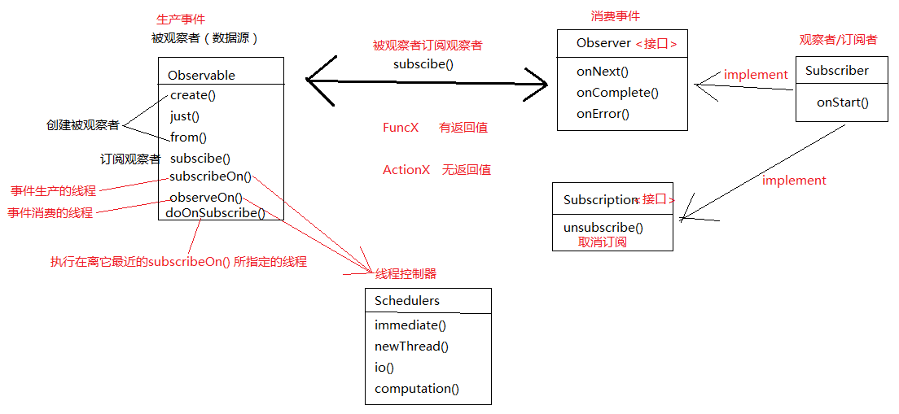

## RxJava 1.0

- Observable

  - create()
  - just()
  - from()
  - subscribe()
  - subscribeOn()
  - observeOn()
  - doOnSubscribe()
- Observer

  - onCompleted()
  - onNext()
  - onError()
  - Subscriber
    - onStart()
- Subscription

  - unsubscribe()
  - isUnsubscribed()
- Action
- Fun
- Schedulers

  - io()
  - immediate()
  - newThread()
  - computation()
- AndroidSchedulers
  - mainThread()

## Operator

## RxJava 2.0

- Observable
  - fromIterable()
  - delay()

- ObservableSource

- CompositeDisposable
  - add()
  - clear()
- BiFunction
- Flowable
- Backpressure
- BackpressureStrategy
  - ERROR
  - BUFFER
  - DROP
  - LATEST

### 操作符

- map() 一对一变换
- flatMap() 扁平化
- concatMap() 有序
- Zip()